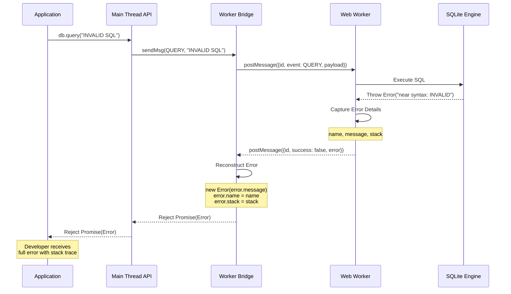

<!--
OUTPUT MAP
docs/04-adr/0007-error-handling-strategy.md

TEMPLATE SOURCE
.claude/templates/docs/04-adr/0000-template.md
-->

# ADR-0007: Error Handling Strategy with Stack Trace Preservation

## Status

Accepted

## Context

- **What is the issue?**
    - Worker-based architecture introduces error boundaries between main thread and worker
    - Errors thrown in worker lose stack traces when passed via postMessage
    - SQLite errors need clear, actionable error messages
    - Transaction failures require automatic rollback
    - Release migration failures must clean up partial state

- **What are the constraints?**
    - postMessage cannot transfer Error objects directly (must be serialized)
    - Worker errors are async (promises reject, not thrown)
    - Stack traces are critical for debugging
    - Errors must preserve error names and messages
    - Transaction failures must maintain database consistency

- **Why do we need to decide now?**
    - Error handling is fundamental to library usability
    - Changing error strategy later would be breaking change
    - Affects debugging experience and developer productivity
    - Critical for production reliability

## Decision

We will implement **comprehensive error handling** with stack trace reconstruction and automatic rollback.

**Error Handling Architecture**: Error serialization, reconstruction, and automatic compensation



**Key Implementation Details**:

- **Error Serialization**: Capture `name`, `message`, and `stack` from worker errors
- **Error Reconstruction**: Create new Error object in main thread with preserved properties
- **Promise Rejection**: All errors propagate as rejected promises
- **Transaction Rollback**: Automatic ROLLBACK on transaction callback errors
- **Migration Cleanup**: Remove incomplete version directories on migration failure
- **Stack Trace Preservation**: Original worker stack traces reconstructed in main thread

## Alternatives Considered

### Option 1: String Errors Only (Rejected)

Pass only error messages (no stack traces, no error objects).

- **Pros**:
    - Simplest implementation (just pass strings)
    - No serialization complexity
    - Works across all browsers

- **Cons**:
    - **No Debugging Info**: Stack traces lost, impossible to debug
    - **No Error Types**: Cannot distinguish error types (syntax, constraint, etc.)
    - **Poor DX**: Developers have no context for errors
    - **Production Nightmare**: Cannot troubleshoot production errors
    - **Unacceptable**: Modern error handling requires stack traces

**Evidence**: Requirements R48: "Preserve error stack traces across worker boundary"

### Option 2: Error Codes (Rejected)

Use numeric error codes instead of error objects.

- **Pros**:
    - Simple serialization (just numbers)
    - Fast comparison (enums)
    - Internationalization friendly

- **Cons**:
    - **No Context**: Error codes don't provide details
    - **Lookup Required**: Must map codes to messages
    - **No Stack Traces**: Debugging information lost
    - **Non-Standard**: Not how JavaScript errors work
    - **Poor DX**: Developers hate error codes

**Evidence**: Standard JavaScript practice is Error objects with stack traces, not numeric codes.

### Option 3: Custom Error Class Hierarchy (Rejected)

Create custom error classes (SQLiteError, MigrationError, etc.).

- **Pros**:
    - Type-safe error handling
    - Can catch specific error types
    - OOP error handling patterns

- **Cons**:
    - **Serialization Complexity**: Custom classes don't survive postMessage
    - **Reconstruction Required**: Must rebuild custom classes in main thread
    - **Overkill**: Standard Error objects are sufficient
    - **Compatibility**: May not work with third-party error trackers
    - **Out of Scope**: Not in requirements

**Evidence**: Requirements specify standard Error objects with preserved properties, not custom classes.

### Option 4: Global Error Handler (Rejected)

Provide a global error handler callback for all errors.

- **Pros**:
    - Centralized error logging
    - Consistent error handling
    - Easy integration with error trackers

- **Cons**:
    - **No Direct Control**: Users cannot handle errors per-operation
    - **Promise Anti-Pattern**: Promises already have error handling (reject/catch)
    - **Complexity**: Additional API surface
    - **Non-Standard**: Not how Promise-based APIs work
    - **Out of Scope**: Users can integrate with error trackers themselves

**Evidence**: Promise-based APIs use rejection, not global handlers.

## Consequences

### Positive

- **Debugging**: Full stack traces preserved across worker boundary
    - Developers can trace errors to exact line in worker code
    - Error messages are clear and actionable
    - Production-validated (v1.1.0 with comprehensive error handling)

- **Consistency**: Automatic rollback maintains data integrity
    - Transaction errors automatically rollback
    - Migration failures clean up partial state
    - Database never in inconsistent state

- **Developer Experience**: Familiar Promise-based error handling
    - Use try/catch or .catch() as usual
    - No custom error handling logic required
    - Works with third-party error trackers (Sentry, Rollbar)

- **Error Types**: Clear error categorization
    - Initialization errors (SharedArrayBuffer, OPFS)
    - SQL execution errors (syntax, constraints)
    - Release errors (hash mismatch, version conflicts)
    - Transaction errors (automatic rollback)

### Negative

- **Implementation Complexity**: Error serialization and reconstruction
    - Must capture all error properties (name, message, stack)
    - Reconstruct Error objects in main thread
    - Handle edge cases (missing stack, custom errors)
    - **Mitigation**: Comprehensive test coverage, documentation

- **Async Error Propagation**: Errors are async (Promise rejection)
    - Cannot use try/catch for async operations
    - Must use async/await or .catch()
    - **Mitigation**: Standard JavaScript pattern, well-understood

- **Worker Isolation**: Cannot debug worker errors directly in DevTools
    - Worker context isolated from main thread
    - Requires worker-specific debugging techniques
    - **Mitigation**: Stack traces preserved, clear error messages

- **Error Reconstruction Limitations**: Some error properties lost
    - Cannot preserve custom error properties
    - Cannot preserve error cause (if available)
    - **Mitigation**: Sufficient for production use (name, message, stack)

### Risks

- **Stack Trace Loss**: Some browsers may not provide stack traces
    - **Probability**: Low (all modern browsers support stack traces)
    - **Impact**: Medium (harder to debug)
    - **Mitigation**: Clear error messages, error names

- **Error Reconstruction Failures**: Reconstructed errors may differ from original
    - **Probability**: Low (careful implementation)
    - **Impact**: Low (still better than no stack trace)
    - **Mitigation**: Test coverage, production validation

- **Transaction Rollback Failures**: Rollback itself may fail
    - **Probability**: Very Low (SQLite rollback is reliable)
    - **Impact**: High (database locked in transaction)
    - **Mitigation**: SQLite handles rollback internally, tested

## Implementation Evidence

**File**: `src/worker-bridge.ts`

```typescript
worker.onmessage = (event: MessageEvent<SqliteResMsg<unknown>>) => {
    const { id, success, error, payload } = event.data;
    const task = idMapPromise.get(id);

    if (!task) return;

    if (!success) {
        const newError = new Error(error!.message);
        newError.name = error!.name;
        newError.stack = error!.stack;
        task.reject(newError);
    }

    task.resolve(payload);
    idMapPromise.delete(id);
};
```

**File**: `src/main.ts` (Transaction Rollback)

```typescript
transaction<T>(fn: transactionCallback<T>): Promise<T> {
  return this.runMutex(async () => {
    await this.exec("BEGIN");
    try {
      const result = await fn(this);
      await this.exec("COMMIT");
      return result;
    } catch (error) {
      await this.exec("ROLLBACK");
      throw error;
    }
  });
}
```

**File**: `src/release/release-manager.ts` (Migration Cleanup)

```typescript
try {
    // Apply migration
    await worker.exec("BEGIN");
    await worker.exec(migrationSQL);
    if (seedSQL) await worker.exec(seedSQL);
    await worker.exec("COMMIT");
} catch (error) {
    await worker.exec("ROLLBACK");
    await opfsUtils.removeDir(baseDir, version);
    throw error;
}
```

**Error Types** (from v1.1.0 implementation):

1. **Initialization Errors**
    - SharedArrayBuffer unavailable
    - Invalid filename
    - OPFS not supported

2. **SQL Execution Errors**
    - Syntax errors
    - Constraint violations
    - Table not found
    - Column not found

3. **Release Errors**
    - Hash mismatch
    - Version conflicts
    - Rollback failures
    - Lock contention

4. **OPFS Errors**
    - File not found
    - Quota exceeded
    - Permission denied

**Test Coverage**:

- E2E tests: `tests/e2e/error.e2e.test.ts`
- Transaction rollback scenarios
- Migration failure cleanup
- Invalid SQL handling
- OPFS error propagation

**Error Message Examples**:

```typescript
// SharedArrayBuffer unavailable
Error: [web-sqlite-js] SharedArrayBuffer is not enabled.

// SQL syntax error
Error: near "INVALID": syntax error
    at worker.ts:45:15
    at query (release-manager.ts:123:10)

// Hash mismatch
Error: migrationSQL hash mismatch for 0.0.1
Expected: abc123...
Actual: def456...

// Rollback below latest release
Error: Cannot rollback below the latest release version
Target: 0.0.1
```

## Related Decisions

- **ADR-0001**: Web Worker Architecture (worker boundary requires error serialization)
- **ADR-0003**: Mutex Queue for Concurrency Control (error isolation in queue)
- **ADR-0004**: Release Versioning System (migration cleanup on errors)

## Error Handling Philosophy

**Design Principles**:

1. **Fail Fast**: Errors thrown immediately, not swallowed
2. **Clear Messages**: Error messages are actionable and specific
3. **Stack Traces**: Preserved across worker boundary
4. **Automatic Cleanup**: Failed operations clean up partial state
5. **Promise Rejection**: Standard async error handling

**Error Recovery Strategies**:

1. **Transaction Rollback**: Automatic ROLLBACK on transaction errors
2. **Migration Cleanup**: Remove incomplete version directories
3. **Lock Release**: Always release metadata lock on errors
4. **Promise Rejection**: Propagate errors to caller for handling

**User Guidance**:

- Try/catch for transaction errors
- .catch() for promise errors
- Integration with error trackers (Sentry, Rollbar)
- Debug mode for detailed logging

---

## Navigation

**Previous ADR**: [ADR-0006: TypeScript Types](./0006-typescript-type-system.md) - Type safety

**ADR Series Complete**

**All ADRs**:

- [ADR-0001: Web Worker](./0001-web-worker-architecture.md)
- [ADR-0002: OPFS Storage](./0002-opfs-persistent-storage.md)
- [ADR-0003: Mutex Queue](./0003-mutex-queue-concurrency.md)
- [ADR-0004: Release Versioning](./0004-release-versioning-system.md)
- [ADR-0005: COOP/COEP](./0005-coop-coep-requirement.md)
- [ADR-0006: TypeScript Types](./0006-typescript-type-system.md)

**Related Documents**:

- [Back to Spec Index](../00-control/00-spec.md)
- [Stage 5: Error Standards](../05-design/01-contracts/03-errors.md) - Error codes and handling
- [Stage 1: Requirements](../01-discovery/02-requirements.md) - R45-R48: Error handling

**Continue to**: [Stage 5: LLD & Contracts](../05-design/) - Low-level design and API contracts
