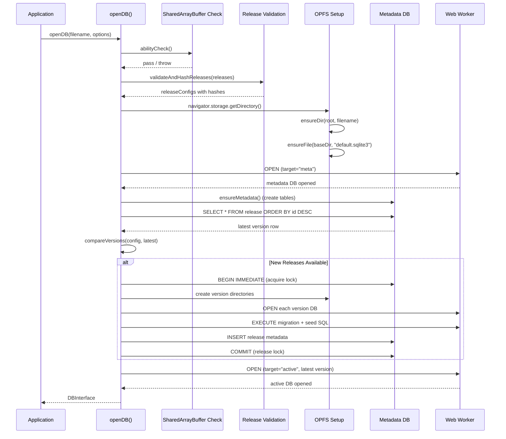
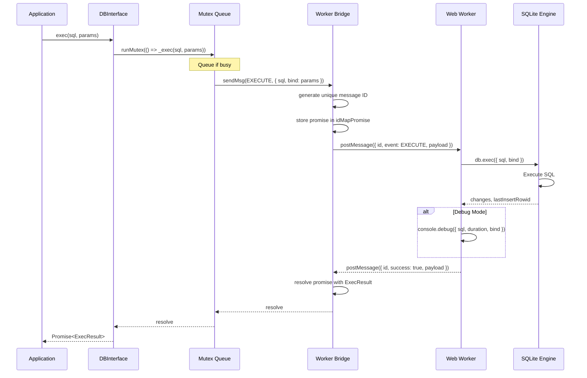
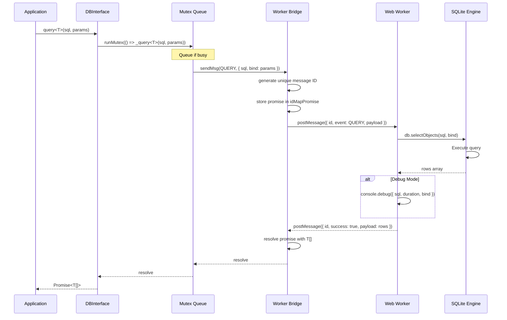
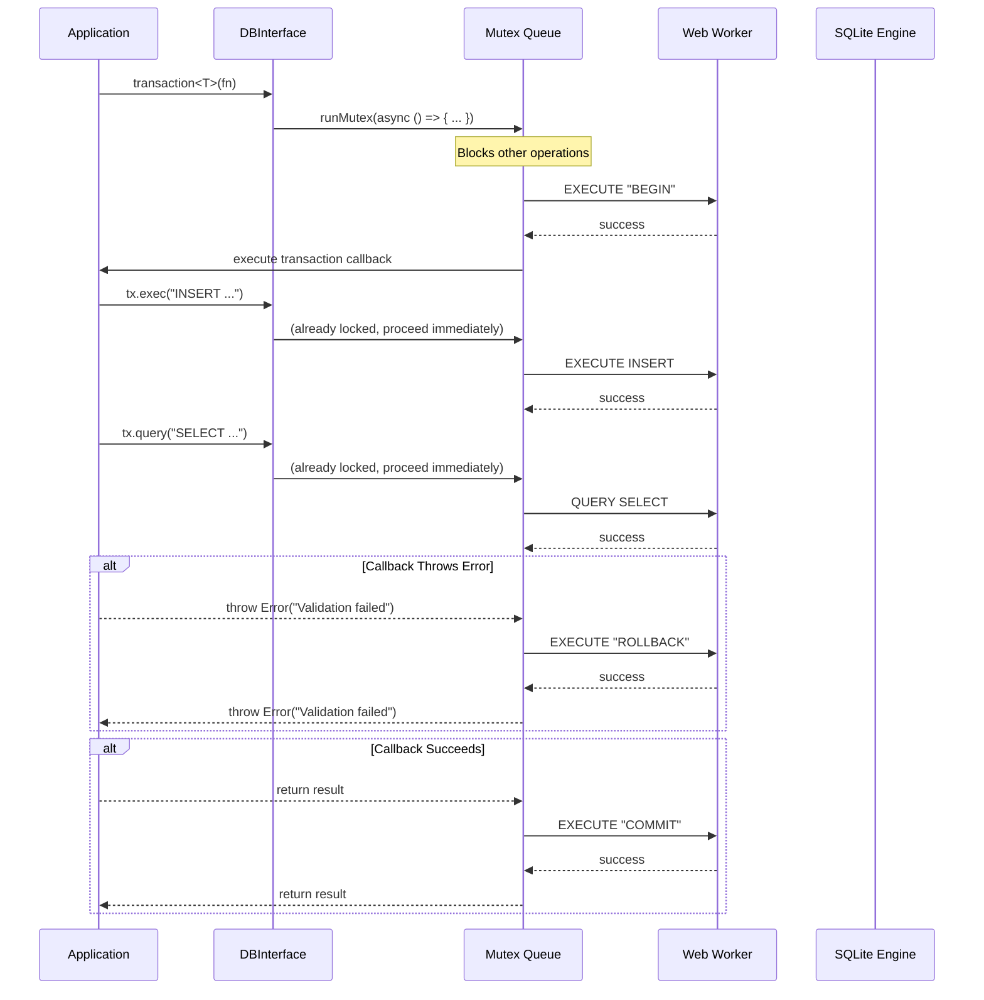
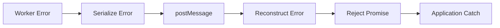

# 01 API Contracts

## 1) Public API Surface

### Module: Core Database API

#### `openDB(filename, options?): Promise<DBInterface>`

Opens a SQLite database connection with release-versioning support.

**Signature:**

```typescript
function openDB(
    filename: string,
    options?: OpenDBOptions,
): Promise<DBInterface>;
```

**Parameters:**

- `filename` (string): The base database name. A directory is created in OPFS with this name.
    - If it does not end with `.sqlite3`, the suffix is appended automatically.
    - Constraints: Non-empty string, trimmed
    - Validation: Throws if invalid
    - Example: `"demo"`, `"myapp.sqlite3"`

- `options` (OpenDBOptions, optional): Configuration options
    - `releases` (ReleaseConfig[], optional): Immutable release history configuration
        - Array of release configs defining schema evolution
        - Each config includes version, migrationSQL, optional seedSQL
        - Must be in ascending version order
    - `debug` (boolean, optional): Enable SQL execution logging in worker
        - Default: `false`
        - Logs query timing, SQL, and bind parameters via console.debug

**Returns:**

- `Promise<DBInterface>`: Database interface for the latest active version
    - Resolves when database is opened and migrations applied
    - Rejects on validation errors, hash mismatches, or SharedArrayBuffer unavailability

**Throws:**

- `Error`: "[web-sqlite-js] SharedArrayBuffer is not enabled." (message includes COOP/COEP header instructions and setup link)
- `Error`: "filename must be a non-empty string"
- `Error`: "Missing release config for {version}"
- `Error`: "migrationSQL hash mismatch for {version}"
- `Error`: "seedSQL hash mismatch for {version}"
- `Error`: "Release config {version} is not greater than the latest version"

**Example:**

```typescript
const db = await openDB("myapp", {
    releases: [
        {
            version: "1.0.0",
            migrationSQL:
                "CREATE TABLE users (id INTEGER PRIMARY KEY, name TEXT);",
            seedSQL: "INSERT INTO users (name) VALUES ('Alice');",
        },
    ],
    debug: true,
});
```

**Flow:**



---

### Module: Database Operations (DBInterface)

#### `exec(sql, params?): Promise<ExecResult>`

Execute a SQL script without returning rows. Intended for migrations, schema setup, or bulk SQL execution.

**Signature:**

```typescript
interface DBInterface {
    exec(sql: string, params?: SQLParams): Promise<ExecResult>;
}
```

**Parameters:**

- `sql` (string): SQL string to execute
    - Constraints: string
    - Can contain multiple statements separated by semicolons
    - Examples: DDL (CREATE, DROP, ALTER), DML (INSERT, UPDATE, DELETE)

- `params` (SQLParams, optional): Bind parameters for the statement
    - Type: `SqlValue[] | Record<string, SqlValue>`
    - Positional parameters: `?` syntax with array
    - Named parameters: `$name`, `:name`, `@name` syntax with object
    - Supported types: `null | number | string | boolean | bigint | Uint8Array | ArrayBuffer`

**Returns:**

- `Promise<ExecResult>`: Metadata about execution
    - `changes` (number | bigint): Number of rows changed
    - `lastInsertRowid` (number | bigint): Last inserted row ID

**Throws:**

- `Error`: "Invalid payload for EXECUTE event: expected SQL string or { sql, bind }"
- `Error`: SQLite errors (syntax, constraints, table not found, etc.)
- `Error`: "Database is not open" (if worker not initialized)

**Example:**

```typescript
// Positional parameters
const result = await db.exec("INSERT INTO users (name, email) VALUES (?, ?)", [
    "Alice",
    "alice@example.com",
]);
console.log(result.changes); // 1
console.log(result.lastInsertRowid); // 1

// Named parameters
await db.exec("UPDATE users SET email = $email WHERE id = $id", {
    $email: "new@email.com",
    $id: 1,
});

// Multiple statements
await db.exec(`
  CREATE TABLE posts (id INTEGER PRIMARY KEY, title TEXT);
  CREATE INDEX posts_title_idx ON posts(title);
`);
```

**Flow:**



---

#### `query<T>(sql, params?): Promise<T[]>`

Execute a SELECT query and return all result rows as an array of objects.

**Signature:**

```typescript
interface DBInterface {
    query<T = unknown>(sql: string, params?: SQLParams): Promise<T[]>;
}
```

**Type Parameters:**

- `T` (extends unknown): Type of result rows
    - Default: `unknown`
    - Inferred from usage or explicitly provided
    - Rows are returned as objects with column names as keys

**Parameters:**

- `sql` (string): SELECT SQL to execute
    - Constraints: Non-empty string, trimmed
    - Must be a query that returns rows (SELECT, EXPLAIN, PRAGMA that returns data)

- `params` (SQLParams, optional): Bind parameters for the query
    - Same as `exec()` parameter syntax

**Returns:**

- `Promise<T[]>`: Array of result rows
    - Each row is an object with column names as keys
    - Empty array if no results
    - Type `T` applied to each row

**Throws:**

- `Error`: "SQL query must be a non-empty string"
- `Error`: SQLite errors (syntax, constraints, table not found, etc.)
- `Error`: "Database is not open"

**Example:**

```typescript
// Basic query
const users = await db.query<{ id: number; name: string }>(
    "SELECT id, name FROM users",
);
// Result: [{ id: 1, name: "Alice" }, { id: 2, name: "Bob" }]

// With positional parameters
const user = await db.query<{ id: number; name: string }>(
    "SELECT id, name FROM users WHERE id = ?",
    [1],
);
// Result: [{ id: 1, name: "Alice" }]

// With named parameters
const users = await db.query<{ id: number; name: string }>(
    "SELECT id, name FROM users WHERE name LIKE $pattern",
    { $pattern: "%Alice%" },
);

// With JOIN
const posts = await db.query<{
    id: number;
    title: string;
    authorName: string;
}>(
    `
  SELECT
    posts.id,
    posts.title,
    users.name AS authorName
  FROM posts
  JOIN users ON posts.authorId = users.id
  `,
);
```

**Flow:**



---

#### `transaction<T>(fn): Promise<T>`

Run a callback inside a transaction. BEGIN is called before `fn`, COMMIT on success, ROLLBACK on error.

**Signature:**

```typescript
interface DBInterface {
    transaction<T>(
        fn: (tx: Pick<DBInterface, "exec" | "query">) => Promise<T>,
    ): Promise<T>;
}
```

**Type Parameters:**

- `T` (extends unknown): Return type of the transaction callback

**Parameters:**

- `fn` (transactionCallback<T>): Callback that receives transaction interface
    - Receives `Pick<DBInterface, "exec" | "query">` (no `transaction` or `close`)
    - Must return a Promise
    - All database operations within callback run in same transaction

**Returns:**

- `Promise<T>`: Result of the transaction callback
    - Resolves with callback return value on COMMIT
    - Rejects with callback error on ROLLBACK

**Throws:**

- `Error`: Any error thrown by callback (triggers ROLLBACK)
- `Error`: SQLite errors during transaction operations

**Transaction Guarantees:**

- **Atomicity**: All operations succeed or all fail (BEGIN/COMMIT/ROLLBACK)
- **Isolation**: Mutex ensures no concurrent transactions
- **Consistency**: SQL constraints enforced by SQLite
- **Durability**: OPFS persists changes immediately

**Example:**

```typescript
// Simple transaction
const result = await db.transaction(async (tx) => {
    await tx.exec("INSERT INTO users (name) VALUES (?)", ["Alice"]);
    await tx.exec("INSERT INTO posts (title, authorId) VALUES (?, ?)", [
        "Hello",
        1,
    ]);
    return { success: true };
});
// Result: { success: true }

// Transaction with query results
const userId = await db.transaction(async (tx) => {
    await tx.exec("INSERT INTO users (name) VALUES (?)", ["Bob"]);

    const users = await tx.query<{ id: number }>(
        "SELECT id FROM users WHERE name = ?",
        ["Bob"],
    );

    return users[0].id;
});
// Result: 2

// Transaction with error (automatic rollback)
try {
    await db.transaction(async (tx) => {
        await tx.exec("INSERT INTO users (name) VALUES (?)", ["Charlie"]);
        throw new Error("Validation failed");
        // ROLLBACK executed automatically
    });
} catch (error) {
    // Charlie not inserted due to rollback
}
```

**Flow:**



---

#### `close(): Promise<void>`

Close the database and release resources.

**Signature:**

```typescript
interface DBInterface {
    close(): Promise<void>;
}
```

**Returns:**

- `Promise<void>`: Resolves when database is closed

**Behavior:**

- Closes active database connection
- Closes metadata database connection
- Resets worker-side SQLite state
- Further operations (including `close()`) fail with "Database is not open"

**Example:**

```typescript
await db.close();
// All subsequent operations will fail
```

---

### Module: Dev Tooling (DevTool)

#### `devTool.release(input): Promise<void>`

Create a new dev version using migration and seed SQL.

**Signature:**

```typescript
interface DevTool {
    release(input: ReleaseConfig): Promise<void>;
}
```

**Parameters:**

- `input` (ReleaseConfig): Release configuration
    - `version` (string): Semantic version string "x.x.x" (no leading zeros)
    - `migrationSQL` (string): Migration SQL to apply for this version
    - `seedSQL` (string | null | undefined): Optional seed SQL to apply after migration

**Returns:**

- `Promise<void>`: Resolves when dev version is created

**Throws:**

- `Error`: "devTool.release version must be greater than latest"
- `Error`: "Release operation already in progress" (if another release/rollback in progress)
- `Error`: SQLite errors during migration (triggers cleanup)

**Behavior:**

- Creates new version directory in OPFS
- Copies latest database to new version
- Executes migration and seed SQL in transaction
- Inserts metadata row with mode="dev"
- Switches active database to new version

**Example:**

```typescript
await db.devTool.release({
    version: "1.0.1",
    migrationSQL: "ALTER TABLE users ADD COLUMN age INTEGER;",
    seedSQL: "UPDATE users SET age = 25 WHERE age IS NULL;",
});
```

---

#### `devTool.rollback(version): Promise<void>`

Roll back to a target version and remove dev versions above it.

**Signature:**

```typescript
interface DevTool {
    rollback(version: string): Promise<void>;
}
```

**Parameters:**

- `version` (string): Target version to rollback to
    - Must be an existing version in metadata
    - Cannot be below latest release version

**Returns:**

- `Promise<void>`: Resolves when rollback is complete

**Throws:**

- `Error`: "Invalid version format: {version}"
- `Error`: "Version not found: {version}"
- `Error`: "Cannot rollback below the latest release version"
- `Error`: "Release operation already in progress"

**Behavior:**

- Identifies all dev versions above target
- Removes dev version directories from OPFS
- Deletes dev version metadata rows
- Switches active database to target version
- Preserves all release versions (never removes releases)

**Example:**

```typescript
// Current dev versions: 1.0.1, 1.0.2
// Latest release: 1.0.0
await db.devTool.rollback("1.0.0");
// Result: Back to 1.0.0, dev versions removed

// Cannot rollback below latest release
await db.devTool.rollback("0.0.9");
// Throws: "Cannot rollback below the latest release version"
```

---

## 2) Internal Worker API

### Module: Worker Message Protocol

#### Message Events (SqliteEvent)

**OPEN**: Open database connection

**Request:**

```typescript
{
  id: number;
  event: "open";
  payload: {
    filename: string;
    options?: { debug?: boolean };
    target?: "active" | "meta";
    replace?: boolean;
  }
}
```

**Response:**

```typescript
{
  id: number;
  success: boolean;
  error?: Error;
  payload?: void;
}
```

**Behavior:**

- Initializes SQLite WASM module on first call
- Opens database file in OPFS using `sqlite3.oo1.OpfsDb`
- Supports two targets: "active" (user data) or "meta" (release metadata)
- If `replace` is true, closes existing connection before opening
- Configures debug logging based on options

---

**EXECUTE**: Run SQL without returning rows

**Request:**

```typescript
{
  id: number;
  event: "execute";
  payload: {
    sql: string;
    bind?: SQLParams;
    target?: "active" | "meta";
  }
}
```

**Response:**

```typescript
{
  id: number;
  success: boolean;
  error?: Error;
  payload?: {
    changes: number | bigint;
    lastInsertRowid: number | bigint;
  }
}
```

**Behavior:**

- Executes SQL using `db.exec({ sql, bind })`
- Returns row count and last insert ID
- Logs query timing if debug mode enabled

---

**QUERY**: Run SELECT query and return rows

**Request:**

```typescript
{
  id: number;
  event: "query";
  payload: {
    sql: string;
    bind?: SQLParams;
    target?: "active" | "meta";
  }
}
```

**Response:**

```typescript
{
  id: number;
  success: boolean;
  error?: Error;
  payload?: unknown[]; // Array of row objects
}
```

**Behavior:**

- Executes query using `db.selectObjects(sql, bind)`
- Returns array of objects with column names as keys
- Logs query timing if debug mode enabled

---

**CLOSE**: Close database connections

**Request:**

```typescript
{
  id: number;
  event: "close";
  payload?: undefined;
}
```

**Response:**

```typescript
{
  id: number;
  success: boolean;
  error?: Error;
  payload?: void;
}
```

**Behavior:**

- Closes active database connection
- Closes metadata database connection
- Clears SQLite WASM module reference

---

### Message ID Correlation

Each request gets a unique incremental ID for promise resolution:

```typescript
const getLatestMsgId = (() => {
    let latestId = 0;
    return () => ++latestId;
})();

// Main thread sends request
const id = getLatestMsgId();
worker.postMessage({ id, event: "query", payload });

// Worker responds with same ID
self.postMessage({ id, success: true, payload: rows });
```

**Promise Mapping:**

```typescript
const idMapPromise: Map<number, Task<unknown>> = new Map();

// Store promise before sending
idMapPromise.set(id, { resolve, reject });

// Retrieve and resolve on response
const task = idMapPromise.get(id);
if (task) {
    task.resolve(payload);
    idMapPromise.delete(id);
}
```

---

## 3) Type Definitions

### Core Types

```typescript
// SQL value types supported by SQLite
type SqlValue =
    | null
    | number
    | string
    | boolean
    | bigint
    | Uint8Array
    | ArrayBuffer;

// Bind parameters (positional or named)
type SQLParams = SqlValue[] | Record<string, SqlValue>;

// Database target
type DbTarget = "active" | "meta";

// Execution result metadata
type ExecResult = {
    changes?: number | bigint;
    lastInsertRowid?: number | bigint;
};

// Release configuration
type ReleaseConfig = {
    version: string;
    migrationSQL: string;
    seedSQL?: string | null;
};

// Database open options
type OpenDBOptions = {
    releases?: ReleaseConfig[];
    debug?: boolean;
};

// Transaction callback
type transactionCallback<T> = (
    db: Pick<DBInterface, "exec" | "query">,
) => Promise<T>;

// Dev tool interface
type DevTool = {
    release(input: ReleaseConfig): Promise<void>;
    rollback(version: string): Promise<void>;
};

// Main database interface
interface DBInterface {
    exec(sql: string, params?: SQLParams): Promise<ExecResult>;
    query<T = unknown>(sql: string, params?: SQLParams): Promise<T[]>;
    transaction<T>(fn: transactionCallback<T>): Promise<T>;
    close(): Promise<void>;
    devTool: DevTool;
}
```

### Worker Protocol Types

```typescript
// Worker message events
enum SqliteEvent {
    OPEN = "open",
    CLOSE = "close",
    EXECUTE = "execute",
    QUERY = "query",
}

// Worker open options
type WorkerOpenDBOptions = {
    debug?: boolean;
};

// Open database arguments
type OpenDBArgs = {
    filename: string;
    options?: WorkerOpenDBOptions;
    target?: DbTarget;
    replace?: boolean;
};

// Request message
type SqliteReqMsg<T> = {
    id: number;
    event: SqliteEvent;
    payload?: T;
};

// Response message
type SqliteResMsg<T> = {
    id: number;
    success: boolean;
    error?: Error;
    payload?: T;
};
```

---

## 4) API Usage Patterns

### Pattern 1: Database Initialization with Migrations

```typescript
import { openDB } from "web-sqlite-js";

const db = await openDB("myapp", {
    releases: [
        {
            version: "1.0.0",
            migrationSQL: `
        CREATE TABLE users (
          id INTEGER PRIMARY KEY,
          name TEXT NOT NULL,
          email TEXT UNIQUE
        );
      `,
        },
        {
            version: "1.1.0",
            migrationSQL: `
        ALTER TABLE users ADD COLUMN age INTEGER;
      `,
        },
    ],
});
```

### Pattern 2: Transactional Operations

```typescript
await db.transaction(async (tx) => {
    const result = await tx.exec(
        "INSERT INTO users (name, email) VALUES (?, ?)",
        ["Alice", "alice@example.com"],
    );

    const userId = result.lastInsertRowid;

    await tx.exec("INSERT INTO posts (title, authorId) VALUES (?, ?)", [
        "Hello World",
        userId,
    ]);
});
```

### Pattern 3: Type-Safe Queries

```typescript
interface User {
    id: number;
    name: string;
    email: string;
}

const users = await db.query<User>(
    "SELECT id, name, email FROM users WHERE age > ?",
    [18],
);

// users is properly typed as User[]
users[0].name; // string
users[0].id; // number
```

### Pattern 4: Dev Testing Workflow

```typescript
// Create dev version for testing migration
await db.devTool.release({
    version: "2.0.0",
    migrationSQL: "ALTER TABLE users ADD COLUMN bio TEXT;",
});

// Test new schema
await db.exec("UPDATE users SET bio = ? WHERE id = ?", ["Hello", 1]);

// Rollback if testing fails
await db.devTool.rollback("1.1.0");
```

---

## 5) Performance Characteristics

### Operation Timing

| Operation           | Typical Latency | Notes                                  |
| ------------------- | --------------- | -------------------------------------- |
| openDB (first time) | 50-100ms        | Includes WASM initialization           |
| openDB (subsequent) | 10-50ms         | Depends on pending migrations          |
| exec                | 0.2-0.5ms       | Simple INSERT/UPDATE                   |
| query               | 0.2-0.5ms       | Simple SELECT                          |
| transaction         | 0.5-2ms         | Depends on operations count            |
| devTool.release     | 50-100ms        | Includes DB copy and migration         |
| devTool.rollback    | 10-50ms         | Directory removal and metadata cleanup |

### Concurrency

- **Mutex Queue**: All operations serialized through single mutex
- **Transaction Throughput**: 1000+ transactions/second (measured)
- **Concurrent Queries**: 100+ concurrent operations via mutex queue
- **Worker Communication**: ~0.05ms for postMessage round-trip

### Memory

- **Worker Memory**: Separate from main thread
- **Result Sets**: Full arrays transferred via structured clone
- **Large Datasets**: May cause worker memory pressure (future: streaming)

---

## 6) Error Handling

### Error Categories

1. **Initialization Errors**
    - SharedArrayBuffer unavailable
    - Invalid filename
    - OPFS not supported

2. **SQL Execution Errors**
    - Syntax errors
    - Constraint violations
    - Table/column not found

3. **Release Errors**
    - Hash mismatch
    - Version conflicts
    - Rollback failures
    - Lock contention

4. **OPFS Errors**
    - File not found
    - Quota exceeded
    - Permission denied

### Error Propagation



All errors preserve `name`, `message`, and `stack` properties across worker boundary.

---

## Navigation

**Previous**: [ADR-0007: Error Handling](../../04-adr/0007-error-handling-strategy.md) - Error strategy

**Next in Series**: [02 Event Catalog](./02-events.md) - Worker message events

**Related Design Documents**:

- [03 Error Standards](./03-errors.md) - Error codes and handling
- [Database Schema](../02-schema/01-database.md) - Database structure
- [Core Module](../03-modules/core.md) - API implementation

**All Design Documents**:

- [Contracts](./) - API, Events, Errors
- [Schema](../02-schema/) - Database, Migrations
- [Modules](../03-modules/) - Core, Release Management, Worker Bridge

**Related ADRs**:

- [ADR-0001: Web Worker](../../04-adr/0001-web-worker-architecture.md) - Worker architecture
- [ADR-0006: TypeScript Types](../../04-adr/0006-typescript-type-system.md) - Type system

**Back to**: [Spec Index](../../00-control/00-spec.md)
