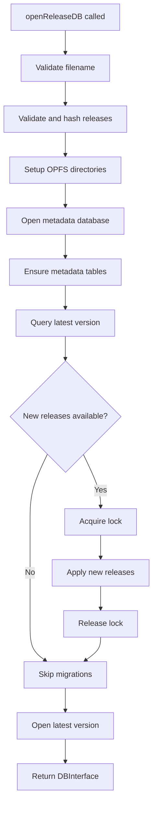
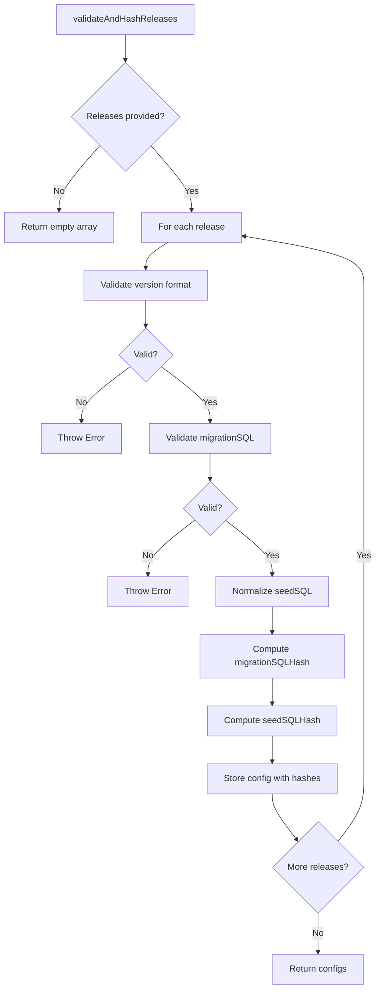
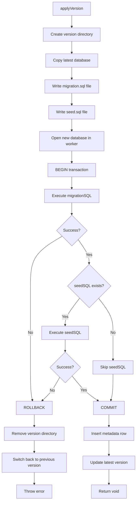
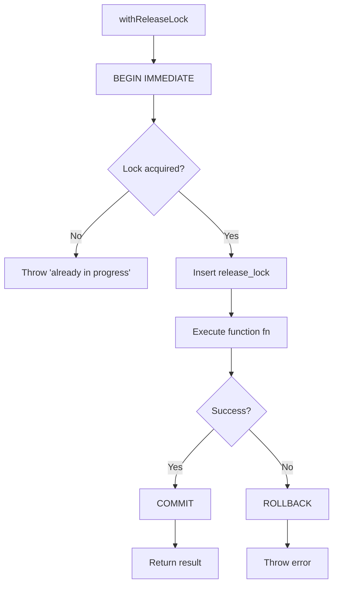
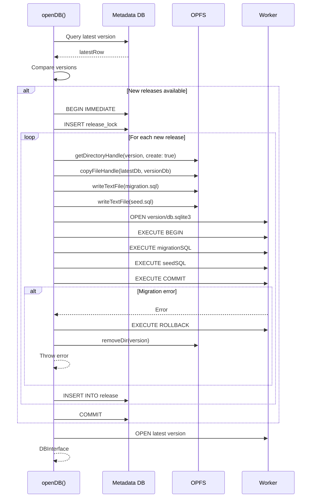
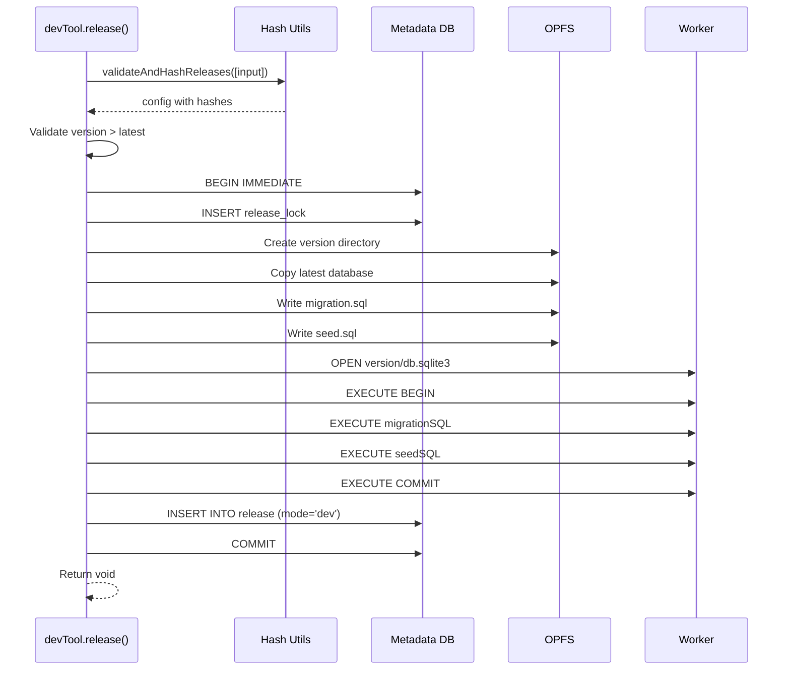
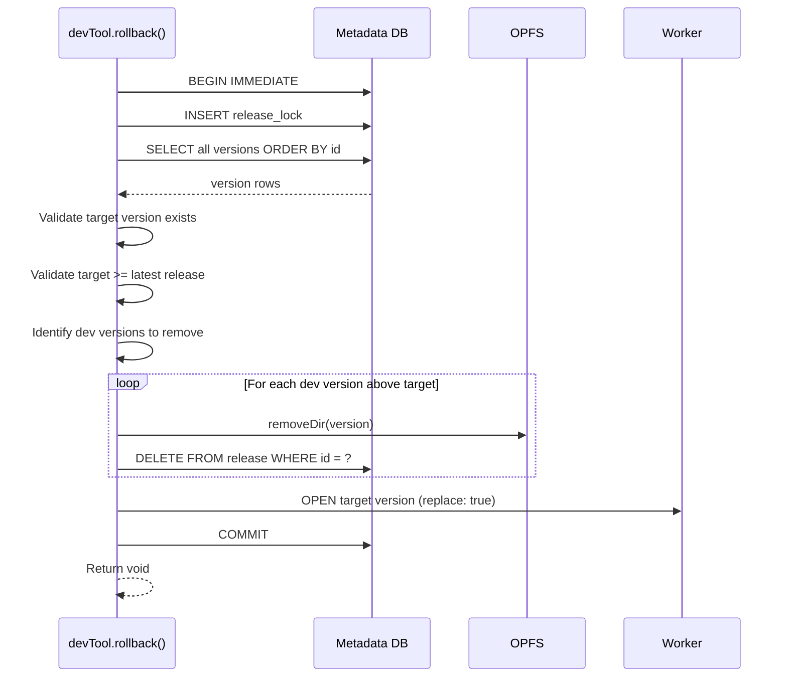

# Module: Release Management

## 1) Assets

**Purpose**: Manage database versioning with release isolation, migration application, and rollback capability.

**Links to Contracts**:

-   API: `agent-docs/05-design/01-contracts/01-api.md#module-dev-tooling-devtool`
-   Events: `agent-docs/05-design/01-contracts/02-events.md#event-version-application`
-   Errors: `agent-docs/05-design/01-contracts/03-errors.md#category-2-release-validation-errors`

**Links to Schema**:

-   Database: `agent-docs/05-design/02-schema/01-database.md#module-release-metadata-database`
-   Migrations: `agent-docs/05-design/02-schema/02-migrations.md`

---

## 2) Module Responsibilities

### Primary Responsibilities

1. **Release Validation**: Compute SHA-256 hashes and validate release configs
2. **Metadata Management**: Create and query metadata database
3. **Version Application**: Apply new releases with migration and seed SQL
4. **Dev Tooling**: Create dev versions and rollback to previous versions
5. **Lock Management**: Serialize release operations to prevent conflicts
6. **OPFS Operations**: Create version directories and copy database files

### Cross-Cutting Concerns

-   **Atomicity**: All version operations in transactions
-   **Isolation**: Metadata lock prevents concurrent modifications
-   **Consistency**: Hash validation ensures release integrity
-   **Durability**: OPFS provides persistent storage

---

## 3) Public Interface

### Function: `openReleaseDB(deps): Promise<DBInterface>`

**Purpose**: Open and prepare a versioned database using release metadata.

**File**: `src/release/release-manager.ts`

**Parameters**:

```typescript
type ReleaseManagerDeps = {
    filename: string;
    options?: OpenDBOptions;
    sendMsg: <TRes, TReq>(event: SqliteEvent, payload?: TReq) => Promise<TRes>;
    runMutex: <T>(callback: () => Promise<T>) => Promise<T>;
};
```

**Returns**: `Promise<DBInterface>` - Database interface for latest version

**Flow**:



**Key Operations**:

1. Validate filename and release configs
2. Compute SHA-256 hashes for migration and seed SQL
3. Create OPFS directories and default database
4. Open metadata database (`release.sqlite3`)
5. Ensure metadata tables exist
6. Query latest version from metadata
7. Validate release configs against archived versions
8. Apply new releases if available
9. Open latest version as active database
10. Create DBInterface with exec, query, transaction, close, devTool

---

### Function: `validateAndHashReleases(releases): Promise<ReleaseConfigWithHash[]>`

**Purpose**: Validate release configs and compute SHA-256 hashes.

**File**: `src/release/hash-utils.ts`

**Parameters**:

```typescript
type ReleaseConfig = {
    version: string;
    migrationSQL: string;
    seedSQL?: string | null;
};
```

**Returns**: `Promise<ReleaseConfigWithHash[]>` - Release configs with computed hashes

**Validation Rules**:

1. Version must match semver pattern: `^(0|[1-9]\d*)\.(0|[1-9]\d*)\.(0|[1-9]\d*)$`
2. Migration SQL must be non-empty string
3. Seed SQL must be string or null/undefined
4. Versions must be in ascending order

**Hash Computation**:

```typescript
async function hashSQL(value: string): Promise<string> {
    const data = new TextEncoder().encode(value);
    const hashBuffer = await crypto.subtle.digest("SHA-256", data);
    const hashArray = Array.from(new Uint8Array(hashBuffer));
    return hashArray.map((b) => b.toString(16).padStart(2, "0")).join("");
}

const normalizedSeedSQL =
    seedSQL === undefined || seedSQL === null || seedSQL === ""
        ? null
        : seedSQL;
const migrationSQLHash = await hashSQL(migrationSQL);
const seedSQLHash = normalizedSeedSQL ? await hashSQL(normalizedSeedSQL) : null;
```

**Flow**:



---

### Function: `applyVersion(config, mode): Promise<void>`

**Purpose**: Apply a new version by copying database and executing migration SQL.

**File**: `src/release/release-manager.ts` (internal function in `openReleaseDB`)

**Parameters**:

```typescript
type ReleaseConfigWithHash = {
    version: string;
    migrationSQL: string;
    normalizedSeedSQL: string;
    migrationSQLHash: string;
    seedSQLHash: string;
};
```

**Flow**:



**Error Handling**:

-   SQL execution error: ROLLBACK, remove version directory, rethrow error
-   OPFS error: Cleanup partial files, rethrow error
-   Metadata error: Transaction rollback, rethrow error

**Code**:

```typescript
const applyVersion = async (
    config: ReleaseConfigWithHash,
    mode: "release" | "dev"
): Promise<void> => {
    const versionDir = await baseDir.getDirectoryHandle(config.version, {
        create: true,
    });
    const destDbHandle = await versionDir.getFileHandle("db.sqlite3", {
        create: true,
    });

    await copyFileHandle(latestDbHandle, destDbHandle);
    await writeTextFile(versionDir, "migration.sql", config.migrationSQL);
    if (config.normalizedSeedSQL) {
        await writeTextFile(versionDir, "seed.sql", config.normalizedSeedSQL);
    }

    await openActiveDb(
        getDbPathForVersion(normalizedFilename, config.version),
        true
    );

    try {
        await _exec("BEGIN", undefined, "active");
        await _exec(config.migrationSQL, undefined, "active");
        if (config.normalizedSeedSQL) {
            await _exec(config.normalizedSeedSQL, undefined, "active");
        }
        await _exec("COMMIT", undefined, "active");
    } catch (error) {
        await _exec("ROLLBACK", undefined, "active");
        await openActiveDb(
            getDbPathForVersion(normalizedFilename, latestVersion),
            true
        );
        await removeDir(baseDir, config.version);
        throw error;
    }

    await metaExec(
        "INSERT INTO release (version, migrationSQLHash, seedSQLHash, mode, createdAt) VALUES (?, ?, ?, ?, ?)",
        [
            config.version,
            config.migrationSQLHash,
            config.seedSQLHash,
            mode,
            new Date().toISOString(),
        ]
    );

    latestVersion = config.version;
    latestDbHandle = destDbHandle;
};
```

---

### Function: `withReleaseLock<T>(fn): Promise<T>`

**Purpose**: Acquire metadata lock, execute function, release lock on success or error.

**File**: `src/release/release-manager.ts` (internal function in `openReleaseDB`)

**Parameters**:

```typescript
type LockFunction<T> = () => Promise<T>;
```

**Returns**: `Promise<T>` - Result of the function

**Flow**:



**Lock Detection**:

```typescript
try {
    await metaExec("BEGIN IMMEDIATE");
} catch (error) {
    if (isLockError(error)) {
        throw new Error("Release operation already in progress");
    }
    throw error;
}
```

**Code**:

```typescript
const withReleaseLock = async <T>(fn: () => Promise<T>): Promise<T> => {
    try {
        await metaExec("BEGIN IMMEDIATE");
    } catch (error) {
        if (isLockError(error)) {
            throw new Error("Release operation already in progress");
        }
        throw error;
    }
    await metaExec(
        "INSERT OR REPLACE INTO release_lock (id, lockedAt) VALUES (1, ?)",
        [new Date().toISOString()]
    );
    try {
        const result = await fn();
        await metaExec("COMMIT");
        return result;
    } catch (error) {
        try {
            await metaExec("ROLLBACK");
        } catch {
            // ignore rollback errors
        }
        throw error;
    }
};
```

---

## 4) Internal Operations

### Operation: Metadata Table Creation

**Purpose**: Ensure metadata database has required tables and default data.

**Location**: `src/release/release-manager.ts` (in `openReleaseDB`)

**Tables Created**:

```sql
CREATE TABLE release (
  id INTEGER PRIMARY KEY AUTOINCREMENT,
  version TEXT NOT NULL,
  migrationSQLHash TEXT,
  seedSQLHash TEXT,
  mode TEXT NOT NULL CHECK (mode IN ('release', 'dev')),
  createdAt TEXT NOT NULL
);

CREATE UNIQUE INDEX idx_release_version ON release(version);

CREATE TABLE release_lock (
  id PRIMARY KEY CHECK (id = 1),
  lockedAt TEXT NOT NULL
);
```

**Default Data**:

```sql
INSERT INTO release (version, migrationSQLHash, seedSQLHash, mode, createdAt)
VALUES ('default', NULL, NULL, 'release', '<timestamp>');
```

**Note**: The 'default' version is an internal version representing the initial empty database file (`default.sqlite3`). User-provided versions must be semver `x.y.z` (no leading zeros); `default` is reserved.

**Code**:

```typescript
const ensureMetadata = async (): Promise<void> => {
    await metaExec(RELEASE_TABLE_SQL);
    await metaExec(RELEASE_INDEX_SQL);
    await metaExec(RELEASE_LOCK_TABLE_SQL);

    const defaults = await metaQuery<{ id: number }>(
        "SELECT id FROM release WHERE version = ? LIMIT 1",
        [DEFAULT_VERSION]
    );
    if (defaults.length === 0) {
        await metaExec(
            "INSERT INTO release (version, migrationSQLHash, seedSQLHash, mode, createdAt) VALUES (?, ?, ?, ?, ?)",
            [DEFAULT_VERSION, null, null, "release", new Date().toISOString()]
        );
    }
};
```

---

### Operation: Version Comparison

**Purpose**: Compare semantic version strings.

**Location**: `src/release/version-utils.ts`

**Algorithm**:

```typescript
export function compareVersions(v1: string, v2: string): number {
    const parse = (v: string) => {
        const match = v.match(/^(\d+)\.(\d+)\.(\d+)/);
        return match
            ? [parseInt(match[1]), parseInt(match[2]), parseInt(match[3])]
            : [0, 0, 0];
    };

    const [major1, minor1, patch1] = parse(v1);
    const [major2, minor2, patch2] = parse(v2);

    if (major1 !== major2) return major1 - major2;
    if (minor1 !== minor2) return minor1 - minor2;
    return patch1 - patch2;
}
```

**Return Values**:

-   `< 0`: v1 < v2
-   `= 0`: v1 = v2
-   `> 0`: v1 > v2

**Usage**:

```typescript
if (compareVersions(config.version, latestVersion) <= 0) {
    throw new Error("Version must be greater than latest");
}
```

---

### Operation: OPFS File Operations

**Purpose**: Manage OPFS directories and files for versioned databases.

**Location**: `src/release/opfs-utils.ts`

**Key Functions**:

#### `ensureDir(root, name): Promise<FileSystemDirectoryHandle>`

Create or get directory handle.

```typescript
export const ensureDir = async (
    root: FileSystemDirectoryHandle,
    name: string
): Promise<FileSystemDirectoryHandle> => {
    return await root.getDirectoryHandle(name, { create: true });
};
```

#### `ensureFile(dir, name): Promise<FileSystemFileHandle>`

Create or get file handle.

```typescript
export const ensureFile = async (
    dir: FileSystemDirectoryHandle,
    name: string
): Promise<FileSystemFileHandle> => {
    return await dir.getFileHandle(name, { create: true });
};
```

#### `copyFileHandle(src, dest): Promise<void>`

Copy file contents from source to destination.

```typescript
export const copyFileHandle = async (
    src: FileSystemFileHandle,
    dest: FileSystemFileHandle
): Promise<void> => {
    const srcFile = await src.getFile();
    const srcData = await srcFile.arrayBuffer();
    const destWritable = await dest.createWritable();
    await destWritable.write(srcData);
    await destWritable.close();
};
```

#### `writeTextFile(dir, name, contents): Promise<void>`

Write text contents to file.

```typescript
export const writeTextFile = async (
    dir: FileSystemDirectoryHandle,
    name: string,
    contents: string
): Promise<void> => {
    const fileHandle = await dir.getFileHandle(name, { create: true });
    const writable = await fileHandle.createWritable();
    await writable.write(contents);
    await writable.close();
};
```

#### `removeDir(baseDir, name): Promise<void>`

Remove directory and all contents.

```typescript
export const removeDir = async (
    baseDir: FileSystemDirectoryHandle,
    name: string
): Promise<void> => {
    const dirHandle = await baseDir.getDirectoryHandle(name);
    // Recursively remove all entries
    for await (const entry of dirHandle.values()) {
        await dirHandle.removeEntry(entry.name, { recursive: true });
    }
    await baseDir.removeEntry(name);
};
```

---

### Operation: Lock Error Detection

**Purpose**: Detect if error is due to metadata lock contention.

**Location**: `src/release/lock-utils.ts`

**Code**:

```typescript
export const isLockError = (error: unknown): boolean => {
    const message = error instanceof Error ? error.message : String(error);
    return (
        message.includes("database is locked") ||
        message.includes("SQLITE_BUSY")
    );
};
```

**Usage**:

```typescript
try {
    await metaExec("BEGIN IMMEDIATE");
} catch (error) {
    if (isLockError(error)) {
        throw new Error("Release operation already in progress");
    }
    throw error;
}
```

---

## 5) Data Flow

### Release Application Flow



### Dev Tool Release Flow



### Dev Tool Rollback Flow



---

## 6) Error Handling

### Error Categories

1. **Hash Mismatch**: Release config SQL differs from archived SQL
2. **Version Conflict**: Version not greater than latest
3. **Lock Contention**: Concurrent release operation in progress
4. **Migration Failure**: SQL execution error during version application
5. **OPFS Errors**: File not found, quota exceeded, permission denied

### Error Recovery

**Migration Failure**:

```typescript
try {
    await _exec("BEGIN");
    await _exec(migrationSQL);
    await _exec(seedSQL);
    await _exec("COMMIT");
} catch (error) {
    await _exec("ROLLBACK");
    await removeDir(baseDir, version);
    throw error;
}
```

**Lock Contention**:

```typescript
try {
    await metaExec("BEGIN IMMEDIATE");
} catch (error) {
    if (isLockError(error)) {
        throw new Error("Release operation already in progress");
    }
    throw error;
}
```

---

## 7) Performance Characteristics

### Operation Timing

| Operation                  | Typical Latency     | Notes                    |
| -------------------------- | ------------------- | ------------------------ |
| Hash computation           | <1ms per SQL string | SHA-256 via Web Crypto   |
| Metadata table creation    | 5-10ms              | One-time on first open   |
| Release validation         | 1-5ms               | Depends on release count |
| Version directory creation | 5-10ms              | OPFS file operations     |
| Database copy (50MB)       | 10-20ms             | OPFS file copy           |
| Migration application      | 1-5ms               | Typical migration SQL    |
| Seed application           | 5-10ms              | 1000 rows typical        |
| Rollback (per version)     | 10-20ms             | Directory removal        |

### Storage Usage

**Per Version Overhead**:

-   Database file: Same as latest database size
-   migration.sql: Typically < 100KB
-   seed.sql: Typically < 100KB (if present)
-   Metadata row: < 1KB

**Total Storage Estimation**:

```
Total = (Database Size × Version Count) + (SQL Files × Version Count)
```

Example: 50MB database, 15 versions

-   Database storage: 50MB × 15 = 750MB
-   SQL files: 50KB × 15 = 750KB
-   Total: ~750MB

---

## 8) Dependencies

### Internal Dependencies

```
src/release/release-manager.ts
├── src/release/constants.ts
├── src/release/types.ts
├── src/release/opfs-utils.ts
├── src/release/hash-utils.ts
├── src/release/lock-utils.ts
└── src/release/version-utils.ts
```

### External Dependencies

-   **Browser APIs**: OPFS, Web Crypto
-   **Worker Protocol**: SqliteEvent, sendMsg
-   **Mutex**: runMutex for serialization

---

## 9) Testing Strategy

### Unit Tests

-   No dedicated unit tests for release hashing/versioning yet.
-   Coverage is exercised via E2E release tests (hash mismatch, release apply, rollback).

### E2E Tests

-   **Release Application**: `tests/e2e/release.e2e.test.ts`

    -   Migration application
    -   Hash validation
    -   Metadata row creation
    -   Version directory creation

-   **Dev Tooling**: `tests/e2e/release.e2e.test.ts`
    -   devTool.release() creation
    -   devTool.rollback() behavior
    -   Rollback constraints

---

## 10) Security Considerations

### Hash Validation

**Purpose**: Detect unauthorized modifications to release SQL

**Algorithm**: SHA-256 (cryptographically secure)

**Validation**: On every `openDB()` call, compare config hashes with metadata hashes

**Failure**: Throws error, prevents database open

### Release Immutability

**Purpose**: Prevent accidental modification of released migrations

**Enforcement**:

-   Release configs validated against metadata on every open
-   Hash mismatch throws error
-   Cannot modify released SQL (only add new versions)

### Metadata Lock

**Purpose**: Prevent concurrent release operations that could corrupt metadata

**Mechanism**: BEGIN IMMEDIATE transaction with lock table

**Detection**: isLockError() detects lock contention

**Behavior**: Throws "Release operation already in progress" error

---

## Navigation

**Previous**: [Core Module](./core.md) - Core database API implementation

**Next in Series**: [Worker Bridge Module](./worker-bridge.md) - Worker communication layer

**Related Design Documents**:

-   [Back to Modules](./)
-   [Database Schema](../02-schema/01-database.md) - Metadata database structure

**All Design Documents**:

-   [Contracts](../01-contracts/) - API, Events, Errors
-   [Schema](../02-schema/) - Database, Migrations

**Related ADRs**:

-   [ADR-0004: Release Versioning](../../04-adr/0004-release-versioning-system.md) - Versioning system
-   [ADR-0003: Mutex Queue](../../04-adr/0003-mutex-queue-concurrency.md) - Metadata lock

**Back to**: [Spec Index](../../00-control/00-spec.md)
