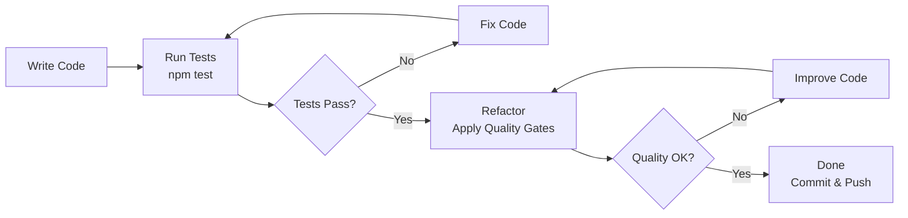
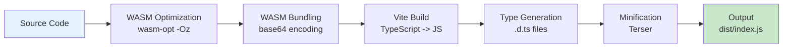
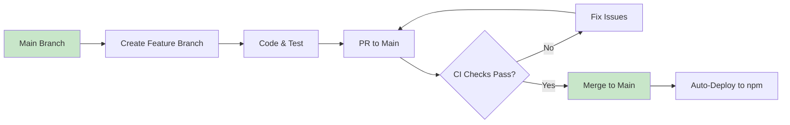

# Build and Run Guide

**Project**: web-sqlite-js
**Version**: 1.1.2
**Last Updated**: 2025-01-09
**Status**: Production

---

## Overview

This guide defines the **mandatory build workflow** and **development standards** for the web-sqlite-js project. All contributors MUST follow these rules to ensure code quality, consistency, and maintainability.

### Quick Start

```bash
# Clone and setup
git clone https://github.com/wuchuheng/web-sqlite-js.git
cd web-sqlite-js
npm install

# Run tests
npm test

# Build library
npm run build

# Development mode (watch mode)
npm run build:watch
```

---

## 1. Build Workflow

### 1.1 Mandatory "Code -> Test -> Refactor" Loop

Every feature MUST follow this workflow:



**Rules**:

1. **Code**: Implement based on Stage 5 LLD (API contracts, module specs)
2. **Test**: Run unit + E2E tests immediately (Vitest + Playwright)
3. **Refactor**: Apply quality gates (max 30 lines/function, max 3 nesting levels)
4. **Evidence**: No code is "done" until tests pass

### 1.2 Build Commands

| Command               | Purpose                             | When to Use        |
| --------------------- | ----------------------------------- | ------------------ |
| `npm run build`       | Production build (minified)         | Before publishing  |
| `npm run build:dev`   | Development build (with sourcemaps) | Local debugging    |
| `npm run build:watch` | Watch mode (auto-rebuild)           | Active development |
| `npm run lint`        | Lint and format code                | Before committing  |
| `npm run typecheck`   | TypeScript type checking            | Before committing  |

### 1.3 Build Pipeline



**Build Stages**:

1. **WASM Optimization** (prebuild hook)

    - Optimizes SQLite WASM binary with `wasm-opt -Oz`
    - Compresses with gzip and base64-encodes
    - Outputs to `src/jswasm/wasm-asset.js`

2. **Vite Build**

    - Compiles TypeScript to ES modules
    - Bundles WASM asset inline
    - Generates type definitions

3. **Minification** (production only)
    - Terser optimization (3 passes)
    - Dead code elimination
    - Sourcemap generation (optional)

---

## 2. Development Workflow

### 2.1 Git Workflow: Trunk-Based Development



**Rules**:

-   **Main branch** is always deployable
-   **Short-lived feature branches** (max 2-3 days)
-   **Pull requests required** for all changes
-   **CI checks must pass** before merging
-   **No long-lived branches** (no GitFlow)

### 2.2 Conventional Commits (Mandatory)

**Format**: `<type>: <description>`

**Types**:

-   `feat`: New feature (user-facing)
-   `fix`: Bug fix (user-facing)
-   `refactor`: Code refactoring (no user impact)
-   `test`: Test updates
-   `docs`: Documentation changes
-   `chore`: Build/config changes

**Examples**:

```bash
feat: add support for transaction batching
fix: resolve race condition in mutex queue
refactor: extract release manager into separate module
test: add E2E tests for rollback operations
docs: update API documentation for query method
chore: upgrade vite to v7.2.7
```

**STRICT PROHIBITION**: NO AI watermarks in commits

-   ❌ "Assistant: added feature"
-   ❌ "AI-generated: fix bug"
-   ✅ "feat: add support for batch queries"

### 2.3 Branch Naming

```bash
feat/feature-name
fix/bug-description
refactor/module-name
agent-docs/documentation-update
```

---

## 3. Coding Standards

### 3.1 Code Quality Gates

**Mandatory Rules**:

| Rule                        | Limit    | Rationale            |
| --------------------------- | -------- | -------------------- |
| Max lines per function      | 30       | Maintainability      |
| Max nesting levels          | 3        | Complexity control   |
| Max parameters per function | 4        | Use objects for more |
| Max function length         | 30 lines | Cognitive load       |

**Three-Phase Pattern** (Input -> Process -> Output):

```typescript
// ✅ GOOD: Clear phases
const processUser = async (userId: string): Promise<User> => {
    // PHASE 1: Input validation
    if (!userId || userId.trim() === "") {
        throw new Error("Invalid userId");
    }

    // PHASE 2: Processing
    const userData = await fetchUser(userId);
    const processed = transformUser(userData);

    // PHASE 3: Output
    return processed;
};

// ❌ BAD: Mixed phases, no clear structure
const processUser = async (userId: string) => {
    if (!userId) throw new Error("Invalid userId");
    const data = await fetchUser(userId);
    if (!data) throw new Error("User not found");
    const result = transformUser(data);
    return result;
};
```

### 3.2 Functional Programming Preference

**Guidelines**:

1. **Pure functions over classes** where possible
2. **Composition over inheritance**
3. **Avoid side effects** in core logic
4. **Immutable data structures** (use `const`, avoid mutations)

```typescript
// ✅ GOOD: Pure function
const createMutex = () => {
    let queue: Promise<unknown> = Promise.resolve();

    return <T>(fn: () => Promise<T>): Promise<T> => {
        const next = queue.then(fn);
        queue = next.catch(() => {});
        return next;
    };
};

// ❌ BAD: Class with mutable state
class Mutex {
    private queue: Promise<unknown> = Promise.resolve();

    async run<T>(fn: () => Promise<T>): Promise<T> {
        // ...
    }
}
```

### 3.3 Vertical Slicing (One File Per Use-Case)

**Module Structure**:

```
src/
├── main.ts                       # Public API entry point
├── worker-bridge.ts              # Worker communication
├── worker.ts                     # Worker implementation
├── config/
│   └── config.ts                 # agent-docs/config constants
├── validations/
│   └── shareBufferAbiliCheck.ts  # SharedArrayBuffer check
├── release/                      # Release management
│   ├── constants.ts
│   ├── hash-utils.ts
│   ├── lock-utils.ts
│   ├── opfs-utils.ts
│   ├── release-manager.ts
│   ├── types.ts
│   └── version-utils.ts
├── utils/                         # Utilities
│   ├── logger.ts
│   └── mutex/
│       ├── mutex.ts
│       └── mutex.unit.test.ts
├── types/                         # Type definitions
│   ├── DB.ts
│   └── message.ts
└── jswasm/
    ├── sqlite3.d.ts
    ├── sqlite3.mjs
    └── sqlite3.wasm
```

**Rules**:

-   Split by feature/domain (e.g., `src/release/`, `src/utils/mutex/`)
-   Avoid monolithic service classes
-   Each module has isolated responsibilities
-   Co-locate tests with source (`*.unit.test.ts`)

---

## 4. Environment Setup

### 4.1 Prerequisites

```bash
# Node.js version
node --version  # v20+ recommended

# Verify WASM support
node -e "console.log('WASM supported')"
```

### 4.2 Dependencies

**Production Dependencies**: None (browser-only library)

**Dev Dependencies**:

```json
{
    "@vitest/browser": "^4.0.15",
    "@vitest/coverage-v8": "4.0.15",
    "@vitest/ui": "^4.0.15",
    "playwright": "^1.57.0",
    "typescript": "^5.9.3",
    "vite": "^7.2.7",
    "vitest": "^4.0.15"
}
```

### 4.3 IDE Configuration

**Recommended**: VSCode with extensions:

-   ESLint
-   Prettier
-   TypeScript Vue Plugin (Volar)
-   Vitest

**VSCode Settings** (`.vscode/settings.json`):

```json
{
    "typescript.tsdk": "node_modules/typescript/lib",
    "eslint.format.enable": true,
    "editor.formatOnSave": true,
    "editor.codeActionsOnSave": {
        "source.fixAll.eslint": true
    }
}
```

---

## 5. Local Development

### 5.1 Development Server

```bash
# Serve local files for testing (with COOP/COEP headers)
npm run http -- --port 8399

# Serve documentation
npm run http:docs
```

**Access**: http://localhost:8399

### 5.2 Testing Commands

| Command              | Purpose                                   | Environment     |
| -------------------- | ----------------------------------------- | --------------- |
| `npm test`           | Run all tests (build + lint + unit + E2E) | CI + Local      |
| `npm run test:unit`  | Unit tests only                           | Local           |
| `npm run test:e2e`   | E2E tests only                            | Local           |
| `npm run test:debug` | E2E tests in debug mode (no parallelism)  | Local debugging |

### 5.3 Debug Mode

**Enable Debug Logging**:

```typescript
import { openDB } from "web-sqlite-js";

const db = await openDB("mydb", {
  releases: [...],
  debug: true  // Enable debug logging
});
```

**Debug Output**:

-   SQL queries with syntax highlighting
-   Query execution timing
-   Worker message logs
-   Release operation logs

---

## 6. Code Review Process

### 6.1 PR Checklist

Before submitting a PR, ensure:

-   [ ] All tests pass (`npm test`)
-   [ ] Linting passes (`npm run lint`)
-   [ ] Type checking passes (`npm run typecheck`)
-   [ ] New features have tests (unit + E2E)
-   [ ] Documentation updated (if needed)
-   [ ] Commit messages follow conventions
-   [ ] No AI watermarks in commits

### 6.2 Review Criteria

Reviewers will check:

1. **Correctness**: Does it work as intended?
2. **Tests**: Are tests comprehensive?
3. **Code Quality**: Follows coding standards?
4. **Documentation**: Is it documented?
5. **Performance**: Any performance impact?

---

## 7. Troubleshooting

### 7.1 Build Failures

**Issue**: WASM optimization fails

```bash
Error: wasm-opt not found
```

**Solution**:

```bash
# Ensure binaryen is installed
npm install binaryen --save-dev
```

**Issue**: Type generation fails

```bash
Error: Cannot find type definitions
```

**Solution**:

```bash
# Clean build
rm -rf dist
npm run build
```

### 7.2 Test Failures

**Issue**: E2E tests fail with COOP/COEP errors

```bash
Error: SharedArrayBuffer is not defined
```

**Solution**:

-   Use `npm run http` for local testing (includes COOP/COEP headers)
-   Ensure headers are set in deployment

**Issue**: Tests timeout

```bash
Error: Test timeout exceeded
```

**Solution**:

-   Increase timeout in `vitest.e2e.config.ts`
-   Check for hanging promises or worker issues

---

## 8. Performance Benchmarks

### 8.1 Build Performance

| Operation         | Time | Notes            |
| ----------------- | ---- | ---------------- |
| WASM Optimization | ~2s  | One-time, cached |
| Type Checking     | ~5s  | Incremental      |
| Full Build        | ~10s | Production       |
| Full Test Suite   | ~30s | Unit + E2E       |

### 8.2 Runtime Performance

| Operation                | Time      | Benchmark  |
| ------------------------ | --------- | ---------- |
| Database Load (50MB)     | <100ms    | Cold start |
| Query Execution          | 0.2-0.5ms | Average    |
| Transaction Throughput   | 1000+/sec | Sustained  |
| Worker Message Roundtrip | <1ms      | In-memory  |

---

## 9. References

### Internal Documentation

-   [API Contracts](../05-design/01-contracts/01-api.md) - Public API specifications
-   [Module LLDs](../05-design/03-modules/) - Implementation details
-   [ADR-0006: TypeScript Type System](../04-adr/0006-typescript-type-system.md) - Type system decisions

### External Resources

-   [Vite Documentation](https://vitejs.dev/)
-   [Vitest Documentation](https://vitest.dev/)
-   [TypeScript Handbook](https://www.typescriptlang.org/agent-docs/)
-   [WebAssembly](https://webassembly.org/)
-   [OPFS Specification](https://fs.spec.whatwg.org/)

---

## Navigation

**Previous**: [Module LLDs](../05-design/03-modules/)

**Next**: [Test Plan](./02-test-plan.md)

**Up**: [Specification Index](../00-control/00-spec.md)
