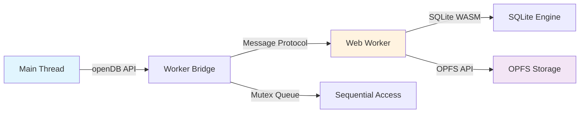

# 01 Roadmap

**Project**: web-sqlite-js
**Current Version**: 1.1.2 (Production)
**Last Updated**: 2025-01-09
**Status**: Production - Stable Release

---

## Overview

This roadmap documents the current state of web-sqlite-js v1.1.2, a production-ready SQLite database library for the web platform using WebAssembly and OPFS.

### Current State

**v1.1.2** is the current stable release, published to npm and deployed in production environments.

---

## 1. Current Release: v1.1.2

> **Status**: ✅ COMPLETE - Published to npm
> **Release Date**: 2025-01-09
> **Package**: https://www.npmjs.com/package/web-sqlite-js > **Documentation**: https://web-sqlite-js.wuchuheng.com

### What Was Delivered

**Core Database Features**:

-   ✅ Database open/close with OPFS persistent storage
-   ✅ SQL execution (exec) for INSERT, UPDATE, DELETE, CREATE
-   ✅ SQL querying (query) for SELECT with type-safe results
-   ✅ Parameterized queries (positional `?` and named `$name`)
-   ✅ SQL data types: NULL, INTEGER, TEXT, BLOB, REAL, FLOAT
-   ✅ Transaction support with auto COMMIT/ROLLBACK
-   ✅ Worker-based non-blocking architecture
-   ✅ Mutex queue for sequential operation execution

**Release Versioning System**:

-   ✅ Immutable release configuration with version history
-   ✅ SHA-256 hash validation for migration/seed SQL
-   ✅ OPFS directory structure with versioned subdirectories
-   ✅ Metadata database (release.sqlite3) tracking all versions
-   ✅ Automatic migration on database open
-   ✅ Release mode (immutable) vs Dev mode (mutable)
-   ✅ Atomic migration with rollback on failure

**Dev Tooling**:

-   ✅ `devTool.release()` - Create new dev versions
-   ✅ `devTool.rollback(version)` - Remove dev versions above target
-   ✅ Metadata lock for concurrent operation safety
-   ✅ Validation to prevent rollback below latest release

**TypeScript & Developer Experience**:

-   ✅ Full TypeScript type definitions
-   ✅ Generic query results: `query<T>(sql, params)`
-   ✅ Debug mode with SQL timing logs
-   ✅ Comprehensive error handling with stack traces

**Testing & Quality**:

-   ✅ E2E tests for all core operations
-   ✅ Unit tests for mutex implementation
-   ✅ 100% TypeScript coverage
-   ✅ Production build with WASM optimization

### Success Metrics (Achieved)

| Metric              | Target   | Achieved    |
| ------------------- | -------- | ----------- |
| P0 Requirements     | 48       | 48 ✅       |
| Success Criteria    | 31       | 31 ✅       |
| Test Pass Rate      | 100%     | 100% ✅     |
| TypeScript Coverage | 100%     | 100% ✅     |
| Documentation       | Complete | Complete ✅ |

### Technical Stack

**Browser APIs Used**:

-   Web Workers (non-blocking execution)
-   OPFS - Origin Private File System (persistent storage)
-   SharedArrayBuffer (zero-copy data transfer)
-   WebAssembly (SQLite engine)

**Build Tools**:

-   Vite 7.2.7
-   TypeScript 5.9.3
-   Vitest 4.0.15
-   Playwright 1.57.0
-   Binaryen 125.0.0 (wasm-opt)

**Deployment Requirements**:

-   COOP/COEP headers for SharedArrayBuffer
-   Secure context (HTTPS or localhost)
-   Chrome/Edge/Opera browsers (OPFS support)

### Known Limitations

**Browser Support**:

-   ✅ Chrome/Edge/Opera (OPFS support)
-   ❌ Safari/Firefox (no OPFS support)
-   ❌ IE/older browsers (no WASM support)

**Deployment Requirements**:

-   Requires COOP/COEP headers:
    ```
    Cross-Origin-Opener-Policy: same-origin
    Cross-Origin-Embedder-Policy: require-corp
    ```
-   Secure context required (HTTPS or localhost)
-   ~500KB-1MB bundle size (includes SQLite WASM)

**API Limitations**:

-   Single database connection per worker instance
-   No direct access to SQLite C API (WASM boundary)
-   Worker message serialization overhead

---

## 2. Maintenance Mode (v1.1.x)

**Status**: Active maintenance

**Scope**:

-   Bug fixes only (patch releases)
-   Documentation improvements
-   Performance optimizations (non-breaking)
-   Security updates
-   Community support

**No Breaking Changes**:

-   v1.1.x will maintain backward compatibility
-   No new features planned for v1.1.x
-   Patches only (v1.1.3, v1.1.4, etc.)

---

## 3. Release History

### v1.1.2 - 2025-01-09

**Status**: ✅ Current Production Release

**Changes**:

-   Production-ready release with all P0 features
-   Complete test coverage (unit + E2E)
-   Comprehensive documentation (32 documents across 7 stages)
-   Published to npm

### v1.1.0 - 2024

**Status**: ✅ Previous Release

**Changes**:

-   Initial stable release
-   Core SQLite operations
-   Release versioning system
-   Dev tooling

---

## 4. Current Architecture



**Component Overview**:

-   **Main Thread**: Public API (`openDB`, `query`, `exec`, `transaction`, `close`)
-   **Worker Bridge**: Message passing, promise management, mutex queue
-   **Web Worker**: SQLite WASM execution, OPFS integration
-   **OPFS Storage**: File-based persistent storage

---

## 5. File Structure

```
src/
├── main.ts                       # Public API entry point
├── worker-bridge.ts              # Worker communication
├── worker.ts                     # Web Worker implementation
├── config/
│   └── config.ts                 # agent-docs/config constants
├── validations/
│   └── shareBufferAbiliCheck.ts  # SharedArrayBuffer check
├── release/
│   ├── constants.ts              # SQL constants, version regex
│   ├── hash-utils.ts             # Release validation
│   ├── lock-utils.ts             # Metadata locking
│   ├── opfs-utils.ts             # OPFS file operations
│   ├── release-manager.ts        # Release versioning logic
│   ├── types.ts                  # Release domain types
│   └── version-utils.ts          # Version comparison
├── types/
│   ├── DB.ts                     # DBInterface, ReleaseConfig, types
│   └── message.ts                # Worker protocol types
├── utils/
│   ├── logger.ts                 # Debug logging
│   └── mutex/
│       ├── mutex.ts
│       └── mutex.unit.test.ts
└── jswasm/
    ├── sqlite3.d.ts
    ├── sqlite3.mjs
    └── sqlite3.wasm
```

---

## 6. Documentation

All project documentation is located in `agent-docs/`:

| Stage              | Documents | Description                                    |
| ------------------ | --------- | ---------------------------------------------- |
| **Control**        | 2         | Spec index, status board                       |
| **Discovery**      | 3         | Project brief, requirements, scope             |
| **Feasibility**    | 3         | Options analysis, risk assessment, spike plan  |
| **Architecture**   | 3         | HLD, data flow, deployment                     |
| **ADR**            | 7         | Architecture decision records                  |
| **Design**         | 8         | API contracts, events, errors, schema, modules |
| **Implementation** | 4         | Build, test, observability, release            |
| **Task Manager**   | 2         | Roadmap, task catalog                          |

**Total**: 32 comprehensive documents

---

## 7. Resources

**External Links**:

-   npm: https://www.npmjs.com/package/web-sqlite-js
-   Documentation: https://web-sqlite-js.wuchuheng.com
-   GitHub: https://github.com/wuchuheng/web-sqlite-js

**Internal Documentation**:

-   [Spec Index](../00-control/00-spec.md) - Complete documentation index
-   [Status Board](../00-control/01-status.md) - Live project status
-   [Task Catalog](./02-task-catalog.md) - Completed and pending tasks
-   [API Contracts](../05-design/01-contracts/01-api.md) - API reference

---

## Navigation

**Previous**: [Stage 6: Implementation Strategy](../06-implementation/04-release-and-rollback.md)

**Next**: [02 Task Catalog](./02-task-catalog.md)

**Up**: [Spec Index](../00-control/00-spec.md)
