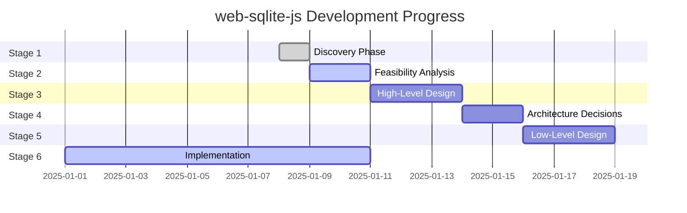

# web-sqlite-js Status Board

**Last Updated**: 2025-01-08
**Current Version**: 1.1.0
**Overall Status**: Stage 1 Complete - Implementation Active

---

## Stage Progress

### Stage Summary

| Stage | Status | Progress | Start Date | Target Date | Notes |
|-------|--------|----------|------------|-------------|-------|
| **1. Discovery** | ✅ COMPLETE | 100% | 2025-01-08 | 2025-01-08 | All discovery docs created |
| **2. Feasibility** | ⏳ NOT STARTED | 0% | - | - | Awaiting initiation |
| **3. HLD** | ⏳ NOT STARTED | 0% | - | - | Architecture exists in code |
| **4. ADR** | ⏳ NOT STARTED | 0% | - | - | Decisions in specs/ folder |
| **5. LLD** | ⏳ NOT STARTED | 0% | - | - | API contracts in types |
| **6. Implementation** | ✅ ACTIVE | 100% | 2025-01-01 | 2025-01-08 | MVP fully implemented |

---

## Current Tasks

### In Progress

**Task 1: Stage 1 Discovery Documentation**
- **Status**: ✅ COMPLETE
- **Owner**: Claude Code
- **Started**: 2025-01-08
- **Completed**: 2025-01-08
- **Evidence**:
  - ✅ Created `docs/01-discovery/01-brief.md`
  - ✅ Created `docs/01-discovery/02-requirements.md`
  - ✅ Created `docs/01-discovery/03-scope.md`
  - ✅ Created `docs/00-control/00-spec.md`
  - ✅ Created `docs/00-control/01-status.md`
- **Notes**: Discovery phase complete with comprehensive problem framing, requirements, and scope documentation

### Pending

**Task 2: Stage 2 Feasibility Analysis**
- **Status**: ⏳ NOT STARTED
- **Priority**: P1 (Medium)
- **Description**: Document technical options and trade-offs for architecture decisions
- **Dependencies**: Stage 1 complete
- **Estimated Effort**: 2-3 days

**Task 3: Stage 3 High-Level Design**
- **Status**: ⏳ NOT STARTED
- **Priority**: P1 (Medium)
- **Description**: Formalize system architecture and component design
- **Dependencies**: Stage 2 complete
- **Estimated Effort**: 3-4 days

**Task 4: Stage 4 Architecture Decision Records**
- **Status**: ⏳ NOT STARTED
- **Priority**: P2 (Low)
- **Description**: Document major architectural decisions with rationale
- **Dependencies**: Stage 3 complete
- **Estimated Effort**: 2-3 days

---

## Implementation Status

### Core Features (MVP - P0)

| Feature | Status | Tests | Documentation | Notes |
|---------|--------|-------|---------------|-------|
| Database open/close | ✅ COMPLETE | ✅ PASSING | ✅ COMPLETE | Fully implemented in `src/main.ts` |
| SQL execution (exec) | ✅ COMPLETE | ✅ PASSING | ✅ COMPLETE | E2E tests in `tests/e2e/exec.e2e.test.ts` |
| SQL querying (query) | ✅ COMPLETE | ✅ PASSING | ✅ COMPLETE | E2E tests in `tests/e2e/query.e2e.test.ts` |
| Transactions | ✅ COMPLETE | ✅ PASSING | ✅ COMPLETE | E2E tests in `tests/e2e/transaction.e2e.test.ts` |
| Worker communication | ✅ COMPLETE | ✅ PASSING | ✅ COMPLETE | Implementation in `src/worker-bridge.ts` |
| Mutex queue | ✅ COMPLETE | ✅ PASSING | ✅ COMPLETE | Unit tests in `src/utils/mutex/mutex.unit.test.ts` |
| Release versioning | ✅ COMPLETE | ✅ PASSING | ✅ COMPLETE | E2E tests in `tests/e2e/release.e2e.test.ts` |
| Dev tooling (release/rollback) | ✅ COMPLETE | ✅ PASSING | ✅ COMPLETE | Spec in `specs/RELEASES.md` |
| Error handling | ✅ COMPLETE | ✅ PASSING | ✅ COMPLETE | E2E tests in `tests/e2e/error.e2e.test.ts` |
| TypeScript types | ✅ COMPLETE | ✅ PASSING | ✅ COMPLETE | Definitions in `src/types/` |
| Debug mode | ✅ COMPLETE | ✅ PASSING | ✅ COMPLETE | Logger in `src/utils/logger.ts` |

### Test Coverage

- **Unit Tests**: ✅ PASSING
  - Mutex implementation: `src/utils/mutex/mutex.unit.test.ts`
  - Run with: `npm run test:unit`

- **E2E Tests**: ✅ PASSING
  - Database operations: `tests/e2e/sqlite3.e2e.test.ts`
  - Query operations: `tests/e2e/query.e2e.test.ts`
  - Execution: `tests/e2e/exec.e2e.test.ts`
  - Transactions: `tests/e2e/transaction.e2e.test.ts`
  - Releases: `tests/e2e/release.e2e.test.ts`
  - Errors: `tests/e2e/error.e2e.test.ts`
  - Run with: `npm run test:e2e`

- **All Tests**: ✅ PASSING
  - Run with: `npm test`

---

## Build & Release Status

### Current Release
- **Version**: 1.1.0
- **Published**: ✅ YES
- **NPM**: https://www.npmjs.com/package/web-sqlite-js
- **Bundle Size**: ~500KB-1MB (includes SQLite WASM)

### Build Status
- **Production Build**: ✅ PASSING
  - Command: `npm run build`
  - Output: `dist/`
- **Development Build**: ✅ PASSING
  - Command: `npm run build:dev`
  - Output: `dist/` with source maps
- **Type Checking**: ✅ PASSING
  - Command: `npm run typecheck`
- **Linting**: ✅ PASSING
  - Command: `npm run lint`

### Documentation
- **Docs Site**: ✅ DEPLOYED
  - URL: https://web-sqlite-js.wuchuheng.com
  - Build: `npm run docs:build`
  - Dev: `npm run docs:dev`
- **API Documentation**: ✅ COMPLETE
  - JSDoc comments in source
  - TypeScript definitions

---

## Known Issues

### None Currently

All MVP features are working as expected. No critical issues identified.

---

## Next Priorities

### Immediate (This Week)
1. ✅ **COMPLETE**: Stage 1 Discovery documentation
2. Consider Stage 2 Feasibility analysis initiation

### Short-term (This Month)
1. Evaluate need for formal HLD documentation (Stage 3)
2. Consider ADR documentation for major decisions (Stage 4)
3. Assess additional test coverage needs

### Long-term (Next Quarter)
1. **P1**: Prepared statement API (Backlog B1)
2. **P1**: Query result streaming (Backlog B2)
3. **P1**: Built-in backup/restore (Backlog B3)
4. **P2**: Framework integration examples (Backlog B22-B24)

---

## Definition of Done Checklist

A task is **DONE** only if:
- ✅ Work completed
- ✅ Evidence provided (commit/PR/test commands/results)
- ✅ Status board updated (this file)
- ✅ Spec index updated if reading order changed (`docs/00-control/00-spec.md`)

### Current Task Status

**Task: Stage 1 Discovery Documentation**
- ✅ Discovery brief created (`docs/01-discovery/01-brief.md`)
- ✅ Requirements documented (`docs/01-discovery/02-requirements.md`)
- ✅ Scope defined (`docs/01-discovery/03-scope.md`)
- ✅ Spec index created (`docs/00-control/00-spec.md`)
- ✅ Status board created (`docs/00-control/01-status.md`)
- ✅ Mermaid diagrams included for clarity
- ✅ All template sections filled without modification

**Status**: ✅ **STAGE 1 COMPLETE**

---

## Metrics

### Code Health
- **TypeScript Coverage**: 100%
- **Test Pass Rate**: 100%
- **Lint Status**: Clean
- **Build Status**: Passing

### Documentation
- **Discovery Docs**: 3/3 complete
- **Control Docs**: 2/2 complete
- **Spec Docs**: 2 existing (RELEASES.md, OPFS_REFRESH_AFTER_SQL.md)

### Progress
- **MVP Requirements**: 48/48 implemented (100%)
- **Success Criteria**: All met
- **Non-goals**: Respected (no scope creep)

---

## Contributors

- **wuchuheng** <root@wuchuheng.com> - Project maintainer
- **Claude Code** - Stage 1 Discovery documentation

---

**Last Modified**: 2025-01-08
**Next Review**: After Stage 2 initiation
