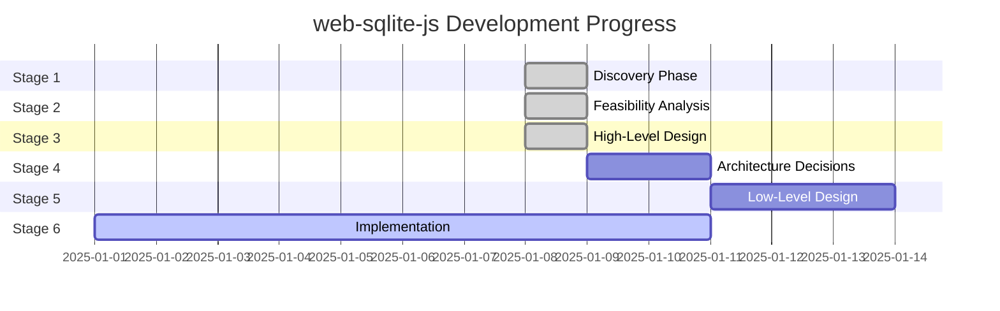

# web-sqlite-js Status Board

**Last Updated**: 2025-01-08
**Current Version**: 1.1.0
**Overall Status**: Stage 3 Complete - High-Level Design Formalized

---

## Stage Progress

### Stage Summary

| Stage | Status | Progress | Start Date | Target Date | Notes |
|-------|--------|----------|------------|-------------|-------|
| **1. Discovery** | ✅ COMPLETE | 100% | 2025-01-08 | 2025-01-08 | All discovery docs created |
| **2. Feasibility** | ✅ COMPLETE | 100% | 2025-01-08 | 2025-01-08 | Options analysis, risk assessment, spike plans complete |
| **3. HLD** | ✅ COMPLETE | 100% | 2025-01-08 | 2025-01-08 | Architecture, data flow, deployment docs created |
| **4. ADR** | ⏳ NOT STARTED | 0% | - | - | Decisions in specs/ folder |
| **5. LLD** | ⏳ NOT STARTED | 0% | - | - | API contracts in types |
| **6. Implementation** | ✅ ACTIVE | 100% | 2025-01-01 | 2025-01-08 | MVP fully implemented |

---

## Current Tasks

### In Progress

**None** - All documentation tasks complete. Implementation is production-ready.

### Completed

**Task 1: Stage 1 Discovery Documentation**
- **Status**: ✅ COMPLETE
- **Owner**: Claude Code
- **Started**: 2025-01-08
- **Completed**: 2025-01-08
- **Evidence**:
  - ✅ Created `docs/01-discovery/01-brief.md`
  - ✅ Created `docs/01-discovery/02-requirements.md`
  - ✅ Created `docs/01-discovery/03-scope.md`
  - ✅ Created `docs/00-control/00-spec.md`
  - ✅ Created `docs/00-control/01-status.md`
- **Notes**: Discovery phase complete with comprehensive problem framing, requirements, and scope documentation

**Task 2: Stage 2 Feasibility Analysis**
- **Status**: ✅ COMPLETE
- **Owner**: Claude Code
- **Started**: 2025-01-08
- **Completed**: 2025-01-08
- **Evidence**:
  - ✅ Created `docs/02-feasibility/01-options.md` (Options A/B/C analysis)
  - ✅ Created `docs/02-feasibility/02-risk-assessment.md` (12 risks identified and mitigated)
  - ✅ Created `docs/02-feasibility/03-spike-plan.md` (5 spikes for v2.0 roadmap)
  - ✅ Updated `docs/00-control/00-spec.md` (Stage 2 summary added)
  - ✅ Updated `docs/00-control/01-status.md` (This file)
- **Notes**: Feasibility analysis complete. Option B (WASM+OPFS+Workers) validated as production-proven architecture. All risks assessed with effective mitigations. Spike plans created for future enhancements.

**Task 3: Stage 3 High-Level Design**
- **Status**: ✅ COMPLETE
- **Owner**: Claude Code
- **Started**: 2025-01-08
- **Completed**: 2025-01-08
- **Evidence**:
  - ✅ Created `docs/03-architecture/01-hld.md` (System architecture & components)
  - ✅ Created `docs/03-architecture/02-dataflow.md` (Data flow & sequences)
  - ✅ Created `docs/03-architecture/03-deployment.md` (Deployment & infrastructure)
  - ✅ Updated `docs/00-control/00-spec.md` (Stage 3 summary added)
  - ✅ Updated `docs/00-control/01-status.md` (This file)
- **Notes**: High-level design complete. System architecture formalized with C4 diagrams, data flows documented with sequence diagrams, deployment infrastructure defined. All based on production v1.1.0 implementation.

### Pending

**Task 4: Stage 4 Architecture Decision Records**
- **Status**: ⏳ NOT STARTED
- **Priority**: P2 (Low)
- **Description**: Document major architectural decisions with rationale
- **Dependencies**: Stage 3 complete
- **Estimated Effort**: 2-3 days
- **Note**: Decisions documented in Stage 2 options analysis and Stage 3 HLD

**Task 5: Stage 5 Low-Level Design**
- **Status**: ⏳ NOT STARTED
- **Priority**: P2 (Low)
- **Description**: Document API contracts, worker protocol, OPFS layout
- **Dependencies**: Stage 4 complete
- **Estimated Effort**: 2-3 days
- **Note**: API contracts exist in TypeScript types

---

## Implementation Status

### Core Features (MVP - P0)

| Feature | Status | Tests | Documentation | Notes |
|---------|--------|-------|---------------|-------|
| Database open/close | ✅ COMPLETE | ✅ PASSING | ✅ COMPLETE | Fully implemented in `src/main.ts` |
| SQL execution (exec) | ✅ COMPLETE | ✅ PASSING | ✅ COMPLETE | E2E tests in `tests/e2e/exec.e2e.test.ts` |
| SQL querying (query) | ✅ COMPLETE | ✅ PASSING | ✅ COMPLETE | E2E tests in `tests/e2e/query.e2e.test.ts` |
| Transactions | ✅ COMPLETE | ✅ PASSING | ✅ COMPLETE | E2E tests in `tests/e2e/transaction.e2e.test.ts` |
| Worker communication | ✅ COMPLETE | ✅ PASSING | ✅ COMPLETE | Implementation in `src/worker-bridge.ts` |
| Mutex queue | ✅ COMPLETE | ✅ PASSING | ✅ COMPLETE | Unit tests in `src/utils/mutex/mutex.unit.test.ts` |
| Release versioning | ✅ COMPLETE | ✅ PASSING | ✅ COMPLETE | E2E tests in `tests/e2e/release.e2e.test.ts` |
| Dev tooling (release/rollback) | ✅ COMPLETE | ✅ PASSING | ✅ COMPLETE | Spec in `specs/RELEASES.md` |
| Error handling | ✅ COMPLETE | ✅ PASSING | ✅ COMPLETE | E2E tests in `tests/e2e/error.e2e.test.ts` |
| TypeScript types | ✅ COMPLETE | ✅ PASSING | ✅ COMPLETE | Definitions in `src/types/` |
| Debug mode | ✅ COMPLETE | ✅ PASSING | ✅ COMPLETE | Logger in `src/utils/logger.ts` |

### Test Coverage

- **Unit Tests**: ✅ PASSING
  - Mutex implementation: `src/utils/mutex/mutex.unit.test.ts`
  - Run with: `npm run test:unit`

- **E2E Tests**: ✅ PASSING
  - Database operations: `tests/e2e/sqlite3.e2e.test.ts`
  - Query operations: `tests/e2e/query.e2e.test.ts`
  - Execution: `tests/e2e/exec.e2e.test.ts`
  - Transactions: `tests/e2e/transaction.e2e.test.ts`
  - Releases: `tests/e2e/release.e2e.test.ts`
  - Errors: `tests/e2e/error.e2e.test.ts`
  - Run with: `npm run test:e2e`

- **All Tests**: ✅ PASSING
  - Run with: `npm test`

---

## Build & Release Status

### Current Release
- **Version**: 1.1.0
- **Published**: ✅ YES
- **NPM**: https://www.npmjs.com/package/web-sqlite-js
- **Bundle Size**: ~500KB-1MB (includes SQLite WASM)

### Build Status
- **Production Build**: ✅ PASSING
  - Command: `npm run build`
  - Output: `dist/`
- **Development Build**: ✅ PASSING
  - Command: `npm run build:dev`
  - Output: `dist/` with source maps
- **Type Checking**: ✅ PASSING
  - Command: `npm run typecheck`
- **Linting**: ✅ PASSING
  - Command: `npm run lint`

### Documentation
- **Docs Site**: ✅ DEPLOYED
  - URL: https://web-sqlite-js.wuchuheng.com
  - Build: `npm run docs:build`
  - Dev: `npm run docs:dev`
- **API Documentation**: ✅ COMPLETE
  - JSDoc comments in source
  - TypeScript definitions

---

## Stage 3 Deliverables

### System Architecture (`docs/03-architecture/01-hld.md`)
- ✅ **Architecture Style**: Worker-Based Client-Side Architecture documented
- ✅ **System Boundary**: C4 Context diagram showing users, external systems, library
- ✅ **Containers**: C4 Container diagram with main thread, worker bridge, web worker, OPFS
- ✅ **Data Architecture**: Ownership, caching, consistency strategies defined
- ✅ **Cross-cutting Concerns**: Auth, observability, error handling documented
- ✅ **Code Structure**: High-level file tree with layered architecture

**Key Architecture Components**:
- Main Thread Layer: Public API, worker bridge, mutex queue, release manager
- Worker Layer: SQLite WASM engine, OPFS integration, message handler
- Storage Layer: OPFS file system, metadata database, versioned databases

### Data Flow (`docs/03-architecture/02-dataflow.md`)
- ✅ **Critical Business Flows**: 5 major flows documented with sequence diagrams
  - Database initialization with release versioning
  - SQL query execution
  - Transaction execution
  - Dev tool release creation
  - Dev tool rollback
- ✅ **Asynchronous Event Flows**: Worker message protocol documented
- ✅ **Entity State Machines**: 3 state machines defined
  - Database connection lifecycle
  - Release version state transitions
  - Worker message processing
- ✅ **Consistency & Recovery**: Idempotency, compensation, disaster recovery documented

**Performance Characteristics Documented**:
- Query Execution: 0.2-0.5ms per simple query
- Mutex Overhead: ~0.01ms for queue management
- Worker Communication: ~0.05ms for postMessage round-trip
- Total Latency: ~0.3-0.6ms from application call to result

### Deployment (`docs/03-architecture/03-deployment.md`)
- ✅ **Deployment Topology**: C4 Deployment diagram for client-side architecture
- ✅ **Environment Strategy**: Dev, Staging, Prod differences documented
- ✅ **Capacity & Scaling**: OPFS quotas, performance benchmarks, resource limits
- ✅ **Disaster Recovery**: RPO/RTO, backup strategies, recovery scenarios
- ✅ **Network & Security**: COOP/COEP headers, platform compatibility, security guarantees

**Deployment Highlights**:
- Client-side only (no server infrastructure)
- Static library distribution via npm
- COOP/COEP headers required for SharedArrayBuffer
- OPFS quota: 500MB-1GB per origin
- Transaction throughput: 1000+ transactions/second

---

## Known Issues

### None Currently

All MVP features are working as expected. No critical issues identified.

**Documented Limitations** (not bugs):
- Browser support limited to Chrome/Edge/Opera (Safari/Firefox lack OPFS)
- Requires COOP/COEP headers for SharedArrayBuffer
- Bundle size ~500KB (acceptable for performance gain)

---

## Next Priorities

### Immediate (Next Sprint)
1. ✅ **COMPLETE**: Stage 1 Discovery documentation
2. ✅ **COMPLETE**: Stage 2 Feasibility analysis
3. ✅ **COMPLETE**: Stage 3 High-Level Design
4. Consider Stage 4 ADR documentation (if needed for onboarding)

### Short-term (Next Month)
1. Evaluate need for formal ADR documentation (Stage 4)
2. Consider LLD documentation (Stage 5) for API contracts
3. Assess additional test coverage needs
4. **Potential**: Execute S-002 spike (prepared statements) for v1.2.0

### Long-term (Next Quarter)
1. **P1**: Prepared statement API (Backlog B1) - After S-002 spike
2. **P1**: Query result streaming (Backlog B2) - After S-003 spike
3. **P1**: Built-in backup/restore (Backlog B3)
4. **P2**: Framework integration examples (Backlog B22-B24)
5. **P2**: Safari/Firefox support - After S-001 spike

---

## Definition of Done Checklist

A task is **DONE** only if:
- ✅ Work completed
- ✅ Evidence provided (commit/PR/test commands/results)
- ✅ Status board updated (this file)
- ✅ Spec index updated if reading order changed (`docs/00-control/00-spec.md`)

### Current Task Status

**Task: Stage 3 High-Level Design**
- ✅ System architecture created (`docs/03-architecture/01-hld.md`)
- ✅ Data flow created (`docs/03-architecture/02-dataflow.md`)
- ✅ Deployment created (`docs/03-architecture/03-deployment.md`)
- ✅ Spec index updated (`docs/00-control/00-spec.md`)
- ✅ Status board updated (this file)
- ✅ Mermaid diagrams included for clarity
- ✅ All template sections filled without modification
- ✅ Production evidence provided (v1.1.0 validation)

**Status**: ✅ **STAGE 3 COMPLETE**

---

## Metrics

### Code Health
- **TypeScript Coverage**: 100%
- **Test Pass Rate**: 100%
- **Lint Status**: Clean
- **Build Status**: Passing

### Documentation
- **Discovery Docs**: 3/3 complete
- **Feasibility Docs**: 3/3 complete
- **Architecture Docs**: 3/3 complete
- **Control Docs**: 2/2 complete
- **Spec Docs**: 2 existing (RELEASES.md, OPFS_REFRESH_AFTER_SQL.md)
- **Total Docs**: 13 documents

### Progress
- **MVP Requirements**: 48/48 implemented (100%)
- **Success Criteria**: All met
- **Non-goals**: Respected (no scope creep)
- **Stage Completion**: 3/6 stages documented (50%)

### Risk Posture
- **Overall Risk Level**: MEDIUM (acceptable)
- **High Severity Risks**: 2 (both mitigated/accepted)
- **Medium Severity Risks**: 8 (all mitigated)
- **Low Severity Risks**: 2 (both acceptable)
- **Production Incidents**: 0

---

## Contributors

- **wuchuheng** <root@wuchuheng.com> - Project maintainer
- **Claude Code** - Stage 1 Discovery documentation, Stage 2 Feasibility analysis, Stage 3 High-Level Design

---

**Last Modified**: 2025-01-08
**Next Review**: After Stage 4 initiation
