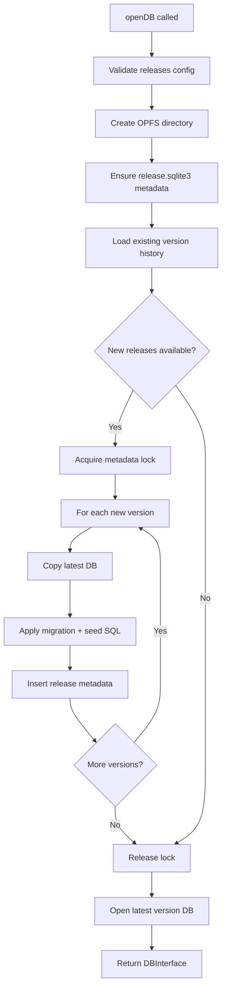

# 01 Brief

## 1) Problem statement

Web applications need robust, persistent client-side data storage that can handle complex relational data without relying on server-side databases. Existing browser storage solutions (LocalStorage, SessionStorage, IndexedDB) have significant limitations:

- **Limited query capabilities**: No SQL support, requiring complex application-level query logic
- **Size constraints**: LocalStorage capped at ~5-10MB
- **Lack of relational features**: No joins, transactions, or complex schema management
- **Developer complexity**: IndexedDB has a difficult, callback-based API
- **No migration system**: No built-in way to manage schema evolution over time

Developers building offline-first applications, progressive web apps (PWAs), and data-intensive browser tools need a full-featured SQL database that runs entirely in the browser.

## 2) Target users

### Primary users

- **Frontend web developers** building offline-first or data-intensive web applications
- **PWA developers** requiring reliable local data persistence
- **Web application developers** needing complex querying and relational data management
- **Internal tool builders** creating browser-based data management interfaces

### Secondary users

- **Full-stack developers** prototyping applications with client-side databases
- **Educators** teaching SQL and database concepts in the browser
- **Data analysts** needing local data processing capabilities

### Technical context

Users are comfortable with:

- JavaScript/TypeScript
- SQL fundamentals
- Modern build tools (Vite, Webpack, etc.)
- Setting HTTP headers (COOP/COEP)

## 3) Proposed solution

**web-sqlite-js** is a friendly, out-of-the-box SQLite database for the web that provides:

- **Full SQLite engine** compiled to WebAssembly, running in a Web Worker
- **OPFS-based persistence** using the Origin Private File System for robust, high-performance storage
- **Non-blocking architecture** with all database operations running off the main thread
- **Type-safe API** with full TypeScript support
- **Release versioning system** for managing database migrations and schema evolution
- **Dev tooling** for testing migrations and rolling back changes
- **Transaction support** with automatic rollback on errors
- **Simple API** that abstracts away worker communication complexity

### Key differentiators

1. **Zero-setup persistence**: Database files are automatically stored in OPFS
2. **Migration-first design**: Built-in release system for schema versioning
3. **Developer experience**: Simple Promise-based API, no callback hell
4. **Production-ready**: Mutex-based concurrency control, comprehensive error handling
5. **Browser-native**: No server required, works entirely client-side

## 4) Success metrics

### Usage metrics

- Successful database initialization in supported browsers
- SQL queries execute and return correct results
- Database persists across browser sessions and page reloads

### Functional metrics

- Release migrations apply correctly and atomically
- Dev tooling (release/rollback) functions as specified
- Transactions maintain ACID properties within browser constraints
- Debug mode provides useful SQL execution logs

### Developer experience metrics

- API is intuitive and requires minimal documentation reading
- Error messages are clear and actionable
- TypeScript types provide accurate autocomplete and type checking
- Integration with modern build tools works seamlessly

### Technical metrics

- No main thread blocking during database operations
- Memory usage remains within reasonable browser limits
- COOP/COEP header requirements are clearly documented
- Bundle size remains competitive (< 1MB minified)

## 5) High-level context

### Technical architecture

```
┌─────────────────────────────────────────────────────────────┐
│                      Browser Environment                     │
├─────────────────────────────────────────────────────────────┤
│                                                               │
│  ┌──────────────────┐         ┌──────────────────────┐     │
│  │   Main Thread    │         │    Web Worker        │     │
│  │                  │         │                      │     │
│  │  ┌────────────┐  │         │  ┌────────────────┐  │     │
│  │  │ openDB()   │  │         │  │  SQLite WASM   │  │     │
│  │  │    API     │  │◄───────►│  │     Engine     │  │     │
│  │  └─────┬──────┘  │ PostMsg │  │                │  │     │
│  │        │         │         │  └───────┬────────┘  │     │
│  │  ┌─────▼──────┐  │         │          │            │     │
│  │  │   Mutex    │  │         │  ┌───────▼────────┐  │     │
│  │  │ (Queue)    │  │         │  │  OPFS Storage  │  │     │
│  │  └────────────┘  │         │  │  - .sqlite3    │  │     │
│  └──────────────────┘         │  │  - metadata    │  │     │
│                                │  └────────────────┘  │     │
│                                └──────────────────────┘     │
│                                                               │
└─────────────────────────────────────────────────────────────┘
```

### Dependencies and constraints

- **Browser requirements**: Modern browsers with OPFS and SharedArrayBuffer support
- **HTTP headers**: COOP/COEP headers required for SharedArrayBuffer
- **Build tools**: Vite for bundling library and documentation
- **Testing**: Vitest for unit and E2E tests, Playwright for browser automation
- **SQLite**: Vendored WASM build of SQLite 3

### Release versioning flow



### Current status

The project is **actively developed and production-ready** with:

- Core SQLite functionality fully implemented
- Release versioning system operational
- Comprehensive test coverage (unit + E2E)
- Documentation site deployed at https://web-sqlite-js.wuchuheng.com
- Version 1.1.0 published to npm

---

## Navigation

**Next in Series**: [02 Requirements](./02-requirements.md) - MVP requirements, success criteria, and non-goals

**Related Discovery Documents**:

- [03 Scope & Glossary](./03-scope.md) - Scope boundaries and terminology
- [Back to Spec Index](../00-control/00-spec.md)

**Continue to**: [Stage 2: Feasibility Analysis](../02-feasibility/01-options.md) - Technical options and recommendations
