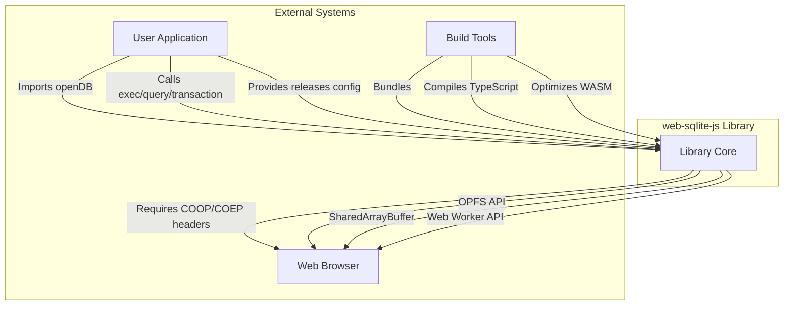

# 03 Scope & Glossary

## 1) In scope

### Core library functionality
- **IS1**: SQLite WASM engine integration via vendored sqlite3.js module
- **IS2**: Web Worker implementation for off-main-thread database operations
- **IS3**: Worker bridge for main thread ↔ worker communication
- **IS4**: Mutex-based operation queue for sequential execution
- **IS5**: OPFS file system operations for database storage
- **IS6**: Database open/close lifecycle management
- **IS7**: SQL execution (exec) for non-query statements
- **IS8**: SQL querying (query) for SELECT statements returning rows
- **IS9**: Transaction support with automatic commit/rollback
- **IS10**: Parameterized query support (positional and named)

### Release versioning system
- **IS11**: Release configuration validation and hashing
- **IS12**: OPFS directory structure for versioned databases
- **IS13**: Metadata database (release.sqlite3) for version tracking
- **IS14**: Automatic release application on database open
- **IS15**: Release hash validation for integrity checking
- **IS16**: Atomic version application with rollback on failure
- **IS17**: Dev tooling API (devTool.release, devTool.rollback)
- **IS18**: Metadata locking for release/rollback operations

### Type system and API
- **IS19**: TypeScript type definitions for all public APIs
- **IS20**: DBInterface with exec, query, transaction, close methods
- **IS21**: ReleaseConfig type for version configuration
- **IS22**: Generic query result types
- **IS23**: DevTool interface for development operations

### Error handling
- **IS24**: Input validation for all public APIs
- **IS25**: Worker error propagation to main thread
- **IS26**: SQL execution error handling
- **IS27**: Release/rollback validation errors
- **IS28**: Stack trace preservation across worker boundary

### Debug capabilities
- **IS29**: Debug mode for SQL execution logging
- **IS30**: Query timing measurements
- **IS31**: Parameter binding logging
- **IS32**: Console.debug output from worker

### Testing infrastructure
- **IS33**: Unit tests for utility functions (mutex, validation)
- **IS34**: E2E tests for core database operations
- **IS35**: E2E tests for release versioning
- **IS36**: E2E tests for dev tooling
- **IS37**: Browser automation via Playwright

### Build and distribution
- **IS38**: Vite build configuration for library bundling
- **IS39**: TypeScript compilation and declaration generation
- **IS40**: WASM optimization and base64 encoding
- **IS41**: NPM package publishing workflow
- **IS42**: Documentation site (VitePress)

## 2) Out of scope

### Database engine features
- **OS1**: Custom SQLite builds or modifications
- **OS2**: SQLite extensions beyond the core WASM build
- **OS3**: Multiple database connections in a single worker instance
- **OS4**: Cross-worker database sharing
- **OS5**: Server-side or Node.js environments

### API features
- **OS6**: Prepared statement reuse API
- **OS7**: Cursor-based result fetching
- **OS8**: Query result streaming
- **OS9**: Batch or bulk operation APIs
- **OS10**: Schema introspection APIs
- **OS11**: Direct file handle access to database files

### Release system features
- **OS12**: Automatic migration generation
- **OS13**: SQL normalization or formatting
- **OS14**: Automatic version pruning or cleanup
- **OS15**: Release branching strategies
- **OS16**: Downgrade migrations (rollback only)
- **OS17**: Migration reversal or "down" scripts
- **OS18**: Cross-database release dependencies

### Browser compatibility
- **OS19**: Browsers without OPFS support
- **OS20**: Browsers without SharedArrayBuffer support
- **OS21**: Legacy browser support (focus on modern browsers)
- **OS22**: Mobile web views or React Native

### Tooling and integrations
- **OS23**: Framework-specific integrations (React, Vue, etc.)
- **OS24**: ORM or query builder functionality
- **OS25**: State management library integrations
- **OS26**: GraphQL or REST API generation
- **OS27**: Migration CLI tools
- **OS28**: Database explorer UI (separate project)

### Documentation
- **OS29**: Framework-specific tutorials (as separate examples)
- **OS30**: Video tutorials or interactive guides
- **OS31**: API documentation in library bundle

## 3) Boundary (interfaces with outside world)

### External systems



### Browser APIs (required)
- **Origin Private File System (OPFS)**: `navigator.storage.getDirectory()`
- **Web Workers**: `new Worker()`, `postMessage()`, `onmessage`
- **SharedArrayBuffer**: Must be available (requires COOP/COEP headers)
- **Performance API**: `performance.now()` for query timing

### User application interfaces
```typescript
// Input: User provides
openDB(filename: string, options?: OpenDBOptions)

// Output: Library returns
interface DBInterface {
  exec(sql: string, params?: SQLParams): Promise<ExecResult>
  query<T>(sql: string, params?: SQLParams): Promise<T[]>
  transaction<T>(fn: TxCallback): Promise<T>
  close(): Promise<void>
  devTool: DevTool
}

// Configuration input
interface ReleaseConfig {
  version: string           // semver "x.x.x"
  migrationSQL: string      // SQL to apply
  seedSQL?: string | null   // Optional seed data
}
```

### Data sources
- **User application**: Provides SQL statements, parameters, release configurations
- **OPFS**: Stores database files and metadata
- **SQLite WASM**: Executes SQL and manages database files

### Outputs
- **Query results**: Arrays of objects representing database rows
- **Execution metadata**: Row counts, last insert IDs
- **Error objects**: Descriptive errors with stack traces
- **Debug logs**: Console.debug output with timing and parameters
- **OPFS files**: Database files, SQL files, metadata database

### Build system interfaces
- **Vite**: Bundling and building the library
- **TypeScript**: Type checking and declaration generation
- **Vitest**: Running unit and E2E tests
- **Playwright**: Browser automation for testing
- **VitePress**: Documentation site generation

### Constraints imposed by external systems
- **COOP/COEP headers**: Required by browser for SharedArrayBuffer
- **Same-origin policy**: Worker and main thread must share origin
- **OPFS quota**: Limited by browser storage quotas
- **WASM size**: SQLite WASM module affects bundle size
- **Browser compatibility**: Modern browsers only (Chrome, Firefox, Edge, Safari)

## 4) Glossary

| Term | Meaning |
|------|---------|
| **OPFS** | Origin Private File System - A browser API for storing files in a private, origin-specific storage area |
| **WASM** | WebAssembly - A binary instruction format for a stack-based virtual machine, used here to run SQLite in the browser |
| **SharedArrayBuffer** | A JavaScript API for sharing memory between workers, required by the SQLite WASM build |
| **COOP/COEP** | Cross-Origin-Opener-Policy and Cross-Origin-Embedder-Policy - HTTP headers required to enable SharedArrayBuffer |
| **Mutex** | Mutual exclusion primitive - Ensures only one operation executes at a time, preventing race conditions |
| **Release** | An immutable version of the database schema defined in the `releases` configuration |
| **Dev version** | A mutable version created via `devTool.release()` for testing and development |
| **Migration SQL** | SQL statements that transform the database schema from one version to another |
| **Seed SQL** | SQL statements that populate the database with initial or test data |
| **Metadata database** | A separate SQLite database (`release.sqlite3`) that tracks version history and hashes |
| **Active DB** | The currently open database connection representing the latest version |
| **Worker bridge** | Communication layer between main thread and Web Worker, handling message passing |
| **Parameterized query** | SQL query with placeholders (?) or named parameters ($name) for safe value binding |
| **Transaction** | A sequence of operations treated as a single atomic unit - all succeed or all fail |
| **Rollback** | Reverting to a previous database version, removing intermediate dev versions |
| **Hash validation** | Verifying SQL integrity by comparing SHA-256 hashes with stored metadata |
| **Semantic versioning** | Version format "x.x.x" (major.minor.patch) used for release versions |
| **Type-safe** | Code that enforces type correctness at compile time via TypeScript |
| **E2E test** | End-to-end test - Verifies complete workflows in a real browser environment |
| **Unit test** - Test that verifies individual functions or components in isolation |
| **Vite** | Build tool and development server for modern web applications |
| **Vitest** | Unit testing framework powered by Vite |
| **Playwright** | Browser automation framework for E2E testing |

## 5) Risks (early)

### Technical risks
- **R1**: **Browser compatibility changes** - Future browser updates may restrict SharedArrayBuffer or OPFS APIs
  - *Mitigation*: Monitor browser changelogs, provide clear documentation of requirements
- **R2**: **OPFS quota limits** - Users may hit storage limits with large databases
  - *Mitigation*: Document quota management, provide guidance for large datasets
- **R3**: **WASM bundle size** - SQLite WASM module is large (~500KB-1MB) affecting page load
  - *Mitigation*: Optimize WASM, use lazy loading, document size expectations
- **R4**: **Memory leaks** - Worker or file handle leaks could degrade performance
  - *Mitigation*: Comprehensive testing, proper cleanup in close() method

### API design risks
- **R5**: **Release system complexity** - Versioning system may be confusing for users
  - *Mitigation*: Clear documentation, examples, and error messages
- **R6**: **Type inference limitations** - Generic query types may not always infer correctly
  - *Mitigation*: Provide type casting examples, document limitations
- **R7**: **Error handling complexity** - Worker boundary errors may lose context
  - *Mitigation*: Preserve stack traces, provide error codes, document common errors

### Development risks
- **R8**: **Test flakiness** - E2E tests may be flaky due to timing or browser issues
  - *Mitigation*: Proper test isolation, retries, clear test data management
- **R9**: **Documentation drift** - Code changes may outpace documentation updates
  - *Mitigation*: Require documentation updates in PRs, automated type doc generation
- **R10**: **SQLite WASM updates** - Upstream SQLite WASM changes may break compatibility
  - *Mitigation*: Pin specific WASM version, test thoroughly before upgrades

### Adoption risks
- **R11**: **COOP/COEP header friction** - Required headers may be difficult for some users to configure
  - *Mitigation*: Provide server configuration examples for common platforms
- **R12**: **Learning curve** - Users unfamiliar with SQL or workers may struggle
  - *Mitigation*: Comprehensive tutorials, examples, and quick start guide
- **R13**: **Competing solutions** - Other browser databases (Dexie.js, PouchDB) may be preferred
  - *Mitigation*: Emphasize SQLite advantages, migration guides, unique features

### Security risks
- **R14**: **SQL injection** - Poorly constructed queries could introduce vulnerabilities
  - *Mitigation*: Strongly recommend parameterized queries, document security best practices
- **R15**: **OPFS access** - Malicious scripts could access database files
  - *Mitigation*: Document same-origin protections, user education

### Performance risks
- **R16**: **Large query results** - Big result sets could cause memory issues
  - *Mitigation*: Document pagination strategies, provide streaming examples (future)
- **R17**: **Mutex bottleneck** - Sequential operations may limit throughput
  - *Mitigation*: Document architecture, provide batch operation guidance (future)
- **R18**: **Worker overhead** - Message passing latency for small queries
  - *Mitigation*: Benchmark and document typical latencies, optimize for common cases

### Maintenance risks
- **R19**: **Single maintainer** - Project depends heavily on one developer
  - *Mitigation*: Encourage contributions, clear code structure, good documentation
- **R20**: **Time zone issues** - Global users may have delayed support
  - *Mitigation*: Async communication, comprehensive documentation, community support
