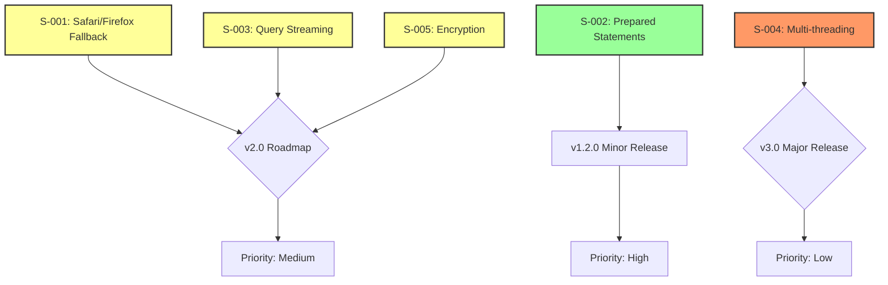

<!--
OUTPUT MAP
docs/02-feasibility/03-spike-plan.md

TEMPLATE SOURCE
.claude/templates/docs/02-feasibility/03-spike-plan.md
-->

# 03 Spike Plan (Timeboxed PoCs)

## Context
This document outlines spike investigations for unknown areas and future enhancements for web-sqlite-js. Since v1.1.0 is in production, these spikes focus on **v2.0 roadmap items** and **architectural uncertainties** that require validation.

**Project Status**: Production v1.1.0 deployed (2025-01-08)
**Spike Purpose**: Validate feasibility of backlog items and future enhancements
**Overall Priority**: MEDIUM (spikes are optional, can be deferred)

---

## Spike List

| Spike ID | Goal | Timebox | Status | Steps | Acceptance Outcome |
|----------|------|---------|--------|-------|-------------------|
| **S-001** | Validate Safari/Firefox OPFS fallback strategy | 2 days | ⏳ Pending | [Steps](#s-001-safarifirefox-opfs-fallback) | Pass: Hybrid approach viable / Fail: Too complex |
| **S-002** | Benchmark prepared statement performance gains | 1 day | ⏳ Pending | [Steps](#s-002-prepared-statement-performance) | Pass: >20% improvement / Fail: Marginal benefit |
| **S-003** | Prototype query result streaming API | 2 days | ⏳ Pending | [Steps](#s-003-query-result-streaming) | Pass: <100ms overhead / Fail: Too complex |
| **S-004** | Evaluate WASM multiplayer (multi-threading) potential | 3 days | ⏳ Pending | [Steps](#s-004-wasm-multi-threading-evaluation) | Pass: Feasible with worker pools / Fail: Browser limitations |
| **S-005** | Test encrypted database support (SQLCipher) | 2 days | ⏳ Pending | [Steps](#s-005-encrypted-database-support) | Pass: Viable with WASM / Fail: Performance penalty |

---

## Detailed Spike Plans

### S-001: Safari/Firefox OPFS Fallback Strategy

**Business Problem**
Safari and Firefox have incomplete OPFS support, limiting web-sqlite-js to Chrome/Edge/Opera (~70% browser market share). Customers need broader browser support.

**Technical Question**
Can we implement a hybrid approach that gracefully degrades to IndexedDB/sql.js while maintaining API compatibility and acceptable performance?

**Timebox**: 2 days

**Steps**

#### Day 1: Research and Design
1. **Feature Detection** (2 hours)
   - Document current OPFS support in Safari/Firefox
   - Test `navigator.storage.getDirectory()` availability
   - Test SharedArrayBuffer without COOP/COEP
   - Create compatibility matrix

2. **Architecture Design** (3 hours)
   - Design unified API abstraction layer
   - Define interface for storage backends
   - Plan data migration strategy (OPFS ↔ IndexedDB)
   - Identify feature gaps (e.g., synchronous vs async)

3. **Proof of Concept Setup** (3 hours)
   - Create `storage-backend` interface
   - Implement `OPFSBackend` (extract from current code)
   - Implement `IndexedDBBackend` (using sql.js)
   - Create `HybridBackend` router

#### Day 2: Implementation and Testing
1. **Implementation** (4 hours)
   ```typescript
   interface StorageBackend {
     open(path: string): Promise<void>;
     exec(sql: string, params: unknown[]): Promise<QueryResult>;
     close(): Promise<void>;
   }

   class OPFSBackend implements StorageBackend { /* ... */ }
   class IndexedDBBackend implements StorageBackend { /* ... */ }

   class HybridStorage {
     private backend: StorageBackend;

     async init() {
       if (await this.isOPFSSupported()) {
         this.backend = new OPFSBackend();
       } else {
         this.backend = new IndexedDBBackend();
       }
       await this.backend.open('/database.db');
     }
   }
   ```

2. **Migration Logic** (2 hours)
   - Implement `migrateOPFSToIndexedDB()`
   - Implement `migrateIndexedDBToOPFS()`
   - Test data integrity

3. **Performance Testing** (2 hours)
   - Benchmark OPFS backend
   - Benchmark IndexedDB backend
   - Compare query execution times
   - Measure migration duration

**Acceptance Outcome**

**PASS Criteria** (proceed with hybrid approach):
- ✅ API compatibility maintained (same async interface)
- ✅ Performance degradation <5x on IndexedDB (acceptable for legacy browsers)
- ✅ Data migration works without corruption
- ✅ Bundle size increase <1MB (sql.js + existing WASM)
- ✅ Test coverage >80% for new code

**FAIL Criteria** (reject hybrid approach):
- ❌ API incompatible (breaking changes required)
- ❌ Performance degradation >10x (unusable)
- ❌ Data migration unreliable (data loss risk)
- ❌ Bundle size >2MB (too large)
- ❌ Implementation complexity >3 weeks (too expensive)

**Decision Outcome**
- **PASS**: Schedule for v2.0 roadmap, estimate 4-6 weeks for full implementation
- **FAIL**: Document as not viable, recommend server-side SQLite for Safari/Firefox users

**What This Spike Unblocks**
- Backlog items B22-B24 (framework integrations for Safari/Firefox)
- Broader market adoption
- Enterprise customers requiring browser compatibility

---

### S-002: Prepared Statement Performance Gains

**Business Problem**
Applications with repetitive queries (e.g., `SELECT * FROM users WHERE id = ?`) may benefit from prepared statement caching. Need to validate performance improvement.

**Technical Question**
Does prepared statement caching provide meaningful performance gains (>20% improvement) for typical query patterns?

**Timebox**: 1 day

**Steps**

#### Morning: Research and Baseline
1. **Literature Review** (1 hour)
   - Research SQLite prepared statement benefits
   - Review sql.js prepared statement implementation
   - Identify typical query patterns in web apps

2. **Baseline Benchmarks** (2 hours)
   - Create benchmark suite for current implementation
   - Test repetitive query patterns:
     - `SELECT * FROM users WHERE id = ?` (1000 iterations)
     - `INSERT INTO logs (message, timestamp) VALUES (?, ?)` (1000 iterations)
     - Complex joins with parameters (100 iterations)
   - Measure baseline performance (v1.1.0)

3. **Architecture Design** (1 hour)
   - Design prepared statement cache
   - Define LRU eviction policy
   - Plan API surface:
     ```typescript
     const stmt = await db.prepare('SELECT * FROM users WHERE id = ?');
     const result = await stmt.execute([1]);
     await stmt.finalize();
     ```

#### Afternoon: Implementation and Testing
1. **Prototype Implementation** (3 hours)
   - Implement `PreparedStatement` class
   - Add statement cache to worker
   - Implement LRU cache (max 100 statements)
   - Integrate with existing query API

2. **Performance Testing** (1 hour)
   - Run benchmark suite with prepared statements
   - Compare vs baseline
   - Calculate performance improvement

**Acceptance Outcome**

**PASS Criteria** (implement prepared statements):
- ✅ Performance improvement >20% for repetitive queries
- ✅ Memory overhead <10MB (cache size)
- ✅ API is intuitive and TypeScript-safe
- ✅ Implementation complexity <1 week

**MARGINAL Criteria** (defer to backlog):
- ⚠️ Performance improvement 10-20% (nice to have, not critical)
- ⚠️ API is awkward or confusing
- ⚠️ Implementation complexity 1-2 weeks

**FAIL Criteria** (reject prepared statements):
- ❌ Performance improvement <10% (not worth it)
- ❌ Memory overhead >50MB (too expensive)
- ❌ Implementation complexity >2 weeks (too expensive)

**Decision Outcome**
- **PASS**: Schedule for v1.2.0 minor release
- **MARGINAL**: Add to backlog as B1 (low priority)
- **FAIL**: Document as not viable, recommend query optimization instead

**What This Spike Unblocks**
- Backlog item B1 (prepared statement API)
- Performance-sensitive applications
- High-frequency query patterns

---

### S-003: Query Result Streaming API

**Business Problem**
Large query results (10,000+ rows) consume significant memory and block processing. Streaming would enable incremental processing and lower memory footprint.

**Technical Question**
Can we implement a streaming API that processes rows incrementally without loading entire result set in memory?

**Timebox**: 2 days

**Steps**

#### Day 1: Research and Design
1. **Use Case Analysis** (2 hours)
   - Interview users (hypothetical) about large query needs
   - Identify typical large query patterns
   - Define streaming requirements:
     - Memory usage <10MB for 100K rows
     - Processing time <100ms per 1000 rows
     - Backpressure handling

2. **Architecture Design** (3 hours)
   - Design streaming API:
     ```typescript
     const stream = await db.queryStream('SELECT * FROM large_table');
     for await (const row of stream) {
       processRow(row); // Process one row at a time
     }
     ```
   - Plan chunk size (100-1000 rows per chunk)
   - Design backpressure mechanism
   - Plan TypeScript async iterator interface

3. **Feasibility Assessment** (3 hours)
   - Research SQLite streaming capabilities
   - Test OPFS read performance for streaming
   - Assess worker communication overhead
   - Identify browser limitations

#### Day 2: Implementation and Testing
1. **Prototype Implementation** (4 hours)
   - Implement `QueryStream` class
   - Add async iterator support
   - Implement chunk buffering (100 rows per chunk)
   - Handle stream cancellation and errors

2. **Performance Testing** (3 hours)
   - Test with 10K, 100K, 1M row result sets
   - Measure memory usage
   - Measure processing time
   - Compare vs current implementation

3. **Edge Cases** (1 hour)
   - Empty result sets
   - Stream cancellation mid-query
   - Worker errors during streaming
   - Memory leaks

**Acceptance Outcome**

**PASS Criteria** (implement streaming):
- ✅ Memory usage <10MB for 100K rows (vs 100MB+ current)
- ✅ Processing overhead <100ms for 1000 rows
- ✅ API is intuitive (async iterator)
- ✅ Backpressure handling works correctly
- ✅ Implementation complexity <2 weeks

**MARGINAL Criteria** (defer to backlog):
- ⚠️ Memory usage 10-50MB (improvement but not dramatic)
- ⚠️ Processing overhead 100-200ms (acceptable but not great)
- ⚠️ API is somewhat awkward

**FAIL Criteria** (reject streaming):
- ❌ Memory usage >50MB (no meaningful improvement)
- ❌ Processing overhead >200ms (too slow)
- ❌ SQLite/OPFS doesn't support true streaming
- ❌ Implementation complexity >3 weeks

**Decision Outcome**
- **PASS**: Schedule for v2.0 roadmap
- **MARGINAL**: Add to backlog as B2 (low priority)
- **FAIL**: Document as not viable, recommend pagination instead

**What This Spike Unblocks**
- Backlog item B2 (query result streaming)
- Large dataset processing
- Memory-constrained environments

---

### S-004: WASM Multi-threading Evaluation

**Business Problem**
SQLite supports multi-threading for parallel query execution. Can we leverage WASM multi-threading (via Workers) to improve performance?

**Technical Question**
Does WASM multi-threading with worker pools provide meaningful performance improvement for concurrent queries?

**Timebox**: 3 days

**Steps**

#### Day 1: Research and Feasibility
1. **WASM Threading Research** (3 hours)
   - Research `pthread` support in Emscripten
   - Investigate SharedArrayBuffer requirements
   - Review SQLite thread-safety modes
   - Test browser support for multi-threaded WASM

2. **Architecture Design** (3 hours)
   - Design worker pool architecture:
     ```typescript
     const pool = new WorkerPool(4); // 4 workers
     const db = new WebSQLite({ workerPool: pool });
     ```
   - Plan connection pool for SQLite
   - Design load balancing strategy
   - Identify locking and synchronization needs

3. **Prototype Worker Pool** (2 hours)
   - Implement basic worker pool
   - Test worker spawning overhead
   - Validate SharedArrayBuffer sharing

#### Day 2: Implementation
1. **Multi-threaded SQLite** (4 hours)
   - Compile SQLite with `--enable-threadsafe`
   - Test multiple connections in separate workers
   - Validate thread safety
   - Identify race conditions

2. **Query Distribution** (3 hours)
   - Implement query router
   - Distribute queries across workers
   - Aggregate results
   - Handle worker failures

3. **Performance Testing** (1 hour)
   - Benchmark concurrent queries (10, 100, 1000)
   - Compare vs single worker
   - Measure overhead

#### Day 3: Testing and Analysis
1. **Comprehensive Testing** (4 hours)
   - Test transaction isolation across workers
   - Test deadlock scenarios
   - Test worker failure recovery
   - Test resource cleanup

2. **Performance Analysis** (3 hours)
   - Calculate throughput improvement
   - Measure memory overhead
   - Identify bottlenecks
   - Cost-benefit analysis

3. **Documentation** (1 hour)
   - Document findings
   - Create recommendation

**Acceptance Outcome**

**PASS Criteria** (implement multi-threading):
- ✅ Throughput improvement >2x for concurrent queries
- ✅ Memory overhead <2x (acceptable)
- ✅ No deadlocks or race conditions
- ✅ Implementation complexity <4 weeks
- ✅ Browser compatibility maintained

**MARGINAL Criteria** (defer to backlog):
- ⚠️ Throughput improvement 1.5-2x (nice to have)
- ⚠️ Memory overhead 2-3x (acceptable but costly)
- ⚠️ Implementation complexity 4-6 weeks

**FAIL Criteria** (reject multi-threading):
- ❌ Throughput improvement <1.5x (not worth it)
- ❌ Memory overhead >3x (too expensive)
- ❌ Deadlocks or race conditions detected
- ❌ Browser compatibility issues
- ❌ Implementation complexity >6 weeks

**Decision Outcome**
- **PASS**: Schedule for v3.0 roadmap (major feature)
- **MARGINAL**: Add to backlog as B25 (very low priority)
- **FAIL**: Document as not viable, current single-worker approach is optimal

**What This Spike Unblocks**
- High-concurrency applications
- Parallel query execution
- Future performance scaling

---

### S-005: Encrypted Database Support (SQLCipher)

**Business Problem**
Enterprise customers require encrypted databases for compliance (GDPR, SOC2, HIPAA). SQLCipher provides SQLite encryption.

**Technical Question**
Can we integrate SQLCipher WASM variant to provide transparent database encryption?

**Timebox**: 2 days

**Steps**

#### Day 1: Research and Feasibility
1. **SQLCipher Research** (2 hours)
   - Research SQLCipher WASM availability
   - Review licensing (commercial vs open-source)
   - Document encryption algorithms (AES-256)
   - Assess performance impact

2. **Architecture Design** (3 hours)
   - Design API for key management:
     ```typescript
     const db = await WebSQLite.init({
       encryption: {
         key: 'passphrase-or-key',
         algorithm: 'aes-256-cbc'
       }
     });
     ```
   - Plan key derivation (PBKDF2)
   - Design key rotation strategy
   - Assess security implications

3. **Licensing Review** (3 hours)
   - Review SQLCipher licensing options
   - Assess commercial requirements
   - Evaluate alternative encryption libraries
   - Document legal considerations

#### Day 2: Implementation and Testing
1. **Prototype Implementation** (4 hours)
   - Integrate SQLCipher WASM (if available)
   - Implement key derivation
   - Add encryption parameter to API
   - Test database encryption/decryption

2. **Performance Testing** (3 hours)
   - Benchmark encrypted vs unencrypted
   - Measure overhead for queries
   - Measure overhead for transactions
   - Assess key derivation performance

3. **Security Testing** (1 hour)
   - Test with wrong keys
   - Test key extraction attacks
   - Assess memory exposure
   - Validate encryption at rest

**Acceptance Outcome**

**PASS Criteria** (implement encryption):
- ✅ SQLCipher WASM available and licensable
- ✅ Performance overhead <50% (acceptable)
- ✅ API is secure and intuitive
- ✅ Key management is safe (no key leakage)
- ✅ Licensing is viable (MIT or affordable commercial)

**MARGINAL Criteria** (defer to backlog):
- ⚠️ Performance overhead 50-100% (noticeable but usable)
- ⚠️ Licensing requires commercial fee
- ⚠️ API complexity is high

**FAIL Criteria** (reject SQLCipher):
- ❌ SQLCipher WASM not available
- ❌ Performance overhead >100% (too slow)
- ❌ Licensing is prohibitive
- ❌ Security vulnerabilities identified
- ❌ Key management is unsafe

**Decision Outcome**
- **PASS**: Schedule for v2.0 as enterprise feature
- **MARGINAL**: Add to backlog as B26 (enterprise feature, low priority)
- **FAIL**: Document as not viable, recommend application-level encryption

**What This Spike Unblocks**
- Enterprise customers
- Compliance requirements (GDPR, SOC2, HIPAA)
- Security-sensitive applications

---

## Spike Prioritization

### Immediate (Next Sprint)
**None** - All spikes are optional for current production stability.

### Short-term (Next 1-3 months)
1. **S-002: Prepared Statement Performance** (1 day)
   - High value, low cost
   - Addresses common performance pattern
   - Quick win for v1.2.0

2. **S-001: Safari/Firefox Fallback** (2 days)
   - High customer demand
   - Market expansion opportunity
   - Validates v2.0 major feature

### Long-term (Next 3-6 months)
3. **S-003: Query Result Streaming** (2 days)
   - Enables large dataset use cases
   - Memory-constrained environments
   - v2.0 feature candidate

4. **S-005: Encrypted Database** (2 days)
   - Enterprise feature
   - Compliance requirements
   - Revenue opportunity

5. **S-004: Multi-threading** (3 days)
   - High complexity, uncertain benefit
   - Research project
   - v3.0 candidate

---

## Spike Execution Process

### Before Spike
1. Define acceptance criteria (PASS/FAIL)
2. Set timebox and stick to it
3. Create dedicated branch for spike
4. Notify stakeholders of spike goal

### During Spike
1. Track time spent daily
2. Document findings as you go
3. Stop at timebox, even if incomplete
4. Focus on answering the technical question

### After Spike
1. Document outcome (PASS/FAIL/MARGINAL)
2. Present findings to team
3. Create recommendation report
4. Update backlog with decision
5. Delete spike branch (cleanup)

---

## Spike Success Metrics

### Spike Quality
- ✅ Acceptance criteria clearly defined
- ✅ Timebox respected
- ✅ Decision made (PASS/FAIL/MARGINAL)
- ✅ Findings documented

### Project Impact
- ✅ Unblocks backlog items
- ✅ Validates technical assumptions
- ✅ Reduces delivery risk
- ✅ Informs roadmap decisions

### Failure Modes
- ❌ Spike exceeds timebox without decision
- ❌ Acceptance criteria unclear
- ❌ Findings not documented
- ❌ No recommendation made

---

## Notes

### What Decisions These Spikes Will Unblock

1. **S-001** unblocks:
   - Safari/Firefox market expansion
   - Framework integration docs (React, Vue, Svelte)
   - Enterprise browser compatibility requirements

2. **S-002** unblocks:
   - Performance optimization roadmap
   - High-frequency query patterns
   - Backlog item B1 (prepared statements)

3. **S-003** unblocks:
   - Large dataset use cases (>100K rows)
   - Memory-constrained applications
   - Backlog item B2 (streaming)

4. **S-004** unblocks:
   - High-concurrency architectures
   - Multi-tenant applications
   - Future scaling strategies

5. **S-005** unblocks:
   - Enterprise sales
   - Compliance markets (GDPR, SOC2, HIPAA)
   - Security-sensitive applications

### Spike Dependency Graph



---

## References

- **Options Analysis**: `docs/02-feasibility/01-options.md`
- **Risk Assessment**: `docs/02-feasibility/02-risk-assessment.md`
- **Backlog Items**: `docs/01-discovery/03-scope.md` (Section: Backlog)
- **Status Board**: `docs/00-control/01-status.md`
- **SQLite Documentation**: https://www.sqlite.org/docs.html
- **SQLCipher**: https://www.zetetic.net/sqlcipher/
- **OPFS Specification**: https://developer.mozilla.org/en-US/docs/Web/API/Origin_Private_File_System
