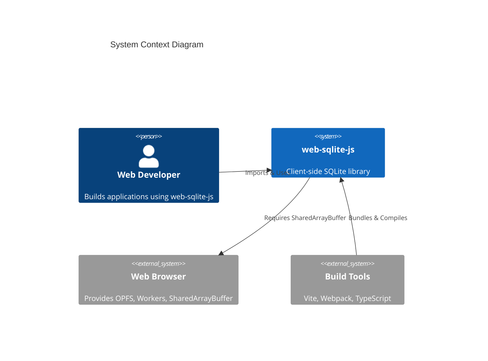
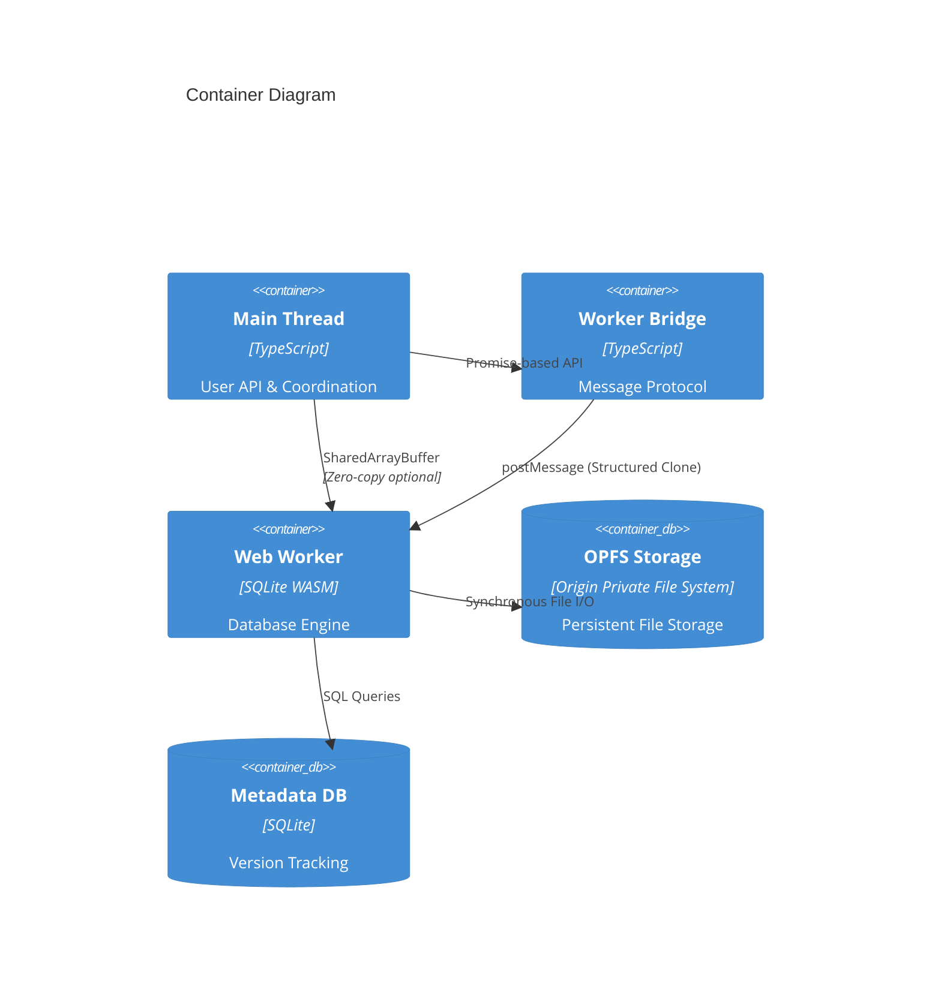

<!--
OUTPUT MAP
docs/03-architecture/01-hld.md

TEMPLATE SOURCE
.claude/templates/docs/03-architecture/01-hld.md
-->

# 01 High-Level Design (HLD) — Structure

## 1) Architecture Style & Principles

- **Pattern**: Worker-Based Client-Side Architecture (Web Worker + OPFS)
- **Key Principles**:
    - **Non-blocking by default**: All database operations execute in a dedicated Web Worker, ensuring the main thread never blocks
    - **Type safety first**: Full TypeScript API with strict type definitions for all operations
    - **Zero-copy where possible**: SharedArrayBuffer for efficient worker-main thread communication (requires COOP/COEP)
    - **Mutex-serialized operations**: Single-threaded SQLite access via mutex queue prevents race conditions
    - **Versioned persistence**: OPFS-based storage with release management for schema evolution
    - **Developer experience**: Simple async/await API abstracting worker communication complexity

## 2) System Boundary (C4 Context)

- **Users**: Frontend web developers building offline-first or data-intensive applications
- **External Systems**: Web Browser APIs (OPFS, Web Workers, SharedArrayBuffer)



**Context Notes**:

- **Browser Requirements**: Modern browsers (Chrome/Edge/Opera) with OPFS and SharedArrayBuffer support
- **Deployment Constraints**: Requires COOP/COEP headers for SharedArrayBuffer availability
- **Build Integration**: Library bundled via Vite, consumed by user applications via npm

## 3) Containers & Tech Stack (C4 Container)

- **Main Thread**: TypeScript/JavaScript (Reason: User API layer, async coordination)
- **Worker Bridge**: TypeScript/JavaScript (Reason: Message passing abstraction, promise management)
- **Web Worker**: SQLite WASM + JavaScript (Reason: Off-main-thread execution, SQLite engine)
- **OPFS Storage**: Browser API (Reason: Persistent file-backed storage, survives browser restarts)
- **Metadata Database**: SQLite (Reason: Version tracking, release history)



**Technology Rationale**:

- **SQLite WASM**: Industry-standard SQL engine compiled to WebAssembly for near-native performance
- **Web Worker**: Prevents main thread blocking, enabling responsive UI during database operations
- **OPFS**: Provides true file-backed storage with synchronous access within worker context
- **Mutex Queue**: Ensures sequential SQLite operations (SQLite is not thread-safe)
- **TypeScript**: Full type safety for API contracts and query results

## 4) Data Architecture Strategy

- **Ownership**:
    - **Active Database**: Primary application data, owned by user application
    - **Metadata Database**: Release versioning history, owned by library internals
    - **Versioned Databases**: Isolated snapshots per release, owned by release manager
- **Caching**:
    - **Worker State**: Active SQLite connections maintained in worker memory
    - **No External Cache**: All data persisted directly to OPFS
- **Consistency**:
    - **Strong Consistency**: ACID transactions within single database operations
    - **Sequential Execution**: Mutex queue ensures no concurrent writes to same database
    - **Release Isolation**: Each version has isolated database file, preventing cross-version contamination

**Data Flow Strategy**:

```
User Application (Main Thread)
    ↓ (async/await API calls)
Worker Bridge (Message Protocol)
    ↓ (postMessage with structured clone)
Web Worker (SQLite WASM)
    ↓ (synchronous file operations)
OPFS Storage (Persistent File System)
```

## 5) Cross-cutting Concerns (Implementation View)

### 5.1 Authentication & Authorization

- **AuthN**: Not applicable (client-side library, no server authentication)
- **AuthZ**: Not applicable (browser same-origin policy provides isolation)
- **Access Control**: OPFS restricts access to same-origin, prevents cross-origin data access

### 5.2 Observability

- **Logs**:
    - **Debug Mode**: Optional SQL execution logging with timing (`debug: true` option)
    - **Console.debug**: Structured log messages with `{ sql, duration, bind }` format
    - **Worker Logs**: Console.debug output from worker for initialization and errors
- **Metrics**:
    - **Query Timing**: `performance.now()` measurements for each SQL execution
    - **Changes Tracking**: `db.changes()` returns affected row count
    - **Last Insert ID**: `last_insert_rowid()` for auto-increment tracking
- **Tracing**: Not implemented (client-side library, no distributed tracing)

### 5.3 Error Handling

- **Global Strategy**:
    - **Typed Errors**: Error objects with `name`, `message`, `stack` preserved across worker boundary
    - **Promise Rejection**: All errors propagated as rejected promises to main thread
    - **Transaction Rollback**: Automatic ROLLBACK on transaction errors
    - **Release Validation**: Hash mismatch errors for release integrity violations
- **Error Types**:
    - **Initialization Errors**: SharedArrayBuffer unavailable, invalid filename
    - **SQL Execution Errors**: Syntax errors, constraint violations, table not found
    - **Release Errors**: Hash mismatches, version conflicts, rollback failures
    - **OPFS Errors**: File not found, quota exceeded, permission denied
- **Stack Trace Preservation**: Worker errors reconstructed in main thread with original stack traces

## 6) Code Structure Strategy (High-Level File Tree)

**Repo Structure**: Monorepo (single package)

```text
/ (root)
  /src
    /jswasm               # Vendored SQLite WASM module
    /release              # Release versioning system
    /types                # TypeScript type definitions
    /utils                # Utilities (mutex, logger, validation)
    main.ts               # Public API entry point (openDB)
    worker-bridge.ts      # Worker communication layer
    worker.ts             # Worker entry point (SQLite operations)
  /tests
    /e2e                  # End-to-end browser tests
    /unit                 # Unit tests for utilities
  /specs                  # Feature specifications
  /docs                   # VitePress documentation site
```

**Module Pattern**: Layered architecture with clear separation

```text
/src
  /release                # Domain: Release versioning logic
    /constants.ts         # SQL constants, version regex
    /types.ts             # Release domain types
    /opfs-utils.ts        # OPFS file operations (adapter)
    /hash-utils.ts        # Release validation (domain)
    /lock-utils.ts        # Metadata locking (domain)
    /version-utils.ts     # Version comparison (domain)
    /release-manager.ts   # Release orchestration (application)

  /types                  # Interface: Public API contracts
    /DB.ts                # DBInterface, ReleaseConfig, types
    /message.ts           # Worker protocol types

  /utils                  # Infrastructure: Cross-cutting utilities
    /mutex                # Concurrency control
    /logger               # Debug logging
    /validations          # Input validation

  main.ts                 # Interface: Public API
  worker-bridge.ts        # Infrastructure: Worker protocol
  worker.ts               # Infrastructure: Worker implementation
```

**Architectural Layers**:

1. **Interface Layer** (`main.ts`, `types/`): Public API surface, type definitions
2. **Application Layer** (`release/`): Business logic for release management
3. **Infrastructure Layer** (`worker-bridge.ts`, `worker.ts`, `utils/`): Worker communication, OPFS integration, utilities

**Key Design Decisions**:

- **Vendored WASM**: SQLite WASM module bundled in source (`jswasm/`), not external dependency
- **Worker Protocol**: Message-based communication with request/response pattern via ID mapping
- **Mutex Queue**: All database operations serialized through single mutex to prevent race conditions
- **Release Isolation**: Each database version stored in separate OPFS directory for rollback capability
- **Metadata Separation**: `release.sqlite3` metadata database separate from user data for version tracking

---

## Navigation

**Previous**: [Stage 2: Spike Plan](../02-feasibility/03-spike-plan.md) - Future enhancement investigations

**Next in Series**: [02 Data Flow](./02-dataflow.md) - Data flow and sequence diagrams

**Related Architecture Documents**:

- [03 Deployment](./03-deployment.md) - Deployment and infrastructure
- [Back to Spec Index](../00-control/00-spec.md)

**Related Feasibility Documents**:

- [01 Options Analysis](../02-feasibility/01-options.md) - Selected architecture option

**Continue to**: [Stage 4: ADR Index](../04-adr/) - Architecture decision records
