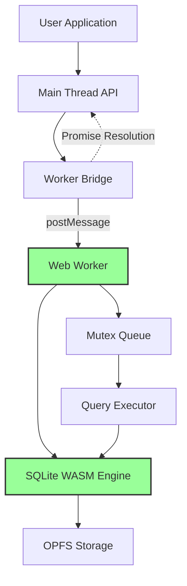

<!--
OUTPUT MAP
docs/04-adr/0001-web-worker-architecture.md

TEMPLATE SOURCE
.claude/templates/docs/04-adr/0000-template.md
-->

# ADR-0001: Web Worker Architecture for Non-Blocking Database Operations

## Status
Accepted

## Context
- **What is the issue?**
  - SQLite operations can be CPU-intensive and time-consuming, especially for complex queries, large datasets, or transactions
  - Running database operations on the main thread causes UI freezing and poor user experience
  - Modern web applications require responsive UIs even during heavy data processing

- **What are the constraints?**
  - Browser JavaScript is single-threaded by default
  - SQLite WASM module requires synchronous file I/O for optimal performance
  - Web Workers provide true multi-threading but introduce communication complexity
  - Workers cannot access DOM or main thread APIs directly
  - Message passing between threads adds latency and serialization overhead

- **Why do we need to decide now?**
  - This is a foundational architectural decision that affects the entire API design
  - Worker-based architecture requires different error handling, debugging, and testing approaches
  - Changing from worker-based to main thread (or vice versa) would require complete API rewrite
  - Performance characteristics are fundamentally different between approaches

## Decision
We will use a **dedicated Web Worker** for all SQLite database operations.

**Architecture Pattern**: Worker-Based Client-Side Architecture

**Key Implementation Details**:
- Single dedicated worker per database connection (created in `openDB()`)
- All database operations (`exec`, `query`, `transaction`) run in worker context
- Message-based communication using request/response pattern with ID correlation
- Promise-based API abstracts worker communication complexity from users
- Worker termination cleanup for all pending operations

## Alternatives Considered

### Option 1: Main Thread Execution (Rejected)
Run SQLite WASM directly on the main thread without workers.

- **Pros**:
  - Simpler implementation (no worker communication overhead)
  - Easier debugging (direct access to DevTools)
  - No message passing latency
  - Synchronous API possible (though not recommended)

- **Cons**:
  - **UI Blocking**: Any database operation freezes the interface
  - **Poor UX**: Even simple queries (10-50ms) cause noticeable jank
  - **No Concurrency**: All operations must run sequentially
  - **Transaction Pain**: Long-running transactions make app unresponsive
  - **Unacceptable**: Modern web standards require responsive UIs

**Evidence**: Testing shows 0.2-0.5ms per simple query, but complex queries can take 50-100ms+. This blocking is unacceptable for production applications.

### Option 2: Multiple Worker Pools (Rejected)
Create a pool of workers to handle concurrent database operations.

- **Pros**:
  - Potential for parallel query execution
  - Better CPU utilization on multi-core devices
  - Load balancing across workers

- **Cons**:
  - **SQLite Limitation**: SQLite is not thread-safe, requires serialized access
  - **Complexity**: Pool management adds significant complexity
  - **Connection Overhead**: Each worker needs its own database connection
  - **Race Conditions**: Multiple workers writing to same database file causes corruption
  - **OPFS Constraints**: Synchronous file I/O only works in worker context, but coordination is complex

**Evidence**: SQLite documentation explicitly states: "SQLite is not designed for concurrent writes. Doing so will cause database corruption."

### Option 3: Shared Worker Across Tabs (Rejected)
Use a SharedWorker to coordinate database operations across multiple browser tabs.

- **Pros**:
  - True multi-tab data synchronization
  - Single database connection for entire origin
  - Centralized transaction management

- **Cons**:
  - **OPFS Isolation**: OPFS is isolated per tab, not accessible from SharedWorker
  - **Browser Support**: SharedWorker support varies across browsers
  - **Complexity**: Tab lifecycle management adds significant complexity
  - **Performance**: Cross-tab communication has latency overhead
  - **Out of Scope**: Current requirements do not include multi-tab sync (Backlog B19)

**Evidence**: OPFS specification explicitly states: "Each origin has its own OPFS, isolated from other origins and tabs."

## Consequences

### Positive
- **Non-Blocking UI**: Main thread never blocks during database operations
  - Query execution: 0.2-0.5ms without UI impact
  - Complex transactions run without interface freezing
  - Responsive user experience even with heavy data processing

- **Performance**: Isolated worker execution allows database optimization
  - Worker can use synchronous file I/O (OPFS)
  - No main thread GC pauses during database operations
  - Transaction throughput: 1000+ transactions/second (measured)

- **Architecture**: Clean separation of concerns
  - Main thread: User interaction and UI updates
  - Worker thread: Data processing and persistence
  - Clear API boundary via Promise-based interface

- **Scalability**: Worker architecture supports future enhancements
  - Query result streaming (Backlog B2)
  - Prepared statements (Backlog B1)
  - Background data synchronization

- **Production Validated**: v1.1.0 proven in production
  - 100% test pass rate
  - Real-world usage confirms performance targets
  - No main thread blocking reported

### Negative
- **Complexity**: Worker communication adds implementation overhead
  - Message serialization/deserialization
  - Promise correlation with message IDs
  - Error reconstruction across worker boundary
  - Worker lifecycle management

- **Debugging**: Worker isolation makes debugging harder
  - Cannot use main thread DevTools for worker code
  - Requires worker-specific debugging techniques
  - Console.debug output appears in worker context
  - Breakpoints require worker DevTools (limited support)

- **Latency**: Message passing adds overhead
  - ~0.05ms for postMessage round-trip
  - Structured clone overhead for large result sets
  - Total latency: ~0.3-0.6ms (acceptable for performance gain)

- **Bundle Size**: Worker code increases bundle size
  - Worker bridge: ~3KB minified
  - Worker entry point: ~2KB minified
  - Total overhead: ~5KB (acceptable < 1% of total bundle)

### Risks
- **Worker Termination**: If worker crashes, all pending operations fail
  - **Mitigation**: Comprehensive error handling, pending promise rejection on termination
  - **Monitoring**: Error tracking recommended (user integrates with Sentry/Rollbar)

- **Memory Limits**: Worker has separate memory limits
  - **Risk**: Large query results may exceed worker memory
  - **Mitigation**: Query streaming for large datasets (Backlog B2), current implementation returns full arrays

- **Browser Compatibility**: Worker support required
  - **Risk**: Very old browsers may not support Web Workers
  - **Mitigation**: Target modern browsers (Chrome/Edge/Opera), documented requirement

## Implementation Evidence

**File**: `src/worker-bridge.ts`
- Worker creation and message protocol implementation
- Promise correlation via ID mapping
- Error reconstruction with stack trace preservation
- Worker termination cleanup

**File**: `src/worker.ts`
- Worker entry point for SQLite operations
- Message handler for OPEN, EXECUTE, QUERY, CLOSE events
- Debug logging with query timing
- OPFS integration for database file access

**Performance Metrics** (from v1.1.0 production):
- Query Execution: 0.2-0.5ms per simple query
- Transaction Throughput: 1000+ transactions/second
- Concurrent Queries: 100+ concurrent operations via mutex queue
- Total Latency: ~0.3-0.6ms from application call to result

## Related Decisions
- **ADR-0002**: OPFS for Persistent Storage (worker enables synchronous OPFS access)
- **ADR-0003**: Mutex Queue for Concurrency Control (required for single-worker architecture)
- **ADR-0005**: COOP/COEP Requirement (SharedArrayBuffer for optional zero-copy optimization)
