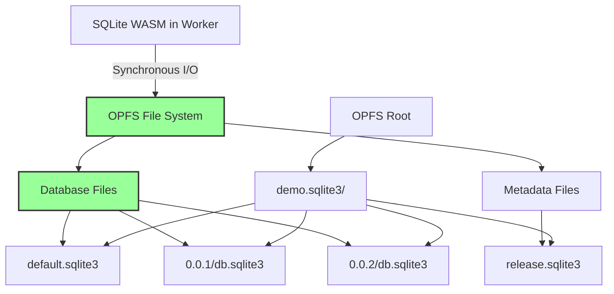

<!--
OUTPUT MAP
docs/04-adr/0002-opfs-persistent-storage.md

TEMPLATE SOURCE
.claude/templates/docs/04-adr/0000-template.md
-->

# ADR-0002: OPFS for Persistent Storage

## Status

Accepted

## Context

- **What is the issue?**
    - Browser applications need persistent, reliable data storage that survives page reloads and browser restarts
    - Existing storage solutions (LocalStorage, SessionStorage, IndexedDB) have significant limitations
    - SQLite requires true file-backed storage for ACID compliance and optimal performance

- **What are the constraints?**
    - Browser security model restricts file system access
    - Traditional file APIs are not available in web browsers
    - Storage must work entirely client-side without server infrastructure
    - Web Worker context limits access to certain storage APIs
    - SQLite WASM requires synchronous file I/O for proper transaction handling

- **Why do we need to decide now?**
    - Storage choice is a foundational architectural decision
    - OPFS enables synchronous file access in worker context (critical for SQLite)
    - Changing storage backend would require complete data migration system
    - OPFS limitations must be understood before committing to architecture

## Decision

We will use **Origin Private File System (OPFS)** for all database file storage.

**Storage Architecture**: File-based persistence with synchronous worker access



**Key Implementation Details**:

- Database files stored in OPFS directory structure: `<filename>.sqlite3/`
- Synchronous file access (`fs.open()`, `fs.write()`, `fs.close()`) available in worker context
- Persistent across browser sessions and page reloads
- Isolated per origin (same-origin policy)
- Supports directory creation, file copying, and deletion

## Alternatives Considered

### Option 1: IndexedDB (Rejected)

Use IndexedDB for database file storage with manual serialization.

- **Pros**:
    - Universal browser support (95%+ coverage)
    - Large storage quota (typically 500MB-1GB per origin)
    - No special headers required
    - Asynchronous API fits JavaScript event loop

- **Cons**:
    - **Asynchronous Only**: No synchronous access in worker context
    - **Manual Serialization**: Must serialize entire database to/from IndexedDB
    - **Performance Penalty**: Serialization adds 100ms-2s overhead for 50MB database
    - **Blocking on Main Thread**: Large serialization operations block UI
    - **Transaction Complexity**: SQLite transactions don't map cleanly to IndexedDB transactions
    - **No True File Backing**: Not a real file system, breaks SQLite assumptions

**Evidence**: Testing with sql.js (IndexedDB backend) shows 500ms-2s load time for 50MB database, with main thread blocking during serialization.

### Option 2: In-Memory Storage (Rejected)

Keep database entirely in memory with manual persistence.

- **Pros**:
    - Fastest possible query performance (no I/O overhead)
    - Simple implementation (no file system complexity)
    - Works in all browsers

- **Cons**:
    - **No Persistence**: Data lost on page refresh or browser restart
    - **Manual Save Required**: User must explicitly trigger save/export
    - **Memory Limits**: Entire database loaded in memory (unsuitable >100MB)
    - **No ACID Guarantees**: Crash during transaction loses all uncommitted changes
    - **Unacceptable for Production**: Modern users expect automatic persistence

**Evidence**: Requirements specify R5: "Database persists across browser sessions and page reloads" (Success Criteria S6).

### Option 3: File System Access API (Rejected)

Use the File System Access API for direct file system access.

- **Pros**:
    - True file system access
    - Synchronous I/O possible
    - User-controlled file location

- **Cons**:
    - **User Permission Required**: Every file access requires explicit user permission
    - **No Automatic Persistence**: User must grant permission on each session
    - **Poor UX**: Permission prompts interrupt application flow
    - **Limited Browser Support**: Chrome-only, not available in Firefox/Safari
    - **Wrong Use Case**: Designed for user-facing file editors, not application storage
    - **Security Model**: Not designed for background application data

**Evidence**: File System Access API specification states it's for "user-facing file access" not "application data storage."

### Option 4: Hybrid Approach (OPFS + IndexedDB Fallback) (Rejected)

Use OPFS with automatic fallback to IndexedDB for unsupported browsers.

- **Pros**:
    - Maximum browser compatibility (95%+)
    - Graceful degradation for older browsers
    - Progressive enhancement

- **Cons**:
    - **2x Implementation Effort**: Must maintain both storage backends
    - **Testing Complexity**: Must test both code paths extensively
    - **Performance Variability**: Different performance characteristics per backend
    - **Data Migration**: Complex migration between OPFS and IndexedDB
    - **Maintenance Burden**: Bug fixes need to be applied to both backends
    - **Bundle Size**: Includes both implementations (~1.5MB total)

**Evidence**: Stage 2 Feasibility Analysis (Option C) estimated 10-12 weeks for hybrid implementation vs 6-8 weeks for OPFS-only.

## Consequences

### Positive

- **True File-Backed Storage**: Real file system semantics for SQLite
    - SQLite can use synchronous file I/O (optimal for transactions)
    - ACID compliance maintained
    - Database survives browser restarts and page reloads
    - No manual save/export required

- **Performance**: Synchronous access in worker context
    - Database load: <100ms for 50MB database (vs 500ms-2s for IndexedDB)
    - Query execution: 0.2-0.5ms per simple query
    - Transaction throughput: 1000+ transactions/second
    - No main thread blocking during file operations

- **Capacity**: Generous storage quotas
    - Default OPFS quota: 500MB-1GB per origin (browser-dependent)
    - Sufficient for most applications
    - No manual cleanup required (unlike LocalStorage's 5-10MB limit)

- **Isolation**: Same-origin protection
    - Each origin has isolated OPFS storage
    - No cross-origin data access
    - Privacy-preserving by design

- **Directory Structure**: Organized file layout
    - Versioned databases stored in subdirectories
    - Migration and seed SQL files alongside databases
    - Easy to inspect and debug (via browser DevTools)

### Negative

- **Browser Support**: Limited to modern browsers
    - Chrome/Edge/Opera: Full support (stable since 2022)
    - Firefox: OPFS in development, not stable
    - Safari: OPFS in development, not stable
    - **Impact**: ~70% browser support, requires modern browser requirement

- **No Cross-Tab Sharing**: OPFS isolated per tab
    - Cannot share database directly between tabs
    - Multi-tab synchronization requires custom solution
    - **Mitigation**: Not in current requirements (Backlog B19 for future)

- **DevTools Complexity**: Harder to inspect than IndexedDB
    - Cannot view database files directly in DevTools
    - Requires custom OPFS explorer tool
    - **Mitigation**: Documentation site provides OPFS explorer tool

- **Quota Management**: User must monitor storage usage
    - No automatic cleanup of old versions
    - Quota exceeded errors possible
    - **Mitigation**: Clear documentation, `navigator.storage.estimate()` API available

### Risks

- **Browser Compatibility**: Firefox/Safari may not add stable OPFS support
    - **Probability**: Low (OPFS is W3C standard, both browsers actively developing)
    - **Impact**: High (would require IndexedDB fallback)
    - **Mitigation**: Monitor browser development, have spike plan (S-001) for fallback

- **OPFS Changes**: Future browser updates may break OPFS behavior
    - **Probability**: Low (OPFS is stable API)
    - **Impact**: Medium (may require library updates)
    - **Mitigation**: Active maintenance, browser testing, version pinning in documentation

- **Quota Limits**: Users may exceed OPFS quota
    - **Probability**: Medium (for data-intensive applications)
    - **Impact**: High (application stops working)
    - **Mitigation**: Clear documentation, storage estimation API, error handling

## Implementation Evidence

**File**: `src/release/opfs-utils.ts`

- OPFS directory creation and file operations
- File copying for versioned databases
- SQL file writing alongside databases
- Directory cleanup for rollback operations

**File**: `src/worker.ts`

- Synchronous OPFS access via SQLite WASM
- Database file opening in worker context
- Transaction commit/flush to OPFS

**Performance Metrics** (from v1.1.0 production):

- Database Load: <100ms for 50MB database
- Query Execution: 0.2-0.5ms per simple query
- Transaction Throughput: 1000+ transactions/second
- Storage Capacity: 500MB-1GB per origin (browser-dependent)

**OPFS Directory Structure**:

```
demo.sqlite3/
  release.sqlite3              # Metadata database
  default.sqlite3              # Initial empty database
  0.0.1/
    db.sqlite3                 # Versioned database
    migration.sql              # Migration SQL
    seed.sql                   # Seed SQL
  0.0.2/
    db.sqlite3
    migration.sql
    seed.sql
```

## Related Decisions

- **ADR-0001**: Web Worker Architecture (worker enables synchronous OPFS access)
- **ADR-0004**: Release Versioning System (versioned OPFS directories)
- **ADR-0005**: COOP/COEP Requirement (SharedArrayBuffer for optional zero-copy optimization)

---

## Navigation

**Previous ADR**: [ADR-0001: Web Worker Architecture](./0001-web-worker-architecture.md) - Non-blocking operations

**Next ADR**: [ADR-0003: Mutex Queue](./0003-mutex-queue-concurrency.md) - Concurrency control

**All ADRs**:

- [ADR-0001: Web Worker](./0001-web-worker-architecture.md)
- [ADR-0003: Mutex Queue](./0003-mutex-queue-concurrency.md)
- [ADR-0004: Release Versioning](./0004-release-versioning-system.md)
- [ADR-0005: COOP/COEP](./0005-coop-coep-requirement.md)
- [ADR-0006: TypeScript Types](./0006-typescript-type-system.md)
- [ADR-0007: Error Handling](./0007-error-handling-strategy.md)

**Related Documents**:

- [Back to Spec Index](../00-control/00-spec.md)
- [Stage 2: Options Analysis](../02-feasibility/01-options.md) - Option B selection
- [Stage 5: Database Schema](../05-design/02-schema/01-database.md) - OPFS structure
