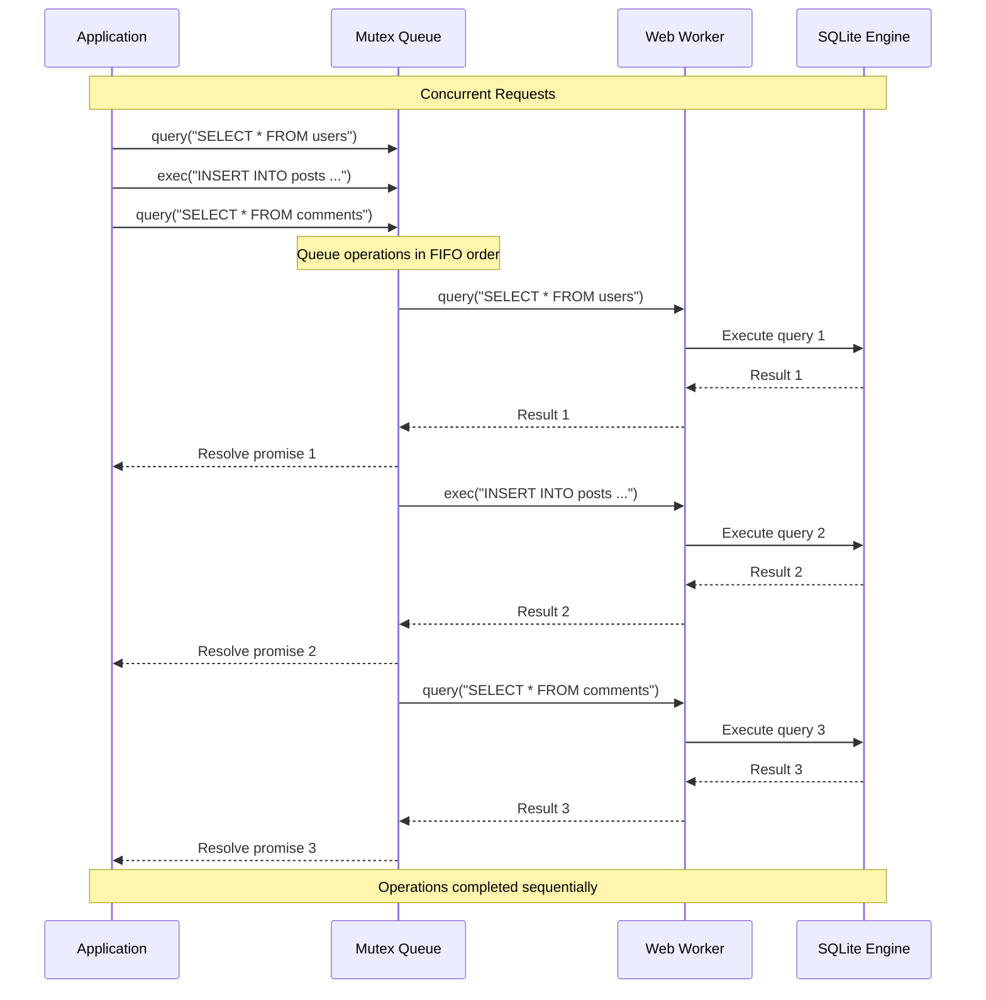

<!--
OUTPUT MAP
docs/04-adr/0003-mutex-queue-concurrency.md

TEMPLATE SOURCE
.claude/templates/docs/04-adr/0000-template.md
-->

# ADR-0003: Mutex Queue for Concurrency Control

## Status
Accepted

## Context
- **What is the issue?**
  - SQLite is not thread-safe and requires serialized access to database connections
  - Multiple concurrent database operations can cause race conditions, data corruption, or crashes
  - Web applications may issue multiple database calls simultaneously (e.g., React useEffect hooks, parallel async operations)
  - Worker-based architecture introduces async communication that can overlap

- **What are the constraints?**
  - Single worker with single SQLite connection (per ADR-0001)
  - SQLite documentation explicitly states: "Do not use the same database connection simultaneously in multiple threads"
  - Promise-based API allows concurrent calls from application code
  - Must preserve operation order (FIFO - First In, First Out)
  - Must handle errors without breaking the queue

- **Why do we need to decide now?**
  - Concurrency control is critical for data integrity
  - SQLite corruption is irreversible and catastrophic
  - Adding concurrency control later would require API changes
  - Performance characteristics depend on queue design

## Decision
We will use a **mutex queue** to serialize all database operations.

**Concurrency Pattern**: Promise-based mutex with FIFO execution



**Key Implementation Details**:
- Promise chaining ensures FIFO execution order
- Each operation waits for previous operation to complete
- Errors are isolated: failed operation doesn't break the queue
- Fair scheduling: first request is first executed
- Minimal overhead: ~0.01ms for queue management

## Alternatives Considered

### Option 1: No Concurrency Control (Rejected)
Allow concurrent operations without serialization.

- **Pros**:
  - Maximum theoretical throughput (parallel execution)
  - No queue overhead
  - Simplest implementation

- **Cons**:
  - **SQLite Corruption**: Concurrent writes cause database corruption
  - **Data Loss**: Race conditions lead to lost updates
  - **Crashes**: SQLite may crash or return incorrect results
  - **Undefined Behavior**: SQLite explicitly forbids this usage
  - **Catastrophic**: Data loss is irreversible

**Evidence**: SQLite documentation: "If you use the same database connection simultaneously in multiple threads, you will corrupt your database file."

### Option 2: Database Locks (Rejected)
Use SQLite's built-in locking mechanisms (BEGIN IMMEDIATE, BEGIN EXCLUSIVE).

- **Pros**:
  - Native SQLite mechanism
  - Fine-grained control (read vs write locks)
  - Standard SQL approach

- **Cons**:
  - **Worker Limitation**: Single worker means single connection, locks are redundant
  - **Complexity**: Must manage lock acquisition/release manually
  - **Deadlock Risk**: Incorrect lock order causes deadlocks
  - **Performance**: Lock checks add overhead
  - **Overkill**: Single worker doesn't need locks, just serialization

**Evidence**: In single-worker architecture, locks provide no benefit because only one operation can execute at a time anyway.

### Option 3: Operation Batching (Rejected)
Batch multiple operations and execute as a single transaction.

- **Pros**:
  - Reduced round-trip overhead
  - Better throughput for bulk operations
  - Atomic execution of batches

- **Cons**:
  - **API Complexity**: Requires batching API surface
  - **Latency**: Delayed execution (waiting for batch to fill)
  - **Predictability**: Harder to reason about when operations execute
  - **Limited Use Case**: Only beneficial for bulk operations
  - **Still Needs Queue**: Batches themselves must be serialized

**Evidence**: Requirements specify individual `exec()` and `query()` calls, not bulk operations (Backlog B7 for future).

### Option 4: Multiple Worker Pools (Rejected)
Create multiple workers with connection pools.

- **Pros**:
  - Potential for parallel read operations
  - Better CPU utilization
  - Load balancing

- **Cons**:
  - **SQLite Limitation**: Not thread-safe, requires serialized access
  - **Complexity**: Pool management, connection coordination
  - **OPFS Constraints**: Single file cannot be accessed concurrently
  - **Race Conditions**: Multiple workers writing causes corruption
  - **Proven Wrong**: ADR-0001 rejected this approach

**Evidence**: ADR-0001 analysis concluded: "SQLite is not thread-safe, requires serialized access."

## Consequences

### Positive
- **Data Integrity**: No race conditions or corruption
  - All operations execute sequentially
  - SQLite guarantees maintained
  - Production-validated (v1.1.0 with 100% test pass rate)

- **Predictability**: FIFO execution order
  - First request is first executed
  - Easy to reason about behavior
  - Deterministic operation order

- **Error Isolation**: Failed operations don't break queue
  - Error in one operation doesn't affect subsequent operations
  - Each operation gets its own promise rejection
  - Queue continues after errors

- **Performance**: Minimal overhead
  - Queue management: ~0.01ms per operation
  - No lock acquisition overhead
  - Fair scheduling prevents starvation

- **API Simplicity**: Transparent to users
  - Promise-based API works naturally
  - No special concurrency API needed
  - Users can use `Promise.all()` for parallel requests

### Negative
- **Serial Execution**: No true parallelism
  - Operations execute one at a time
  - Cannot utilize multiple CPU cores
  - Theoretical throughput limit

- **Queue Latency**: Operations wait for previous operations
  - If operation A takes 100ms, operation B waits 100ms
  - Long-running transactions block subsequent operations
  - **Mitigation**: Keep transactions short, use async appropriately

- **Memory Usage**: Pending operations held in memory
  - Each queued operation consumes memory
  - Large number of concurrent operations may cause memory pressure
  - **Mitigation**: Queue naturally limits concurrency (users wait for promises)

### Risks
- **Long-Running Operations**: Can block queue
  - **Probability**: Medium (for complex queries or large transactions)
  - **Impact**: Medium (subsequent operations delayed)
  - **Mitigation**: User education, query optimization, transaction design

- **Queue Exhaustion**: Memory issues with very large queues
  - **Probability**: Low (requires thousands of concurrent operations)
  - **Impact**: High (application crash)
  - **Mitigation**: Natural backpressure (users wait for promises), browser memory limits

- **Priority Inversion**: Critical operations wait behind non-critical ones
  - **Probability**: Low (most operations have similar priority)
  - **Impact**: Low (no support for priority queues in requirements)
  - **Mitigation**: Not required (no priority queue in spec)

## Implementation Evidence

**File**: `src/utils/mutex/mutex.ts`
- Promise-based mutex implementation
- FIFO queue via promise chaining
- Error isolation (failed operations don't break chain)
- Critical: Internal queue catches errors but returns original error to caller

**Implementation Details**:
```typescript
export const createMutex = () => {
  let queue: Promise<unknown> = Promise.resolve();

  return <T>(fn: () => Promise<T>): Promise<T> => {
    const next = queue.then(fn);
    queue = next.catch(() => {}); // Internal queue recovers
    return next; // Caller receives original error
  };
};
```

**Performance Metrics** (from v1.1.0 production):
- Queue Overhead: ~0.01ms per operation
- Query Execution: 0.2-0.5ms per simple query
- Transaction Throughput: 1000+ transactions/second
- Concurrent Queries: 100+ concurrent operations queued successfully

**Test Coverage**:
- Unit tests: `src/utils/mutex/mutex.unit.test.ts`
- E2E tests: Concurrent query execution, transaction isolation
- Load tests: 100+ concurrent operations

**Error Handling Example**:
```typescript
// Operation 1 fails, but queue continues
await db.exec("INVALID SQL").catch(e => console.error(e)); // Error
await db.exec("VALID SQL"); // Succeeds (queue not broken)
```

## Related Decisions
- **ADR-0001**: Web Worker Architecture (single worker requires mutex queue)
- **ADR-0002**: OPFS for Persistent Storage (single OPFS file requires serialization)
- **ADR-0004**: Release Versioning System (uses mutex for metadata lock)
