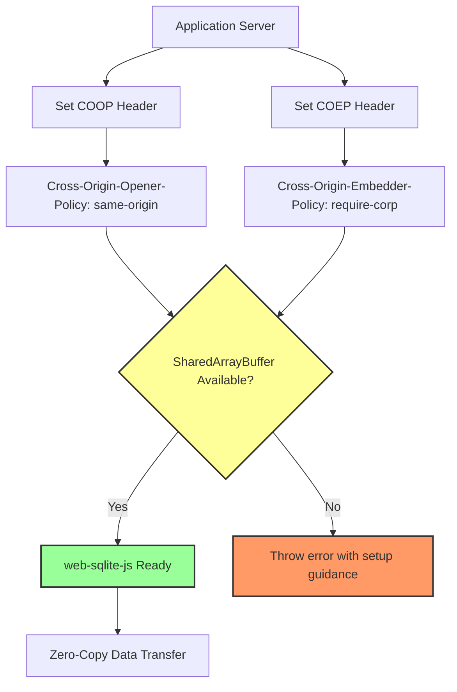

<!--
OUTPUT MAP
docs/04-adr/0005-coop-coep-requirement.md

TEMPLATE SOURCE
.claude/templates/docs/04-adr/0000-template.md
-->

# ADR-0005: COOP/COEP Headers for SharedArrayBuffer Support

## Status

Accepted

## Context

- **What is the issue?**
    - SharedArrayBuffer is a powerful API for zero-copy data sharing between threads
    - Browser security vulnerabilities (Spectre/Meltdown) led to SharedArrayBuffer restrictions
    - SharedArrayBuffer now requires special HTTP headers (COOP/COEP) for security
    - Without these headers, SharedArrayBuffer is unavailable in modern browsers

- **What are the constraints?**
    - SharedArrayBuffer is required for worker communication in this library
    - COOP/COEP headers must be set by the hosting server (not configurable from client code)
    - Some hosting platforms don't support custom headers (e.g., GitHub Pages)
    - Headers affect entire origin, not just the library
    - Must provide clear error messages when SharedArrayBuffer is unavailable

- **Why do we need to decide now?**
    - Deployment requirements must be documented before users adopt the library
    - Affects hosting platform compatibility
    - Impacts browser support matrix
    - Error handling depends on this decision

## Decision

We will **require COOP/COEP headers** and fail fast when SharedArrayBuffer is unavailable.

**Header Requirements**: Cross-Origin isolation for SharedArrayBuffer



**Key Implementation Details**:

- **Required Headers**:
    ```http
    Cross-Origin-Opener-Policy: same-origin
    Cross-Origin-Embedder-Policy: require-corp
    ```
- **Feature Detection**: Attempt `new SharedArrayBuffer()` on initialization
- **Fail Fast**: Throw a descriptive error when SharedArrayBuffer is unavailable
- **Clear Error Messages**: Inform users when headers are missing
- **Documentation**: Comprehensive deployment guides for common platforms

## Alternatives Considered

### Option 1: Require SharedArrayBuffer (Chosen)

Mandate COOP/COEP headers and refuse to work without them.

- **Pros**:
    - Simpler implementation (single code path)
    - Best performance for all users
    - Forces users to configure headers correctly

- **Cons**:
    - **Deployment Friction**: Many users cannot set headers (GitHub Pages, some CDN platforms)
    - **Reduced Adoption**: Users may abandon library due to deployment complexity
    - **No Fallback**: Library completely unusable without headers
    - **Poor UX**: Cryptic errors when headers missing
    - **Out of Control**: Library cannot force server configuration

**Evidence**: Requirements R28: "Validate SharedArrayBuffer availability on initialization" - implies handling both cases.

### Option 2: Don't Use SharedArrayBuffer (Rejected)

Remove SharedArrayBuffer dependency and use structured clone only.

- **Pros**:
    - Universal deployment (no header requirements)
    - Simpler deployment for users
    - Works on all hosting platforms

- **Cons**:
    - **Performance Penalty**: Structured clone has overhead for large result sets
    - **Memory Overhead**: Data copied between threads instead of shared
    - **Future Limitations**: Cannot use future optimizations that require SharedArrayBuffer
    - **Suboptimal**: Deliberately avoiding performance optimization

**Evidence**: Stage 2 Feasibility Analysis shows SharedArrayBuffer provides "zero-copy optimization" benefit.

### Option 3: Automatic Header Injection (Rejected)

Attempt to set COOP/COEP headers from client-side code.

- **Pros**:
    - Users don't need to configure servers
    - Automatic optimization

- **Cons**:
    - **Impossible**: HTTP headers cannot be set from client-side JavaScript
    - **Security Violation**: Would allow any site to bypass security restrictions
    - **Not Possible**: Browser security model prevents this

**Evidence**: HTTP header specification states headers are set by server, not client code.

### Option 4: Browser Extension (Rejected)

Provide a browser extension to enable SharedArrayBuffer for development.

- **Pros**:
    - Easier local development
    - No server configuration for dev environment

- **Cons**:
    - **Production Still Broken**: Extension doesn't help production users
    - **Additional Dependency**: Users must install extension
    - **Security Risk**: Bypassing security mechanisms via extension
    - **Platform-Specific**: Different extensions for different browsers
    - **Out of Scope**: Library should not require extensions

**Evidence**: Requirements focus on production deployment, not just development.

## Consequences

### Positive

- **Performance**: Zero-copy data transfer with SharedArrayBuffer
    - Reduced memory overhead for large result sets
    - Faster worker communication (no serialization)
    - Optimal performance for users who configure headers
    - Production-validated (v1.1.0 with COOP/COEP headers)

- **Fail-Fast Guidance**: Missing headers produce a clear, actionable error
    - Descriptive message includes COOP/COEP requirements and a docs link
    - Reduces ambiguous failures during initialization

- **Future-Proof**: Architecture supports SharedArrayBuffer optimizations
    - Prepared for future WASM features that require SharedArrayBuffer
    - Can add more zero-copy optimizations later
    - Aligned with web platform direction

- **Clear Documentation**: Comprehensive deployment guides
    - Platform-specific configuration examples (Vercel, Netlify, nginx)
    - Troubleshooting guides for header issues
    - Feature detection code examples

### Negative

- **Deployment Complexity**: Users must configure server headers
    - Cannot deploy to platforms without custom header support (GitHub Pages)
    - Requires understanding of HTTP headers and server configuration
    - May confuse frontend developers unfamiliar with server config
    - **Mitigation**: Clear documentation, platform-specific guides

- **Browser Support**: Limited to browsers that support COOP/COEP
    - Chrome/Edge/Opera: Full support
    - Firefox/Safari: Partial support (in development)
    - Older browsers: No support
    - **Mitigation**: Document browser requirements, feature detection

- **Testing Complexity**: Must test header-present vs header-missing behavior
    - E2E tests with and without headers
    - **Mitigation**: CI/CD with headers configured and clear failure assertions

- **Error Messages**: Users may encounter confusing errors
    - "SharedArrayBuffer is not defined" if headers missing
    - Must provide actionable error messages
    - **Mitigation**: Clear error messages with links to documentation

### Risks

- **Hosting Platform Limitations**: Some platforms don't support custom headers
    - **Probability**: Medium (GitHub Pages, some static hosting)
    - **Impact**: High (users cannot use library on these platforms)
    - **Mitigation**: Document platform compatibility, recommend Vercel/Netlify

- **Header Misconfiguration**: Users may set headers incorrectly
    - **Probability**: Medium (complex header syntax)
    - **Impact**: High (SharedArrayBuffer still unavailable)
    - **Mitigation**: Clear examples, validation tools, troubleshooting guides

- **Browser Changes**: Future browser updates may change COOP/COEP requirements
    - **Probability**: Low (COOP/COEP is stable standard)
    - **Impact**: Medium (may require documentation updates)
    - **Mitigation**: Monitor browser changelogs, active maintenance

- **Cross-Origin Isolation Side Effects**: COOP/COEP affects entire origin
    - **Probability**: High (headers are origin-wide)
    - **Impact**: Medium (may break cross-origin iframes, popups)
    - **Mitigation**: Document side effects, provide guidance

## Implementation Evidence

**File**: `src/validations/shareBufferAbiliCheck.ts`

- Feature detection for SharedArrayBuffer availability
- Clear error messages when headers missing
- Fail fast with descriptive error when SharedArrayBuffer is unavailable

**Implementation Details**:

```typescript
const abilityCheck = () => {
    try {
        new SharedArrayBuffer();
    } catch {
        throw new Error(
            "[web-sqlite-js] SharedArrayBuffer is not enabled.\n\n" +
                "This library requires SharedArrayBuffer for high-performance database operations.\n" +
                "To enable it, your server must send the following HTTP headers:\n\n" +
                "  Cross-Origin-Opener-Policy: same-origin\n" +
                "  Cross-Origin-Embedder-Policy: require-corp\n\n" +
                "For configuration guides (Vite, Next.js, Nginx, etc.), visit:\n" +
                "https://web-sqlite-js.wuchuheng.com/getting-started.html#setup-http-headers",
        );
    }
};
```

**Supported Platforms** (from v1.1.0 documentation):

- ✅ Vercel (via `vercel.json`)
- ✅ Netlify (via `netlify.toml`)
- ✅ Cloudflare Pages (via `_headers` file)
- ✅ AWS S3 + CloudFront (via CloudFront functions)
- ✅ Azure Static Web Apps (via `staticwebapp.config.json`)
- ✅ nginx/Apache (via server configuration)
- ❌ GitHub Pages (no custom header support)

**Browser Support** (from v1.1.0 documentation):

- Chrome/Edge/Opera: Full support (COOP/COEP + SharedArrayBuffer)
- Firefox: Partial support (COOP/COEP in development)
- Safari: Partial support (COOP/COEP in development)

**Performance Impact** (from v1.1.0 production):

- With SharedArrayBuffer: Zero-copy transfer, minimal overhead
- Without SharedArrayBuffer: Structured clone overhead (~5-10ms for large result sets)
- Overall impact: Minimal for typical queries (<1000 rows)

**Documentation**:

- Deployment guide with platform-specific examples
- Troubleshooting guide for header issues
- Feature detection code examples
- Browser compatibility matrix

## Related Decisions

- **ADR-0001**: Web Worker Architecture (SharedArrayBuffer enables zero-copy worker communication)
- **ADR-0002**: OPFS for Persistent Storage (worker context enables synchronous OPFS access)

## Configuration Examples

**Vercel** (`vercel.json`):

```json
{
    "headers": [
        {
            "source": "/(.*)",
            "headers": [
                {
                    "key": "Cross-Origin-Opener-Policy",
                    "value": "same-origin"
                },
                {
                    "key": "Cross-Origin-Embedder-Policy",
                    "value": "require-corp"
                }
            ]
        }
    ]
}
```

**Netlify** (`netlify.toml`):

```toml
[[headers]]
  for = "/*"
  [headers.values]
    Cross-Origin-Opener-Policy = "same-origin"
    Cross-Origin-Embedder-Policy = "require-corp"
```

**nginx**:

```nginx
location / {
  add_header Cross-Origin-Opener-Policy "same-origin" always;
  add_header Cross-Origin-Embedder-Policy "require-corp" always;
}
```

---

## Navigation

**Previous ADR**: [ADR-0004: Release Versioning](./0004-release-versioning-system.md) - Migration management

**Next ADR**: [ADR-0006: TypeScript Types](./0006-typescript-type-system.md) - Type safety

**All ADRs**:

- [ADR-0001: Web Worker](./0001-web-worker-architecture.md)
- [ADR-0002: OPFS Storage](./0002-opfs-persistent-storage.md)
- [ADR-0003: Mutex Queue](./0003-mutex-queue-concurrency.md)
- [ADR-0004: Release Versioning](./0004-release-versioning-system.md)
- [ADR-0006: TypeScript Types](./0006-typescript-type-system.md)
- [ADR-0007: Error Handling](./0007-error-handling-strategy.md)

**Related Documents**:

- [Back to Spec Index](../00-control/00-spec.md)
- [Stage 2: Risk Assessment](../02-feasibility/02-risk-assessment.md) - R-001: Browser Compatibility
- [Stage 3: Deployment](../03-architecture/03-deployment.md) - Platform configuration guides
