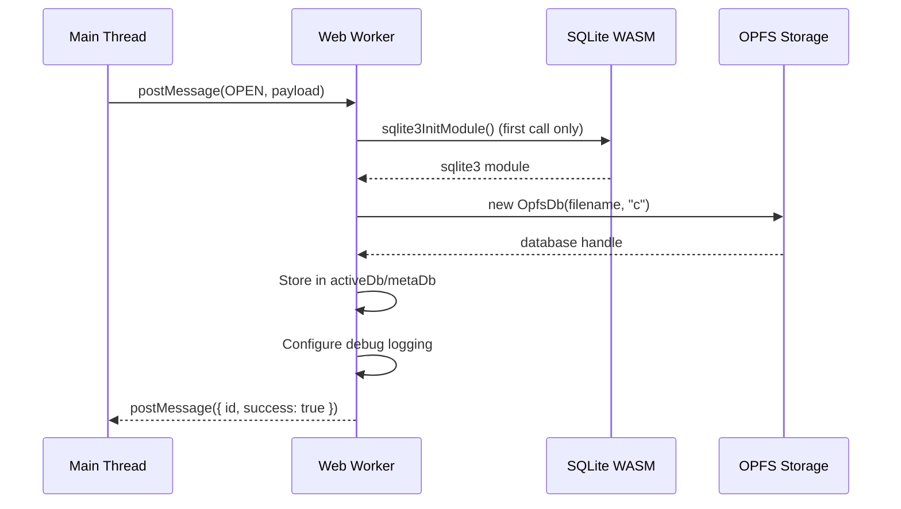
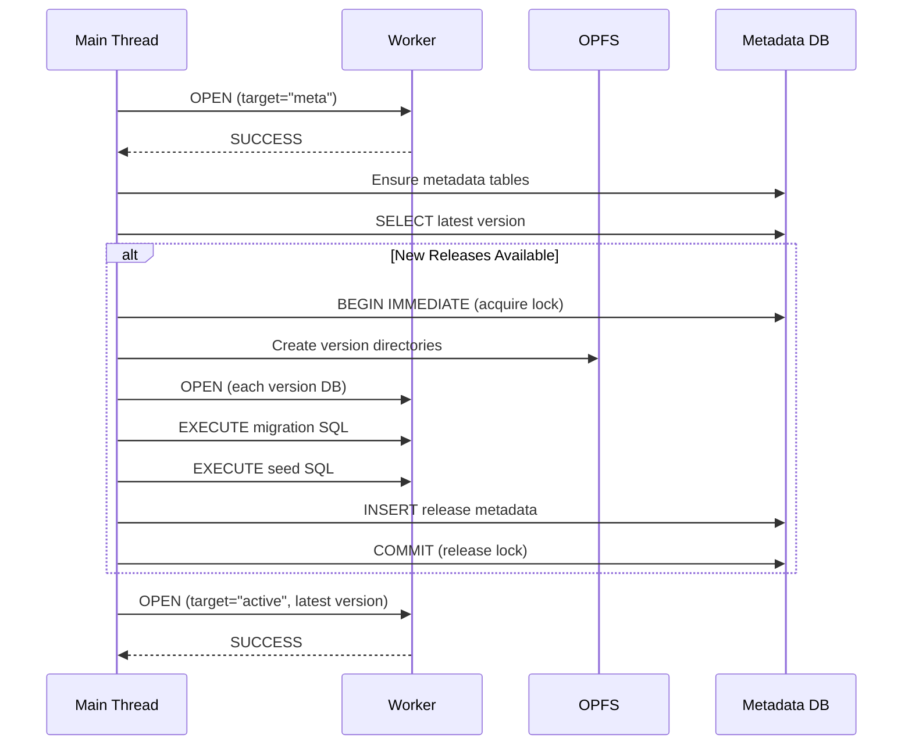
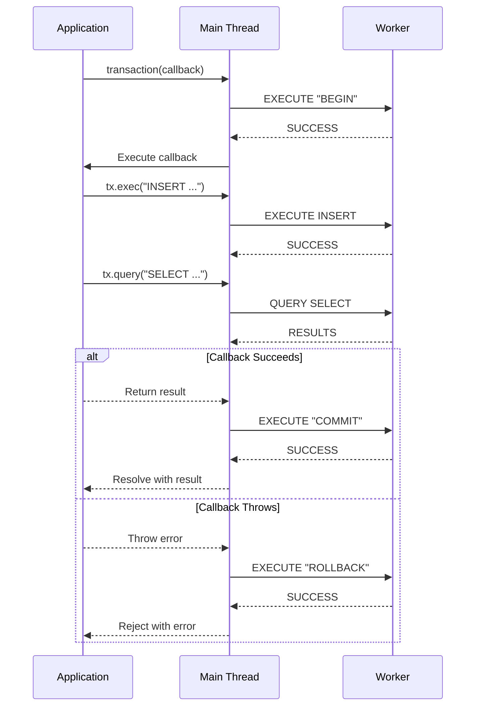
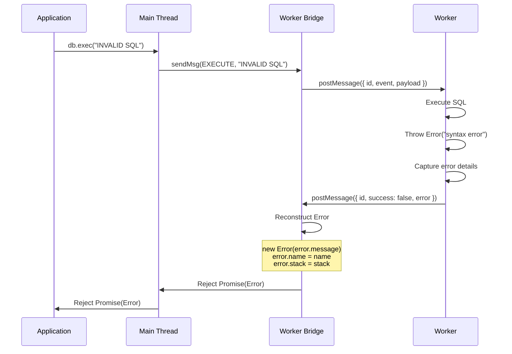

# 02 Event Catalog

## 1) Worker Message Events

### Event: OPEN

**Description**: Initialize and open a database connection in the worker context. Supports both active (user data) and metadata (release tracking) databases.

**Direction**: Main Thread → Worker

**Payload Schema**:

```typescript
type OpenDBArgs = {
    filename: string; // Database file name (relative to base directory)
    options?: {
        debug?: boolean; // Enable SQL execution logging
    };
    target?: "active" | "meta"; // Database target (default: "active")
    replace?: boolean; // Close existing connection before opening
};
```

**Response Schema**:

```typescript
type OpenDBResponse = void; // No payload on success
```

**Error Conditions**:

- SQLite WASM module initialization failure
- OPFS file access errors
- Invalid filename format

**State Changes**:

- Initializes SQLite WASM module on first call
- Creates new `sqlite3.oo1.OpfsDb` instance
- Stores reference in `activeDb` or `metaDb` global variable
- Configures debug logging if `options.debug === true`

**Example**:

```typescript
// Request
{
  id: 1,
  event: "open",
  payload: {
    filename: "demo/1.0.0/db.sqlite3",
    options: { debug: true },
    target: "active",
    replace: true
  }
}

// Response (success)
{
  id: 1,
  success: true,
  payload: undefined
}

// Response (error)
{
  id: 1,
  success: false,
  error: {
    name: "Error",
    message: "Database is not open",
    stack: "..."
  }
}
```

**Flow Diagram**:



---

### Event: EXECUTE

**Description**: Execute SQL statements without returning rows. Used for DDL (CREATE, DROP, ALTER) and DML (INSERT, UPDATE, DELETE) operations.

**Direction**: Main Thread → Worker

**Payload Schema**:

```typescript
type ExecutePayload = {
    sql: string; // SQL string to execute
    bind?: SQLParams; // Bind parameters (positional or named)
    target?: "active" | "meta"; // Database target (default: "active")
};
```

**Response Schema**:

```typescript
type ExecuteResult = {
    changes: number | bigint; // Number of rows changed
    lastInsertRowid: number | bigint; // Last inserted row ID
};
```

**Error Conditions**:

- SQL syntax errors
- Constraint violations (UNIQUE, NOT NULL, FOREIGN KEY)
- Table or column not found
- Database not open

**State Changes**:

- Executes SQL in specified database (active or meta)
- Modifies database state
- Updates internal `changes` and `lastInsertRowid` counters

**Performance**:

- Typical execution time: 0.2-0.5ms for simple operations
- Timing logged if debug mode enabled

**Example**:

```typescript
// Request (positional parameters)
{
  id: 2,
  event: "execute",
  payload: {
    sql: "INSERT INTO users (name, email) VALUES (?, ?)",
    bind: ["Alice", "alice@example.com"],
    target: "active"
  }
}

// Request (named parameters)
{
  id: 3,
  event: "execute",
  payload: {
    sql: "UPDATE users SET email = $email WHERE id = $id",
    bind: { $email: "new@email.com", $id: 1 },
    target: "active"
  }
}

// Response (success)
{
  id: 2,
  success: true,
  payload: {
    changes: 1,
    lastInsertRowid: 1
  }
}
```

**Debug Logging**:

```typescript
// When debug mode is enabled
console.debug({
    sql: "INSERT INTO users (name, email) VALUES (?, ?)",
    duration: 0.35, // milliseconds
    bind: ["Alice", "alice@example.com"],
});
```

---

### Event: QUERY

**Description**: Execute a SELECT query and return all result rows as an array of objects.

**Direction**: Main Thread → Worker

**Payload Schema**:

```typescript
type QueryPayload = {
    sql: string; // SELECT SQL to execute
    bind?: SQLParams; // Bind parameters (positional or named)
    target?: "active" | "meta"; // Database target (default: "active")
};
```

**Response Schema**:

```typescript
type QueryResult<T = unknown> = T[]; // Array of row objects
```

**Error Conditions**:

- SQL syntax errors
- Table or column not found
- Invalid bind parameters
- Database not open

**State Changes**:

- No state changes (read-only operation)

**Performance**:

- Typical execution time: 0.2-0.5ms for simple queries
- Timing logged if debug mode enabled
- Full result set transferred via structured clone

**Example**:

```typescript
// Request
{
  id: 4,
  event: "query",
  payload: {
    sql: "SELECT id, name, email FROM users WHERE age > ?",
    bind: [18],
    target: "active"
  }
}

// Response (success)
{
  id: 4,
  success: true,
  payload: [
    { id: 1, name: "Alice", email: "alice@example.com" },
    { id: 2, name: "Bob", email: "bob@example.com" }
  ]
}

// Response (empty result)
{
  id: 4,
  success: true,
  payload: []
}
```

**Debug Logging**:

```typescript
// When debug mode is enabled
console.debug({
    sql: "SELECT id, name FROM users",
    duration: 0.28,
    bind: [],
});
```

---

### Event: CLOSE

**Description**: Close database connections and cleanup worker resources.

**Direction**: Main Thread → Worker

**Payload Schema**:

```typescript
type ClosePayload = undefined; // No payload
```

**Response Schema**:

```typescript
type CloseResponse = void; // No payload on success
```

**Error Conditions**:

- None (idempotent operation)

**State Changes**:

- Closes `activeDb` connection if open
- Closes `metaDb` connection if open
- Clears `sqlite3` module reference
- Worker becomes unusable for subsequent operations

**Example**:

```typescript
// Request
{
  id: 5,
  event: "close",
  payload: undefined
}

// Response (success)
{
  id: 5,
  success: true,
  payload: undefined
}
```

---

## 2) Internal Application Events

### Event: Release Lock Acquisition

**Description**: Acquire metadata lock before release/rollback operations to prevent concurrent modifications.

**Triggered By**:

- `openDB()` when applying new releases
- `devTool.release()` when creating dev version
- `devTool.rollback()` when rolling back version

**Payload**: Not applicable (database transaction)

**Behavior**:

```typescript
// Execute in metadata database
await metaExec("BEGIN IMMEDIATE");
await metaExec(
    "INSERT OR REPLACE INTO release_lock (id, lockedAt) VALUES (1, ?)",
    [new Date().toISOString()],
);
```

**Error Conditions**:

- Lock already held by another operation ("Release operation already in progress")

**State Changes**:

- Metadata database locked for write
- `release_lock` table updated with timestamp

---

### Event: Release Lock Release

**Description**: Release metadata lock after release/rollback operations complete (success or failure).

**Triggered By**:

- Completion of release application
- Completion of rollback operation
- Error during release/rollback (automatic rollback)

**Payload**: Not applicable (database transaction)

**Behavior**:

```typescript
// On success
await metaExec("COMMIT");

// On error
await metaExec("ROLLBACK");
```

**State Changes**:

- Metadata database lock released
- Transaction committed or rolled back

---

### Event: Version Application

**Description**: Apply a new release or dev version by copying database and executing migration SQL.

**Triggered By**:

- `openDB()` detecting new release versions
- `devTool.release()` creating dev version

**Payload**:

```typescript
type VersionApplication = {
    config: ReleaseConfigWithHash;
    mode: "release" | "dev";
};
```

**Behavior**:

1. Create version directory in OPFS
2. Copy latest database to new version
3. Write migration.sql and seed.sql files
4. Open new database in worker
5. Execute BEGIN transaction
6. Execute migration SQL
7. Execute seed SQL (if provided)
8. Execute COMMIT
9. Insert metadata row

**Error Handling**:

- On SQL error: ROLLBACK, remove version directory, rethrow error
- On copy error: Cleanup partial files, rethrow error

**State Changes**:

- New version directory created in OPFS
- Metadata database updated with version record
- Active database switched to new version

---

### Event: Rollback Execution

**Description**: Remove dev versions above target version and switch active database.

**Triggered By**:

- `devTool.rollback(version)` call

**Payload**:

```typescript
type RollbackExecution = {
    targetVersion: string;
};
```

**Behavior**:

1. Query all versions from metadata
2. Validate target version exists
3. Validate target version >= latest release
4. Identify dev versions to remove
5. For each dev version:
    - Remove version directory from OPFS
    - Delete metadata row
6. Switch active database to target version

**Error Conditions**:

- Target version not found
- Rollback below latest release version

**State Changes**:

- Dev version directories removed from OPFS
- Dev version metadata rows deleted
- Active database switched to target version

---

## 3) Debug Events

### Event: SQL Execution Logging

**Description**: Log SQL execution details when debug mode is enabled.

**Triggered By**:

- Every EXECUTE or QUERY operation when `options.debug === true`

**Payload Schema**:

```typescript
type SqlLogInfo = {
    sql: string; // Executed SQL
    duration: number; // Execution time in milliseconds
    bind?: SQLParams; // Bind parameters used
};
```

**Output Method**:

- `console.debug()` in worker context
- Visible in browser DevTools console

**Example Output**:

```javascript
{sql: "SELECT * FROM users WHERE id = ?", duration: 0.28, bind: [1]}
{sql: "INSERT INTO users (name) VALUES (?)", duration: 0.35, bind: ["Alice"]}
{sql: "CREATE TABLE posts (id INTEGER PRIMARY KEY)", duration: 1.2, bind: undefined}
```

**Usage**:

```typescript
const db = await openDB("myapp", {
    debug: true, // Enable logging
});
```

---

## 4) Error Events

### Event: Worker Error

**Description**: Error occurred during worker operation execution.

**Triggered By**:

- SQL execution errors
- Database not open
- Invalid payload
- Any unexpected worker exception

**Payload Schema**:

```typescript
type WorkerError = {
    name: string; // Error class name (e.g., "Error", "TypeError")
    message: string; // Error message
    stack: string; // Stack trace
};
```

**Response Schema**:

```typescript
type ErrorResponse = {
    id: number;
    success: false;
    error: WorkerError;
    payload?: undefined;
};
```

**Error Reconstruction**:

```typescript
// In worker bridge
worker.onmessage = (event) => {
    const { id, success, error } = event.data;

    if (!success) {
        const newError = new Error(error.message);
        newError.name = error.name;
        newError.stack = error.stack;
        task.reject(newError);
    }
};
```

**Example**:

```typescript
// Request (invalid SQL)
{
  id: 6,
  event: "query",
  payload: {
    sql: "SELCT * FROM users", // Typo: SELCT
    target: "active"
  }
}

// Response (error)
{
  id: 6,
  success: false,
  error: {
    name: "Error",
    message: "near \"SELCT\": syntax error",
    stack: "Error: near \"SELCT\": syntax error\n    at worker.ts:123:15\n    ..."
  }
}
```

---

### Event: Worker Termination

**Description**: Worker terminated abnormally or explicitly.

**Triggered By**:

- Worker crash
- Explicit `worker.terminate()` call
- Browser tab close
- Out of memory error

**Behavior**:

- All pending promises rejected with "Worker terminated" error
- Message ID map cleared
- Worker becomes unusable

**Example**:

```typescript
// In worker bridge
const terminate = () => {
    worker.terminate();
    idMapPromise.forEach((task) => {
        task.reject(new Error("Worker terminated"));
    });
    idMapPromise.clear();
};
```

---

## 5) Event Flow Examples

### Flow: Database Initialization with Release



---

### Flow: Transaction Execution



---

### Flow: Error Propagation



---

## 6) Event Timing Characteristics

### Message Latency Breakdown

| Operation                   | Latency        | Notes                     |
| --------------------------- | -------------- | ------------------------- |
| postMessage (Main → Worker) | ~0.02ms        | Structured clone overhead |
| Worker processing           | 0.2-0.5ms      | SQLite execution time     |
| postMessage (Worker → Main) | ~0.02ms        | Structured clone overhead |
| Promise resolution          | ~0.01ms        | Map lookup and cleanup    |
| **Total Round-trip**        | **~0.3-0.6ms** | End-to-end latency        |

### High-Volume Events

- **Query Execution**: 1000+ queries/second (measured)
- **Transaction Throughput**: 1000+ transactions/second
- **Concurrent Operations**: 100+ via mutex queue

### Low-Volume Events

- **Database Open**: 10-100ms (includes WASM initialization, migrations)
- **Release Application**: 50-100ms per version
- **Rollback**: 10-50ms (directory removal + metadata cleanup)

---

## 7) Event Correlation

### Message ID Generation

```typescript
const getLatestMsgId = (() => {
    let latestId = 0;
    return () => ++latestId;
})();
```

- Each request gets unique incremental ID
- IDs are 64-bit integers (in practice, much smaller)
- IDs wrap safely due to JavaScript number precision

### Promise Storage

```typescript
const idMapPromise: Map<number, Task<unknown>> = new Map();

type Task<T> = {
    resolve: (value: T) => void;
    reject: (reason?: unknown) => void;
};
```

- Promises stored in Map keyed by message ID
- Removed after response received or worker terminated
- Prevents memory leaks from unresolved promises

### Timeout Protection

- No explicit timeout implementation
- Worker termination rejects all pending promises
- Future enhancement: Add timeout option to API

---

## 8) Event Serialization

### Structured Clone Algorithm

All message payloads are serialized using the structured clone algorithm:

**Supported Types**:

- Primitives: `undefined`, `null`, `boolean`, `number`, `string`
- Objects: Plain objects, arrays
- Binary: `ArrayBuffer`, `Uint8Array`
- Dates: `Date` objects
- Errors: Error objects (custom serialization)

**Not Supported**:

- Functions
- Classes
- DOM nodes
- Map/Set (must be converted to arrays)

### Error Serialization

```typescript
// Worker serializes error
const serialized = {
    name: errorObj.name,
    message: errorObj.message,
    stack: errorObj.stack,
} as Error;

// Main thread reconstructs error
const reconstructed = new Error(serialized.message);
reconstructed.name = serialized.name;
reconstructed.stack = serialized.stack;
```

---

## 9) Event Security

### Input Validation

- SQL strings validated as non-empty
- Filenames validated as non-empty strings
- Release versions validated against semver pattern
- Bind parameters accepted as-is (SQLite handles validation)

### SQL Injection Prevention

- Parameterized queries enforced via bind parameters
- No string concatenation for SQL construction
- SQLite prepared statements used internally

### Worker Isolation

- Worker runs in isolated context
- No access to main thread DOM or globals
- OPFS access restricted to same origin
- WASM sandbox prevents code escape

---

## 10) Event Debugging

### Debug Mode Activation

```typescript
const db = await openDB("myapp", {
    debug: true, // Enable SQL logging
});
```

### Console Output

```javascript
// Worker initialization
[openDB] input validation start
[openDB] input validation end
[openDB] normalized filename: myapp
[openDB] ensured directory: myapp
[openDB] ensured default.sqlite3
[openDB] opened release.sqlite3
[openDB] ensured metadata tables and default row
[openDB] latest version: 1.0.0, release rows: 1

// SQL execution (debug mode)
{sql: "SELECT * FROM users", duration: 0.28, bind: []}

// Release operations
[release] lock acquired
[release] apply start 1.1.0 (release)
[release] apply end 1.1.0 (release)
[release] lock released

// Dev tooling
[devTool.release] start 1.2.0-dev
[devTool.release] end 1.2.0-dev
[devTool.rollback] start 1.0.0
[devTool.rollback] end 1.0.0
```

### Worker Debug Tools

- Chrome DevTools: Sources → Workers → worker.js
- Firefox DevTools: Debugger → Threads → worker
- Console.debug appears in worker console context
- Breakpoints work in worker code (limited support)

---

## Navigation

**Previous**: [01 API Contracts](./01-api.md) - Public API specifications

**Next in Series**: [03 Error Standards](./03-errors.md) - Error codes and handling

**Related Design Documents**:

- [Back to Contracts: 01 API](./01-api.md)
- [Worker Bridge Module](../03-modules/worker-bridge.md) - Event handling implementation

**All Design Documents**:

- [Contracts](./) - API, Events, Errors
- [Schema](../02-schema/) - Database, Migrations
- [Modules](../03-modules/) - Core, Release Management, Worker Bridge

**Related ADRs**:

- [ADR-0001: Web Worker](../../04-adr/0001-web-worker-architecture.md) - Worker message protocol

**Back to**: [Spec Index](../../00-control/00-spec.md)
