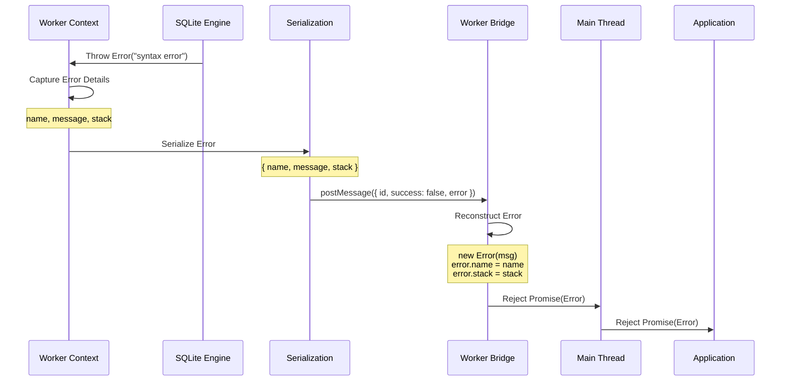
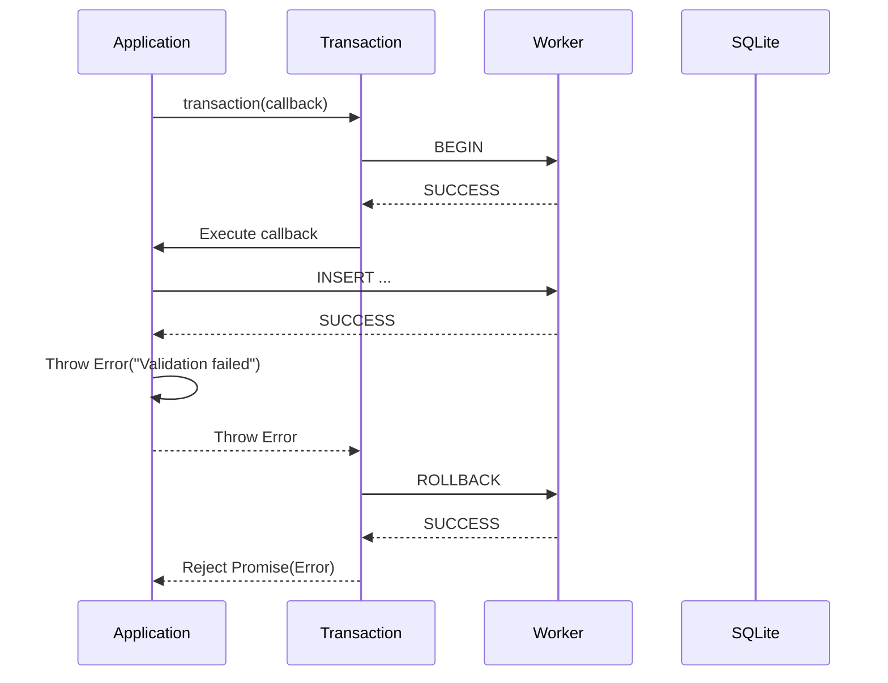
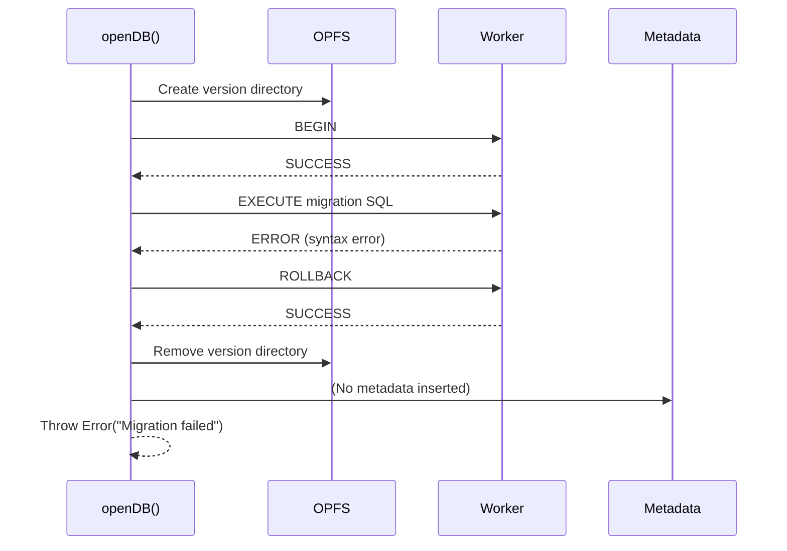

# 03 Error Standards

## 1) Error Handling Strategy

### Global Principles

**Fail Fast**: Errors thrown immediately, not swallowed

- All errors propagate to caller via Promise rejection
- No silent failures or default values
- Clear error messages for debugging

**Stack Trace Preservation**: Full error context across worker boundary

- `name`, `message`, and `stack` preserved
- Original worker stack traces reconstructed in main thread
- Debugging capability maintained

**Automatic Cleanup**: Failed operations clean up partial state

- Transaction errors trigger automatic ROLLBACK
- Migration failures remove incomplete version directories
- Lock release on errors (via ROLLBACK)

**Standard JavaScript Errors**: Native Error objects, not custom classes

- Familiar try/catch and .catch() patterns
- Compatible with error trackers (Sentry, Rollbar)
- No custom error hierarchy

---

## 2) Error Categories

### Category 1: Initialization Errors

**Trigger**: During `openDB()` call, before database operations

**Error Types**:

#### E001: SharedArrayBuffer Unavailable

```typescript
Error: SharedArrayBuffer is not available. Ensure COOP/COEP headers are set.
```

**Cause**:

- COOP/COEP headers not configured
- Browser doesn't support SharedArrayBuffer
- Cross-origin isolation not enabled

**Solution**:

- Configure HTTP headers:
    ```
    Cross-Origin-Opener-Policy: same-origin
    Cross-Origin-Embedder-Policy: require-corp
    ```
- Verify headers at: `https://example.com/test`
- Check browser compatibility (Chrome/Edge/Opera only)

**Where**: `src/validations/shareBufferAbiliCheck.ts`

---

#### E002: Invalid Filename

```typescript
Error: filename must be a non-empty string
```

**Cause**:

- Empty string passed as filename
- Whitespace-only filename
- Non-string type passed

**Solution**:

- Use non-empty string: `openDB("myapp")`
- Trim whitespace if needed

**Where**: `src/release/release-manager.ts`

---

#### E003: OPFS Not Supported

```typescript
Error: OPFS is not supported in this browser
```

**Cause**:

- Browser doesn't implement OPFS API
- `navigator.storage.getDirectory()` not available

**Solution**:

- Use modern browser (Chrome 86+, Edge 86+, Opera 72+)
- Check browser compatibility before calling `openDB()`

**Where**: `src/release/release-manager.ts`

---

### Category 2: Release Validation Errors

**Trigger**: During release config validation in `openDB()`

**Error Types**:

#### E010: Missing Release Config

```typescript
Error: Missing release config for 1.0.0
```

**Cause**:

- Metadata database has version not in release config
- Release config array is incomplete
- Mismatch between config and metadata

**Solution**:

- Include all versions in `releases` config
- Ensure config is complete and ordered
- Check metadata database for existing versions

**Where**: `src/release/release-manager.ts`

---

#### E011: Migration SQL Hash Mismatch

```typescript
Error: migrationSQL hash mismatch for 1.0.0
```

**Cause**:

- Archived release SQL differs from config
- Release config modified after initial deployment
- Manual SQL file modification in OPFS

**Solution**:

- Ensure release configs are immutable
- Don't modify release SQL after deployment
- Revert to original SQL or create new version

**Where**: `src/release/release-manager.ts`

---

#### E012: Seed SQL Hash Mismatch

```typescript
Error: seedSQL hash mismatch for 1.0.0
```

**Cause**:

- Archived seed SQL differs from config
- Release config modified after initial deployment

**Solution**:

- Ensure release configs are immutable
- Revert to original SQL or create new version

**Where**: `src/release/release-manager.ts`

---

#### E013: Release Config Not Greater Than Latest

```typescript
Error: Release config 1.0.0 is not greater than the latest version
```

**Cause**:

- Release config version <= current latest version
- Versions not in ascending order
- Attempting to add historical version

**Solution**:

- Use ascending version order in config
- Only add new versions greater than latest
- Create new version with higher version number

**Where**: `src/release/release-manager.ts`

---

#### E014: Release Config Within Archived Range But Not Recorded

```typescript
Error: Release config 0.9.0 is within archived range but not recorded
```

**Cause**:

- Attempting to insert version between existing versions
- Version history inconsistency
- Manual metadata manipulation

**Solution**:

- Maintain linear version history
- Don't skip versions in config
- Ensure config matches metadata history

**Where**: `src/release/release-manager.ts`

---

### Category 3: SQL Execution Errors

**Trigger**: During `exec()`, `query()`, or transaction operations

**Error Types**:

#### E020: SQL Syntax Error

```typescript
Error: near "SELCT": syntax error
    at worker.ts:123:15
    at query (main.ts:456:10)
```

**Cause**:

- Typo in SQL statement
- Invalid SQL syntax
- Missing keywords or clauses

**Solution**:

- Fix SQL syntax typo
- Validate SQL before execution
- Use SQL linter in development

**Where**: `src/worker.ts` (SQLite engine)

---

#### E021: Table Not Found

```typescript
Error: no such table: users
    at worker.ts:123:15
```

**Cause**:

- Table doesn't exist
- Typo in table name
- Migration not applied

**Solution**:

- Check table name spelling
- Ensure migration created table
- Query `sqlite_master` to verify tables exist

**Where**: `src/worker.ts` (SQLite engine)

---

#### E022: Column Not Found

```typescript
Error: no such column: name
    at worker.ts:123:15
```

**Cause**:

- Column doesn't exist in table
- Typo in column name
- Migration not applied

**Solution**:

- Check column name spelling
- Ensure migration added column
- Query table schema to verify columns

**Where**: `src/worker.ts` (SQLite engine)

---

#### E023: Constraint Violation

```typescript
Error: UNIQUE constraint failed: users.email
    at worker.ts:123:15
```

**Cause**:

- Duplicate value in UNIQUE column
- NOT NULL constraint violated
- FOREIGN KEY constraint violated
- CHECK constraint violated

**Solution**:

- Handle duplicate values in application code
- Ensure required fields are set
- Validate data before insertion

**Where**: `src/worker.ts` (SQLite engine)

---

#### E024: Database Not Open

```typescript
Error: Database is not open
    at worker.ts:123:15
```

**Cause**:

- Worker not initialized
- Database connection closed
- Operation before `openDB()` completes

**Solution**:

- Wait for `openDB()` promise to resolve
- Don't call operations after `close()`
- Ensure proper initialization order

**Where**: `src/worker.ts`

---

### Category 4: Release Operation Errors

**Trigger**: During `devTool.release()` or `devTool.rollback()`

**Error Types**:

#### E030: Dev Tool Release Version Not Greater

```typescript
Error: devTool.release version must be greater than latest
```

**Cause**:

- Dev version <= current latest version
- Attempting to create historical dev version

**Solution**:

- Use version number greater than latest
- Follow semver format (e.g., "1.0.1-dev", "1.0.2-dev")

**Where**: `src/release/release-manager.ts`

---

#### E031: Invalid Version Format

```typescript
Error: Invalid version format: 1.0
```

**Cause**:

- Version doesn't match semver pattern
- Missing patch version
- Leading zeros

**Solution**:

- Use semver format: "x.y.z"
- No leading zeros: "1.0.0", not "1.0.00"
- Use "-dev" suffix for dev versions: "1.0.1-dev"

**Where**: `src/release/release-manager.ts`

---

#### E032: Version Not Found

```typescript
Error: Version not found: 1.0.5
```

**Cause**:

- Attempting to rollback to non-existent version
- Version not in metadata database

**Solution**:

- Query available versions first
- Use existing version from metadata
- Check version spelling

**Where**: `src/release/release-manager.ts`

---

#### E033: Rollback Below Latest Release

```typescript
Error: Cannot rollback below the latest release version
```

**Cause**:

- Attempting to rollback below latest release version
- Target version < latest release version

**Solution**:

- Only rollback to versions >= latest release
- Dev versions can be rolled back freely
- Release versions are protected

**Where**: `src/release/release-manager.ts`

---

#### E034: Release Operation Already In Progress

```typescript
Error: Release operation already in progress
```

**Cause**:

- Concurrent release/rollback operation in progress
- Metadata lock held by another operation

**Solution**:

- Wait for current operation to complete
- Don't call release/rollback concurrently
- Implement operation queue in application if needed

**Where**: `src/release/release-manager.ts`

---

#### E035: Migration Failed (Automatic Rollback)

```typescript
Error: near "INVALID": syntax error
    (Migration rolled back, version directory removed)
```

**Cause**:

- Migration SQL has syntax error
- Seed SQL has syntax error
- Constraint violation during migration

**Solution**:

- Fix SQL syntax error
- Test migration SQL in isolation
- Use dev tooling to test migrations before release

**Automatic Cleanup**:

- Transaction rolled back
- Version directory removed from OPFS
- Active database reverted to previous version

**Where**: `src/release/release-manager.ts`

---

### Category 5: OPFS Errors

**Trigger**: During OPFS file operations

**Error Types**:

#### E040: File Not Found

```typescript
NotFoundError: File not found: db.sqlite3
```

**Cause**:

- Database file doesn't exist
- Version directory missing
- Manual file deletion

**Solution**:

- Ensure database opened with `openDB()`
- Don't manually delete OPFS files
- Reinitialize database if needed

**Where**: `src/release/opfs-utils.ts`

---

#### E041: Quota Exceeded

```typescript
QuotaExceededError: The quota has been exceeded
```

**Cause**:

- OPFS storage limit reached (typically 500MB-1GB)
- Too many versioned databases
- Large dataset exceeding quota

**Solution**:

- Delete old versions manually
- Clear database and reinitialize
- Request more storage from browser (future feature)

**Where**: Browser OPFS API

---

#### E042: Permission Denied

```typescript
NotAllowedError: Permission denied
```

**Cause**:

- OPFS access denied by browser
- Private browsing mode
- Cross-origin isolation issues

**Solution**:

- Exit private browsing mode
- Ensure same-origin isolation
- Check browser permissions

**Where**: Browser OPFS API

---

### Category 6: Transaction Errors

**Trigger**: During `transaction()` callback execution

**Error Types**:

#### E050: Transaction Callback Error

```typescript
Error: Validation failed
    (Transaction rolled back automatically)
```

**Cause**:

- Application code threw error in callback
- Validation failed
- Business logic error

**Solution**:

- Fix application logic error
- Add try/catch in callback for expected errors
- Ensure validation passes before transaction

**Automatic Cleanup**:

- ROLLBACK executed automatically
- Database state restored
- Error re-thrown to caller

**Where**: `src/release/release-manager.ts`

---

#### E051: Transaction SQL Error

```typescript
Error: UNIQUE constraint failed: users.id
    (Transaction rolled back automatically)
```

**Cause**:

- SQL error during transaction
- Constraint violation
- Invalid SQL statement

**Solution**:

- Fix SQL error
- Validate data before transaction
- Ensure constraints are correct

**Automatic Cleanup**:

- ROLLBACK executed automatically
- Partial changes undone
- Error re-thrown to caller

**Where**: `src/worker.ts` → `src/release/release-manager.ts`

---

### Category 7: Worker Errors

**Trigger**: Worker communication failures

**Error Types**:

#### E060: Worker Terminated

```typescript
Error: Worker terminated
```

**Cause**:

- Worker crashed due to unhandled error
- Explicit worker termination
- Browser tab closed
- Out of memory error

**Solution**:

- Handle worker errors in application
- Reinitialize database with new `openDB()` call
- Monitor worker health

**Cleanup**:

- All pending promises rejected
- Message ID map cleared
- Worker becomes unusable

**Where**: `src/worker-bridge.ts`

---

#### E061: Unknown Worker Event

```typescript
Error: Unknown event: invalid_event
```

**Cause**:

- Invalid event type sent to worker
- Message corruption
- Version mismatch between main and worker

**Solution**:

- Use only valid event types (OPEN, EXECUTE, QUERY, CLOSE)
- Ensure library versions match
- Report bug if this occurs

**Where**: `src/worker.ts`

---

#### E062: Invalid Worker Payload

```typescript
Error: Invalid payload for QUERY event: expected { sql: string, bind?: any[] }
```

**Cause**:

- Payload doesn't match expected schema
- Missing required fields
- Type mismatch

**Solution**:

- Ensure payload has required fields
- Check event-specific payload schema
- Verify payload structure

**Where**: `src/worker.ts`

---

## 3) Error Message Format

### Standard Format

```
Error: {descriptive message}
    at {function} ({file}:{line}:{col})
```

### Contextual Messages

**With Context**:

```typescript
Error: migrationSQL hash mismatch for 1.0.0
Expected: abc123...
Actual: def456...
```

**With SQL**:

```typescript
Error: near "SELCT": syntax error
SQL: SELCT * FROM users WHERE id = ?
```

**With Version**:

```typescript
Error: Cannot rollback below latest release version 1.0.0
Target: 0.9.0
```

### Debug Mode Logging

When `debug: true` is enabled:

```typescript
console.debug({
    sql: "SELECT * FROM users",
    duration: 0.28,
    bind: [1],
});
```

---

## 4) Error Propagation Flow

### Worker to Main Thread



### Transaction Error Handling



### Migration Error Handling



---

## 5) Error Recovery Strategies

### Automatic Recovery

**Transaction Rollback**:

```typescript
transaction<T>(fn: transactionCallback<T>): Promise<T> {
  return this.runMutex(async () => {
    await this.exec("BEGIN");
    try {
      const result = await fn(this);
      await this.exec("COMMIT");
      return result;
    } catch (error) {
      await this.exec("ROLLBACK"); // Automatic
      throw error;
    }
  });
}
```

**Migration Cleanup**:

```typescript
try {
    await _exec("BEGIN");
    await _exec(migrationSQL);
    await _exec(seedSQL);
    await _exec("COMMIT");
} catch (error) {
    await _exec("ROLLBACK");
    await removeDir(baseDir, version); // Automatic cleanup
    throw error;
}
```

**Lock Release**:

```typescript
try {
    await metaExec("BEGIN IMMEDIATE");
    // ... release operations ...
    await metaExec("COMMIT");
} catch (error) {
    try {
        await metaExec("ROLLBACK"); // Always release lock
    } catch {
        // ignore rollback errors
    }
    throw error;
}
```

### Manual Recovery

**Worker Restart**:

```typescript
// After worker crash, reinitialize
const db = await openDB("myapp", options);
```

**Database Reset**:

```typescript
// Clear database and start over
await navigator.storage
    .getDirectory()
    .then((root) =>
        root.getDirectoryHandle("myapp").then((dir) => dir.removeRecursively()),
    );
const db = await openDB("myapp", options);
```

**Version Cleanup**:

```typescript
// Remove old versions to free OPFS space
await db.devTool.rollback("1.0.0");
```

---

## 6) Error Prevention

### Input Validation

**Filename Validation**:

```typescript
if (typeof filename !== "string" || filename.trim() === "") {
    throw new Error("filename must be a non-empty string");
}
```

**SQL Validation**:

```typescript
if (typeof sql !== "string" || sql.trim() === "") {
    throw new Error("SQL query must be a non-empty string");
}
```

**Version Validation**:

```typescript
if (!VERSION_RE.test(version)) {
    throw new Error(`Invalid version format: ${version}`);
}
```

### Release Config Immutability

```typescript
// Compute hashes once, validate against metadata
const releaseConfigs = await validateAndHashReleases(options?.releases);
```

### Lock-Based Serialization

```typescript
// Prevent concurrent release operations
const withReleaseLock = async <T>(fn: () => Promise<T>): Promise<T> => {
    try {
        await metaExec("BEGIN IMMEDIATE");
    } catch (error) {
        if (isLockError(error)) {
            throw new Error("Release operation already in progress");
        }
        throw error;
    }
    // ... operations ...
};
```

---

## 7) Error Testing

### Test Coverage

**Unit Tests**:

- Mutex error handling
- Input validation errors
- Error serialization/deserialization

**E2E Tests**:

- Transaction rollback scenarios
- Migration failure cleanup
- Invalid SQL handling
- Hash mismatch errors
- Lock contention scenarios

### Test Examples

**Transaction Rollback**:

```typescript
test("transaction rolls back on error", async () => {
    await db.transaction(async (tx) => {
        await tx.exec("INSERT INTO users (name) VALUES (?)", ["Alice"]);
        throw new Error("Intentional error");
    });

    const users = await db.query("SELECT * FROM users");
    expect(users.length).toBe(0); // Alice not inserted
});
```

**Migration Failure**:

```typescript
test("migration failure removes version directory", async () => {
    const db = await openDB("test", {
        releases: [
            {
                version: "1.0.0",
                migrationSQL: "INVALID SQL", // Syntax error
            },
        ],
    });

    // Should throw error
    // Version directory should be removed
    // Database should remain at previous version
});
```

---

## 8) Error Monitoring

### Integration with Error Trackers

**Sentry Integration**:

```typescript
import * as Sentry from "@sentry/browser";

try {
    await db.exec("INSERT INTO users ...");
} catch (error) {
    Sentry.captureException(error);
    throw error;
}
```

**Custom Error Handler**:

```typescript
const db = await openDB("myapp");

db.query("SELECT * FROM users").catch((error) => {
    console.error("Database error:", error);
    // Send to error tracking service
    analytics.trackError(error);
});
```

### Debug Mode for Development

```typescript
const db = await openDB("myapp", {
    debug: true, // Enable SQL logging for debugging
});
```

---

## 9) Error Reference Table

| Code | Error                                | Category           | Recovery                           |
| ---- | ------------------------------------ | ------------------ | ---------------------------------- |
| E001 | SharedArrayBuffer unavailable        | Initialization     | Configure COOP/COEP headers        |
| E002 | Invalid filename                     | Initialization     | Use non-empty string               |
| E003 | OPFS not supported                   | Initialization     | Use modern browser                 |
| E010 | Missing release config               | Release validation | Add missing version to config      |
| E011 | Migration SQL hash mismatch          | Release validation | Revert SQL or create new version   |
| E012 | Seed SQL hash mismatch               | Release validation | Revert SQL or create new version   |
| E013 | Release config not greater           | Release validation | Use higher version number          |
| E014 | Release config within archived range | Release validation | Maintain linear history            |
| E020 | SQL syntax error                     | SQL execution      | Fix SQL syntax                     |
| E021 | Table not found                      | SQL execution      | Check table name or run migration  |
| E022 | Column not found                     | SQL execution      | Check column name or run migration |
| E023 | Constraint violation                 | SQL execution      | Handle duplicates, validate data   |
| E024 | Database not open                    | SQL execution      | Wait for openDB() to complete      |
| E030 | Dev version not greater              | Release operation  | Use higher version number          |
| E031 | Invalid version format               | Release operation  | Use semver format x.y.z            |
| E032 | Version not found                    | Release operation  | Use existing version               |
| E033 | Rollback below latest release        | Release operation  | Rollback to >= latest release      |
| E034 | Release operation in progress        | Release operation  | Wait for completion                |
| E035 | Migration failed                     | Release operation  | Fix SQL, automatic cleanup         |
| E040 | File not found                       | OPFS               | Don't delete files manually        |
| E041 | Quota exceeded                       | OPFS               | Delete old versions                |
| E042 | Permission denied                    | OPFS               | Check browser permissions          |
| E050 | Transaction callback error           | Transaction        | Fix application logic              |
| E051 | Transaction SQL error                | Transaction        | Fix SQL error                      |
| E060 | Worker terminated                    | Worker             | Reinitialize database              |
| E061 | Unknown worker event                 | Worker             | Use valid event types              |
| E062 | Invalid worker payload               | Worker             | Check payload schema               |

---

## Navigation

**Previous**: [02 Event Catalog](./02-events.md) - Worker message events

**Contracts Series Complete**

**Related Design Documents**:

- [Back to Contracts: 01 API](./01-api.md)
- [Back to Contracts: 02 Events](./02-events.md)

**All Design Documents**:

- [Schema](../02-schema/) - Database, Migrations
- [Modules](../03-modules/) - Core, Release Management, Worker Bridge

**Related ADRs**:

- [ADR-0007: Error Handling](../../04-adr/0007-error-handling-strategy.md) - Error strategy

**Continue to**: [Database Schema](../02-schema/01-database.md) - Database structure and OPFS layout

**Back to**: [Spec Index](../../00-control/00-spec.md)
