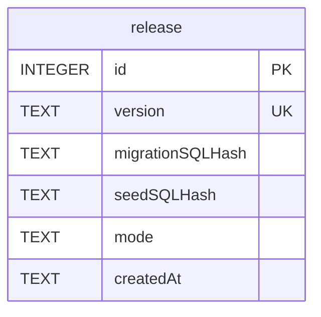
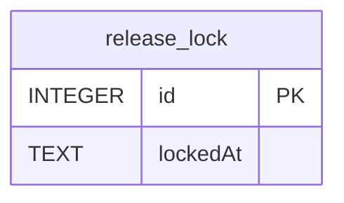
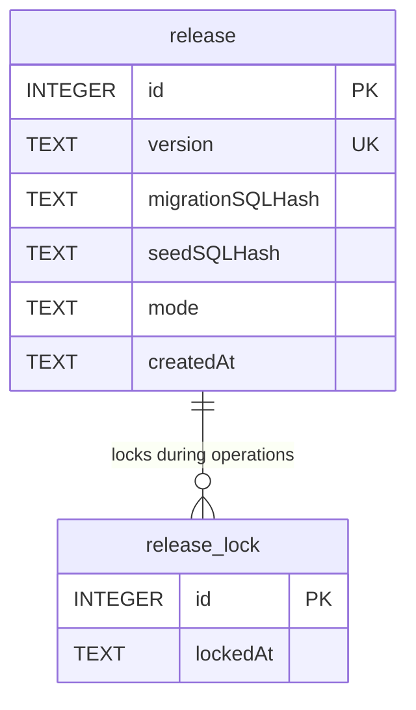
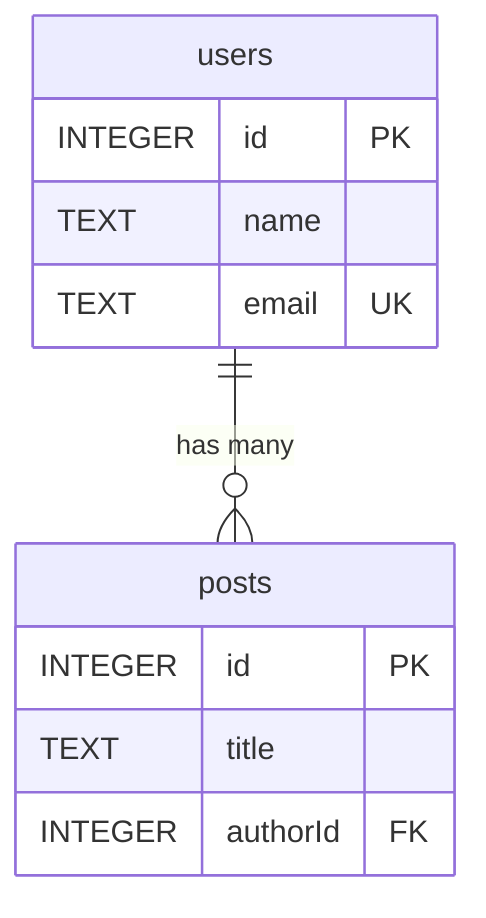
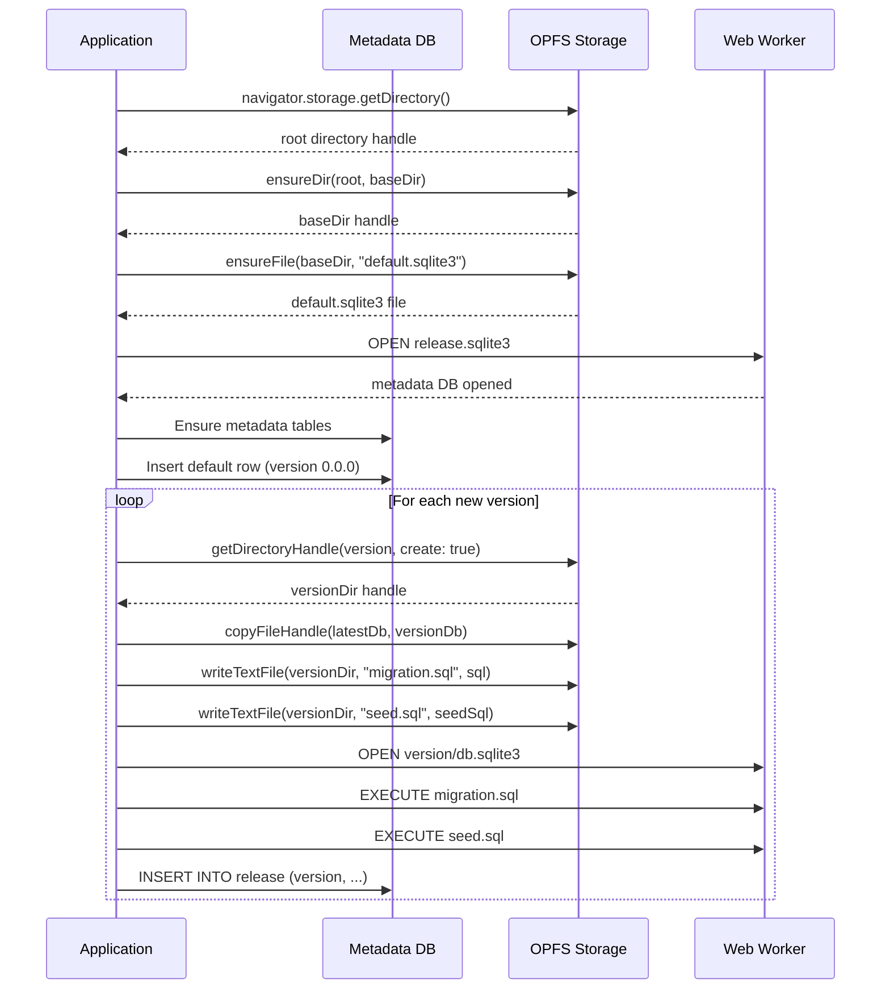
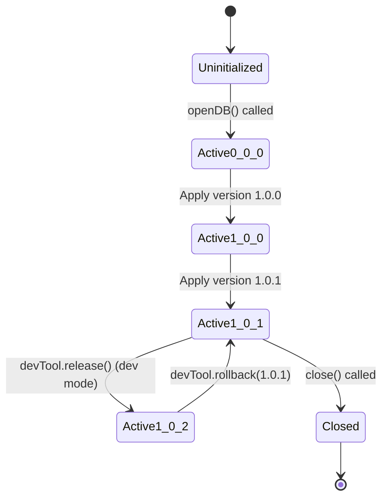
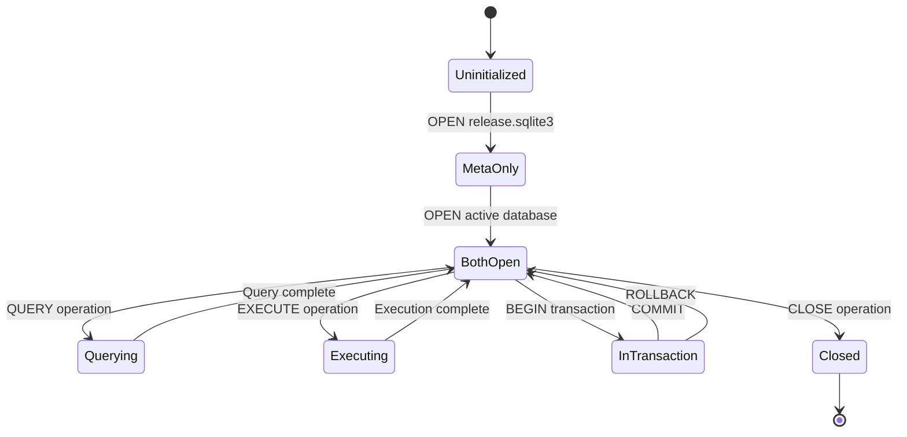

# 01 Database Schema

## 1) Module: Release Metadata Database

### Database: `release.sqlite3`

**Purpose**: Track all database versions with migration and seed SQL hashes.

**Location**: `{baseDir}/release.sqlite3` in OPFS

**Technology**: SQLite (same as user databases)

**Lifecycle**: Created on first `openDB()` call, persists across sessions

---

### Table: `release`

**Purpose**: Store version history with SQL hashes for integrity validation.

**Schema**:

```sql
CREATE TABLE release (
  id INTEGER PRIMARY KEY AUTOINCREMENT,
  version TEXT NOT NULL,
  migrationSQLHash TEXT,
  seedSQLHash TEXT,
  mode TEXT NOT NULL CHECK (mode IN ('release', 'dev')),
  createdAt TEXT NOT NULL
);

CREATE UNIQUE INDEX idx_release_version ON release(version);
```

**Column Descriptions**:

| Column             | Type    | Constraints               | Description                                            |
| ------------------ | ------- | ------------------------- | ------------------------------------------------------ |
| `id`               | INTEGER | PRIMARY KEY AUTOINCREMENT | Auto-incrementing unique identifier                    |
| `version`          | TEXT    | NOT NULL, UNIQUE          | Semantic version string (e.g., "1.0.0", "1.0.1")       |
| `migrationSQLHash` | TEXT    | NULL                      | SHA-256 hash of migration SQL (NULL for version 0.0.0) |
| `seedSQLHash`      | TEXT    | NULL                      | SHA-256 hash of seed SQL (NULL if no seed SQL)         |
| `mode`             | TEXT    | NOT NULL, CHECK           | Version mode: "release" (immutable) or "dev" (mutable) |
| `createdAt`        | TEXT    | NOT NULL                  | ISO 8601 timestamp of version creation                 |

**Indexes**:

- `idx_release_version`: Unique index on `version` column for fast version lookups and uniqueness constraint

**Constraints**:

- `version UNIQUE`: Ensured by unique index `idx_release_version`
- `mode CHECK`: Ensures only valid mode values ("release" or "dev")

**Default Data**:

```sql
INSERT INTO release (version, migrationSQLHash, seedSQLHash, mode, createdAt)
VALUES ('default', NULL, NULL, 'release', '<timestamp>');
```

**Note**: The 'default' version is an internal version representing the initial empty database file (`default.sqlite3`). User-provided releases start from version "0.0.0" or higher.

**Example Rows**:

```sql
-- Version 0.0.0 (first user-provided release)
INSERT INTO release (version, migrationSQLHash, seedSQLHash, mode, createdAt)
VALUES ('0.0.0', NULL, NULL, 'release', '2025-01-09T00:00:00.000Z');

-- Version 1.0.0 (first release)
INSERT INTO release (version, migrationSQLHash, seedSQLHash, mode, createdAt)
VALUES (
  '1.0.0',
  'abc123def456...',  -- SHA-256 hash of migration.sql
  'fed654cba321...',  -- SHA-256 hash of seed.sql
  'release',
  '2025-01-09T01:00:00.000Z'
);

-- Version 1.0.1 (dev version)
INSERT INTO release (version, migrationSQLHash, seedSQLHash, mode, createdAt)
VALUES (
  '1.0.1',
  '789xyz012abc...',
  NULL,  -- No seed SQL for this version
  'dev',
  '2025-01-09T02:00:00.000Z'
);
```

**ER Diagram**:



**Relationships**:

- One-to-many with versioned databases: Each `release` row corresponds to one OPFS directory with database file
- Self-referential ordering: Versions ordered by `id` for linear version history

---

### Table: `release_lock`

**Purpose**: Serialize release operations to prevent concurrent modifications.

**Schema**:

```sql
CREATE TABLE release_lock (
  id PRIMARY KEY CHECK (id = 1),
  lockedAt TEXT NOT NULL
);
```

**Column Descriptions**:

| Column     | Type    | Constraints                 | Description                               |
| ---------- | ------- | --------------------------- | ----------------------------------------- |
| `id`       | INTEGER | PRIMARY KEY, CHECK (id = 1) | Always 1 (single-row table)               |
| `lockedAt` | TEXT    | NOT NULL                    | ISO 8601 timestamp when lock was acquired |

**Constraints**:

- `CHECK (id = 1)`: Ensures only one row exists
- No indexes needed (single-row table)

**Usage Pattern**:

```sql
-- Acquire lock
BEGIN IMMEDIATE;
INSERT OR REPLACE INTO release_lock (id, lockedAt) VALUES (1, '<timestamp>');

-- Perform release operations
-- ...

-- Release lock
COMMIT;

-- Or on error
ROLLBACK;
```

**ER Diagram**:



**Relationships**:

- Independent table used for locking metadata database during release operations

---

### Complete ER Diagram: Metadata Database



---

## 2) Module: User Application Databases

### Database: `{baseDir}/{version}/db.sqlite3`

**Purpose**: Store user application data.

**Location**: `{baseDir}/{version}/db.sqlite3` in OPFS

**Technology**: SQLite (same as metadata database)

**Lifecycle**:

- Created as copy of previous version database
- Persisted across sessions
- Version-specific (isolated snapshots)

**Schema**:

- User-defined (application-specific)
- Evolves via migration SQL in release configs
- No library-enforced schema

**Example Schema**:

```sql
-- Application-defined tables
CREATE TABLE users (
  id INTEGER PRIMARY KEY AUTOINCREMENT,
  name TEXT NOT NULL,
  email TEXT UNIQUE
);

CREATE TABLE posts (
  id INTEGER PRIMARY KEY AUTOINCREMENT,
  title TEXT NOT NULL,
  authorId INTEGER NOT NULL,
  FOREIGN KEY (authorId) REFERENCES users(id)
);
```

**ER Diagram (Example)**:



---

## 3) OPFS File Structure

### Directory Layout

```
OPFS Root
└── {baseDir}/                           # Base directory (e.g., "demo", "myapp")
    ├── release.sqlite3                  # Metadata database
    ├── default.sqlite3                  # Initial empty database (version 0.0.0)
    ├── 0.0.0/                           # Version 0.0.0 directory (alias to default.sqlite3)
    ├── 1.0.0/                           # Version 1.0.0 directory
    │   ├── db.sqlite3                   # Versioned database snapshot
    │   ├── migration.sql                # Migration SQL (for inspection)
    │   └── seed.sql                     # Seed SQL (for inspection)
    ├── 1.0.1/                           # Version 1.0.1 directory
    │   ├── db.sqlite3
    │   ├── migration.sql
    │   └── seed.sql
    └── 1.0.2/                           # Dev version directory
        ├── db.sqlite3
        ├── migration.sql
        └── seed.sql
```

### File Descriptions

#### `release.sqlite3`

- **Purpose**: Metadata database tracking all versions
- **Schema**: `release` and `release_lock` tables
- **Location**: `{baseDir}/release.sqlite3`
- **Size**: Typically < 1MB (depends on version count)

#### `default.sqlite3`

- **Purpose**: Initial empty database (version 0.0.0)
- **Schema**: Empty (no tables)
- **Location**: `{baseDir}/default.sqlite3`
- **Size**: Empty SQLite file (typically 8KB)

#### `{version}/db.sqlite3`

- **Purpose**: Versioned database snapshot
- **Schema**: User-defined (evolves via migrations)
- **Location**: `{baseDir}/{version}/db.sqlite3`
- **Size**: Depends on user data (can be MB to GB)

#### `{version}/migration.sql`

- **Purpose**: Migration SQL for inspection and debugging
- **Content**: SQL executed for this version
- **Location**: `{baseDir}/{version}/migration.sql`
- **Size**: Typically < 100KB

#### `{version}/seed.sql`

- **Purpose**: Seed SQL for inspection and debugging
- **Content**: Optional seed data SQL
- **Location**: `{baseDir}/{version}/seed.sql`
- **Size**: Typically < 100KB (may not exist)

### File Creation Flow



---

## 4) Module: Active Database Pointers

### Concept: "Active Database"

The active database is the versioned database currently in use by the application.

**Representation**:

- In-memory reference in worker: `activeDb` global variable
- File path: `{baseDir}/{latestVersion}/db.sqlite3`
- Metadata row: `release` table row with highest `id`

**Switching Active Database**:

```typescript
// In worker
await sendMsg(OPEN, {
    filename: `${baseDir}/${version}/db.sqlite3`,
    target: "active",
    replace: true, // Close existing connection first
});
```

**State Machine**:



---

## 5) Module: Version History Management

### Linear Version History

Versions are stored in linear order by `id` in the `release` table.

**Querying Versions**:

```sql
-- All versions (ordered)
SELECT id, version, migrationSQLHash, seedSQLHash, mode, createdAt
FROM release
ORDER BY id ASC;

-- Latest version
SELECT id, version, migrationSQLHash, seedSQLHash, mode, createdAt
FROM release
ORDER BY id DESC
LIMIT 1;

-- Latest release version (excluding dev)
SELECT id, version, migrationSQLHash, seedSQLHash, mode, createdAt
FROM release
WHERE mode = 'release' AND version != '0.0.0'
ORDER BY id DESC
LIMIT 1;

-- Dev versions above target
SELECT id, version, mode
FROM release
WHERE mode = 'dev' AND version > '1.0.0'
ORDER BY id;
```

### Version Comparison

**Version Format**: Semantic versioning (semver)

- Pattern: `^(\d+)\.(\d+)\.(\d+)$`
- Examples: "0.0.0", "1.0.0", "1.0.1", "2.3.4"

**Comparison Logic**:

```typescript
function compareVersions(v1: string, v2: string): number {
    const parse = (v: string) => {
        const match = v.match(/^(\d+)\.(\d+)\.(\d+)/);
        return match
            ? [parseInt(match[1]), parseInt(match[2]), parseInt(match[3])]
            : [0, 0, 0];
    };

    const [major1, minor1, patch1] = parse(v1);
    const [major2, minor2, patch2] = parse(v2);

    if (major1 !== major2) return major1 - major2;
    if (minor1 !== minor2) return minor1 - minor2;
    return patch1 - patch2;
}
```

**Version Ordering**:

- "0.0.0" < "1.0.0" < "1.0.1" < "1.0.2" < "1.1.0" < "2.0.0"
- Dev versions follow the same semantic version pattern (no special suffix)
- Distinction is only in the `mode` field ("release" vs "dev")

### Rollback Constraints

**Cannot Rollback Below Latest Release**:

```typescript
if (compareVersions(targetVersion, latestReleaseVersion) < 0) {
    throw new Error("Cannot rollback below the latest release version");
}
```

**Rationale**: Release versions are immutable and must be preserved.

**Example**:

- Latest release: "1.0.0"
- Dev versions: "1.0.1", "1.0.2"
- Valid rollback: "1.0.1", "1.0.0"
- Invalid rollback: "0.9.0", "0.0.0"

---

## 6) Module: SQL Hash Storage

### Hash Computation

**Algorithm**: SHA-256 (using Web Crypto API)

**Input**: Normalized SQL string

**Computation**:

```typescript
async function computeHash(sql: string): Promise<string> {
    const encoder = new TextEncoder();
    const data = encoder.encode(sql);
    const hashBuffer = await crypto.subtle.digest("SHA-256", data);
    const hashArray = Array.from(new Uint8Array(hashBuffer));
    return hashArray.map((b) => b.toString(16).padStart(2, "0")).join("");
}
```

**Normalization**:

```typescript
function normalizeSQL(sql: string | undefined | null): string {
    if (!sql) return "";
    return sql.trim();
}
```

### Hash Storage

**In Metadata Table**:

```sql
INSERT INTO release (version, migrationSQLHash, seedSQLHash, mode, createdAt)
VALUES (
  '1.0.0',
  'abc123def456...',  -- SHA-256 hash of normalized migration.sql
  'fed654cba321...',  -- SHA-256 hash of normalized seed.sql
  'release',
  '2025-01-09T00:00:00.000Z'
);
```

### Hash Validation

**On Database Open**:

```typescript
for (const row of releaseRows) {
    const config = configByVersion.get(row.version);
    if (config.migrationSQLHash !== row.migrationSQLHash) {
        throw new Error(`migrationSQL hash mismatch for ${row.version}`);
    }
    if (config.seedSQLHash !== row.seedSQLHash) {
        throw new Error(`seedSQL hash mismatch for ${row.version}`);
    }
}
```

**Purpose**: Detect accidental or malicious modification of release SQL.

---

## 7) Module: Database Connection Management

### Worker Database Handles

**Global Variables** (in worker context):

```typescript
let activeDb: Sqlite3DB | null = null; // Active user database
let metaDb: Sqlite3DB | null = null; // Metadata database
let sqlite3: Sqlite3 | null = null; // SQLite WASM module
let isDebug = false; // Debug logging flag
```

### Connection Lifecycle



### Connection Switching

**For Version Switching**:

```typescript
// Switch to new version database
await sendMsg(OPEN, {
    filename: `${baseDir}/${newVersion}/db.sqlite3`,
    target: "active",
    replace: true, // Close existing connection first
});
```

**Worker Behavior**:

```typescript
if (target === "active" && replace) {
    if (activeDb) {
        activeDb.close();
        activeDb = null;
    }
}
if (!activeDb) {
    activeDb = new sqlite3!.oo1!.OpfsDb!(filename, "c");
    console.debug(`Switched active database to: ${filename}`);
}
```

---

## 8) Module: Data Consistency

### ACID Guarantees

**Atomicity**: All operations in a transaction succeed or all fail

- Enforced by SQLite: `BEGIN`, `COMMIT`, `ROLLBACK`

**Consistency**: SQL constraints enforced

- UNIQUE, NOT NULL, FOREIGN KEY, CHECK constraints

**Isolation**: No concurrent transactions

- Mutex queue ensures sequential execution
- SQLite is not thread-safe (by design)

**Durability**: Changes persist immediately

- OPFS provides persistent file-backed storage
- SQLite write-ahead logging (WAL) mode

### Transaction Isolation

**Mutex Queue**: All database operations serialized

```typescript
const exec = async (sql: string, params?: SQLParams): Promise<ExecResult> => {
    return runMutex(() => _exec(sql, params, "active"));
};
```

**Benefit**: No concurrent writes, no race conditions

**Trade-off**: Serial execution limits throughput (acceptable for client-side use)

### Release Operation Isolation

**Metadata Lock**: Prevents concurrent release/rollback operations

```typescript
const withReleaseLock = async <T>(fn: () => Promise<T>): Promise<T> => {
    await metaExec("BEGIN IMMEDIATE");
    try {
        const result = await fn();
        await metaExec("COMMIT");
        return result;
    } catch (error) {
        await metaExec("ROLLBACK");
        throw error;
    }
};
```

**Benefit**: Prevents version conflicts and corruption

---

## 9) Module: Database Performance

### Query Performance

**Typical Execution Times**:

- Simple SELECT: 0.2-0.5ms
- INSERT/UPDATE: 0.2-0.5ms
- Transaction: 0.5-2ms (depends on operations)

**Factors**:

- Table size (row count)
- Index usage
- Query complexity (JOINs, subqueries)
- OPFS I/O performance

### Storage Performance

**OPFS Characteristics**:

- Persistent file-backed storage
- Synchronous file I/O in worker context
- Typical quota: 500MB-1GB per origin
- No automatic cleanup

**Versioned Storage Overhead**:

- Each version: full database copy
- Migration SQL: typically < 100KB per version
- Seed SQL: typically < 100KB per version

**Storage Estimation**:

```
Total Storage = (Database Size × Version Count) + (SQL Files × Version Count)
```

Example:

- Database: 50MB
- Versions: 10 releases + 5 dev versions
- SQL files: 50KB × 15 = 750KB
- Total: 50MB × 15 + 750KB ≈ 750MB

---

## 10) Module: Database Backup and Export

### Manual Backup (User-Managed)

**Download Database File**:

```typescript
// Get database file handle from OPFS
const root = await navigator.storage.getDirectory();
const dir = await root.getDirectoryHandle("myapp");
const file = await dir.getFileHandle("1.0.0/db.sqlite3");
const blob = await file.getFile();

// Download to user's computer
const url = URL.createObjectURL(blob);
const a = document.createElement("a");
a.href = url;
a.download = "myapp-1.0.0.sqlite3";
a.click();
```

**Export to SQL Dump**:

```typescript
// Export database schema and data
const rows = await db.query(`
  SELECT sql FROM sqlite_master
  WHERE sql IS NOT NULL
`);

// Generate SQL dump
const dump = rows.map((row) => row.sql).join(";\n");
console.log(dump);
```

### Import (User-Managed)

**Import from SQL Dump**:

```typescript
// Execute SQL dump
const dump = `
  CREATE TABLE users (id INTEGER PRIMARY KEY, name TEXT);
  INSERT INTO users VALUES (1, 'Alice');
`;

await db.exec(dump);
```

**Import from Database File**:

```typescript
// Upload database file and replace existing
const file = await uploadFile(); // User uploads file
const arrayBuffer = await file.arrayBuffer();

// Write to OPFS (user must handle this)
const root = await navigator.storage.getDirectory();
const dir = await root.getDirectoryHandle("myapp");
const newDb = await dir.getFileHandle("imported.sqlite3", { create: true });
const writable = await newDb.createWritable();
await writable.write(arrayBuffer);
await writable.close();
```

---

## 11) Module: Database Inspection

### SQL Schema Inspection

**List Tables**:

```typescript
const tables = await db.query<{ name: string }>(`
  SELECT name FROM sqlite_master
  WHERE type = 'table'
  ORDER BY name
`);
```

**Get Table Schema**:

```typescript
const schema = await db.query<{ sql: string }>(`
  SELECT sql FROM sqlite_master
  WHERE type = 'table' AND name = 'users'
`);
```

**List Indexes**:

```typescript
const indexes = await db.query<{ name: string }>(`
  SELECT name FROM sqlite_master
  WHERE type = 'index'
  ORDER BY name
`);
```

### Data Inspection

**Count Rows**:

```typescript
const count = await db.query<{ count: number }>(`
  SELECT COUNT(*) as count FROM users
`);
```

**Sample Data**:

```typescript
const sample = await db.query(`
  SELECT * FROM users
  LIMIT 10
`);
```

---

## 12) Module: Database Maintenance

### Vacuum (Reclaim Space)

```typescript
await db.exec("VACUUM");
```

**Purpose**: Reclaim unused space and defragment database

**When to Use**: After large DELETE operations

**Caution**: Requires temporary storage space equal to database size

### Analyze (Update Statistics)

```typescript
await db.exec("ANALYZE");
```

**Purpose**: Update query optimizer statistics

**When to Use**: After large INSERT/DELETE operations

### Integrity Check

```typescript
const result = await db.query<{ integrity_check: string }>(
    "PRAGMA integrity_check",
);

if (result[0].integrity_check !== "ok") {
    console.error("Database integrity check failed:", result);
}
```

**Purpose**: Verify database file integrity

**When to Use**: If database corruption suspected

---

## Navigation

**Previous**: [03 Error Standards](../01-contracts/03-errors.md) - Error codes and handling

**Next in Series**: [02 Migration Strategy](./02-migrations.md) - Release versioning and migrations

**Related Design Documents**:

- [Back to Schema](./)
- [Release Management Module](../03-modules/release-management.md) - OPFS operations

**All Design Documents**:

- [Contracts](../01-contracts/) - API, Events, Errors
- [Modules](../03-modules/) - Core, Release Management, Worker Bridge

**Related ADRs**:

- [ADR-0002: OPFS Storage](../../04-adr/0002-opfs-persistent-storage.md) - OPFS architecture
- [ADR-0004: Release Versioning](../../04-adr/0004-release-versioning-system.md) - Versioning system

**Back to**: [Spec Index](../../00-control/00-spec.md)
