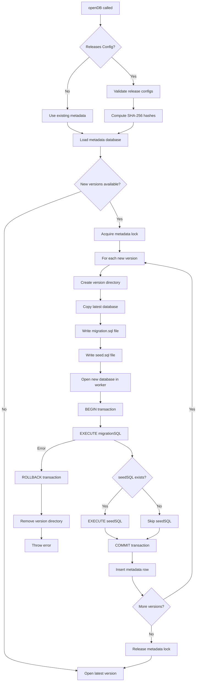
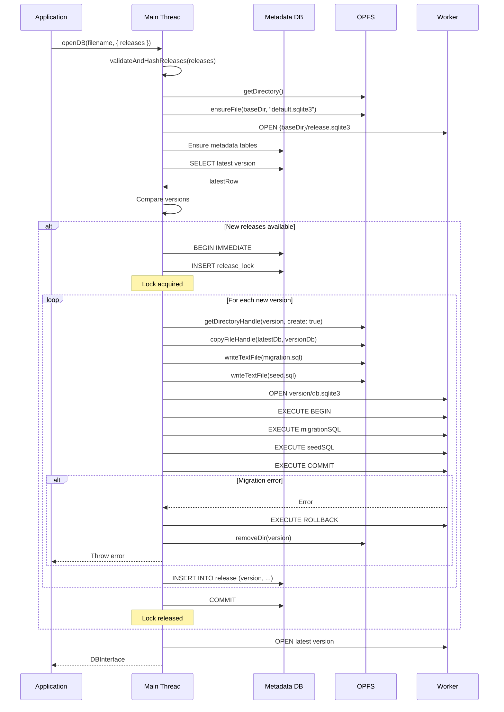
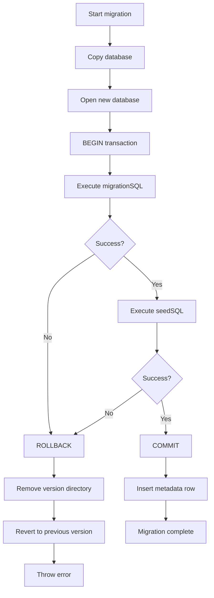
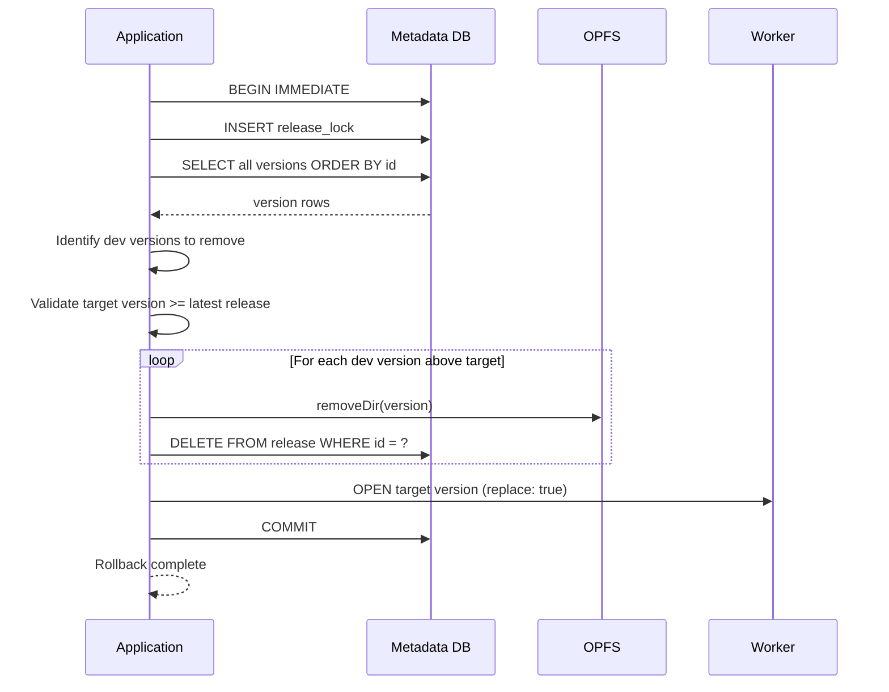

# 02 Migration Strategy

## 1) Migration Philosophy

### Release-Based Versioning

**Core Principle**: Database schema evolves through releases, each with migration SQL and optional seed SQL.

**Key Concepts**:

- **Immutable Releases**: Production releases defined in `openDB()` config, cannot be modified
- **Dev Versions**: Mutable versions created via `devTool.release()` for testing
- **Linear History**: Versions form a linear sequence (no branching)
- **Hash Validation**: SHA-256 hashes ensure release SQL integrity
- **Atomic Application**: Each version applies in a single transaction

**Analogy**: Git commits for database schema

- Each version is like a commit
- Migration SQL is like the diff
- Cannot modify past commits (immutable releases)
- Can create new commits (dev versions)

---

## 2) Migration Types

### Type 1: Schema Migration (migrationSQL)

**Purpose**: Modify database schema (DDL operations)

**Common Operations**:

```sql
-- Create tables
CREATE TABLE users (
  id INTEGER PRIMARY KEY,
  name TEXT NOT NULL
);

-- Add columns
ALTER TABLE users ADD COLUMN email TEXT;

-- Create indexes
CREATE INDEX users_email_idx ON users(email);

-- Drop tables
DROP TABLE old_table;

-- Rename tables
ALTER TABLE old_table RENAME TO new_table;
```

**Constraints**:

- Must be valid SQLite SQL
- Executed in transaction (all-or-nothing)
- Cannot modify migrationSQL after deployment (hash validation)

### Type 2: Data Seeding (seedSQL)

**Purpose**: Populate database with initial data (DML operations)

**Common Operations**:

```sql
-- Insert reference data
INSERT INTO roles (name) VALUES ('admin'), ('user'), ('guest');

-- Insert default users
INSERT INTO users (name, email) VALUES
  ('Alice', 'alice@example.com'),
  ('Bob', 'bob@example.com');

-- Update existing data
UPDATE users SET active = 1 WHERE active IS NULL;
```

**Constraints**:

- Optional (can be `null` or `undefined`)
- Executed after migrationSQL in same transaction
- Cannot modify seedSQL after deployment (hash validation)

### Type 3: Combined Migration + Seed

**Example Release Config**:

```typescript
{
  version: "1.0.0",
  migrationSQL: `
    CREATE TABLE users (
      id INTEGER PRIMARY KEY,
      name TEXT NOT NULL,
      email TEXT UNIQUE
    );
    CREATE INDEX users_email_idx ON users(email);
  `,
  seedSQL: `
    INSERT INTO users (name, email) VALUES
      ('Alice', 'alice@example.com'),
      ('Bob', 'bob@example.com');
  `
}
```

---

## 3) Migration Application Flow

### High-Level Flow



### Detailed Sequence



---

## 4) Migration Validation

### Hash Computation

**Algorithm**: SHA-256 using Web Crypto API

```typescript
async function computeHash(sql: string | undefined | null): Promise<string> {
    if (!sql) return "";
    const normalized = sql.trim();
    const encoder = new TextEncoder();
    const data = encoder.encode(normalized);
    const hashBuffer = await crypto.subtle.digest("SHA-256", data);
    const hashArray = Array.from(new Uint8Array(hashBuffer));
    return hashArray.map((b) => b.toString(16).padStart(2, "0")).join("");
}
```

**Validation on Open**:

```typescript
for (const row of releaseRows) {
    const config = configByVersion.get(row.version);
    if (config.migrationSQLHash !== row.migrationSQLHash) {
        throw new Error(`migrationSQL hash mismatch for ${row.version}`);
    }
    if (config.seedSQLHash !== row.seedSQLHash) {
        throw new Error(`seedSQL hash mismatch for ${row.version}`);
    }
}
```

### Version Validation

**Version Format**: Semver `x.y.z` with no leading zeros

```typescript
const VERSION_RE = /^(0|[1-9]\d*)\.(0|[1-9]\d*)\.(0|[1-9]\d*)$/;
```

**Version Ordering**: Semantic version comparison

```typescript
function compareVersions(v1: string, v2: string): number {
    const [major1, minor1, patch1] = parseVersion(v1);
    const [major2, minor2, patch2] = parseVersion(v2);

    if (major1 !== major2) return major1 - major2;
    if (minor1 !== minor2) return minor1 - minor2;
    return patch1 - patch2;
}
```

**Validation Rules**:

1. Version must be greater than latest
2. Version format must match semver pattern
3. No duplicate versions allowed
4. Linear history (no branching)

---

## 5) Migration Error Handling

### Error Categories

#### E1: SQL Syntax Error

```typescript
Error: near "INVALID": syntax error
```

**Cause**: Typo or invalid SQL in migrationSQL or seedSQL

**Recovery**:

1. Automatic ROLLBACK
2. Remove incomplete version directory
3. Revert to previous version
4. Throw error to application

**Prevention**: Test migration SQL in isolation before release

#### E2: Constraint Violation

```typescript
Error: UNIQUE constraint failed: users.email
```

**Cause**: Migration or seed SQL violates database constraints

**Recovery**: Same as E1 (automatic rollback)

**Prevention**: Ensure seed data respects constraints

#### E3: Hash Mismatch

```typescript
Error: migrationSQL hash mismatch for 1.0.0
```

**Cause**: Release config SQL differs from archived SQL

**Recovery**: No recovery (error thrown on open)

**Prevention**: Keep release configs immutable

### Error Recovery Flow



---

## 6) Migration Best Practices

### DO: Atomic Migrations

**Good**: Single transaction for all operations

```typescript
{
  version: "1.0.0",
  migrationSQL: `
    CREATE TABLE users (
      id INTEGER PRIMARY KEY,
      name TEXT NOT NULL
    );
    CREATE INDEX users_name_idx ON users(name);
    ALTER TABLE posts ADD COLUMN authorId INTEGER;
  `
}
```

**Bad**: Multiple separate migrations (breaks atomicity)

```typescript
// Don't do this
[
    {
        version: "1.0.0",
        migrationSQL: "CREATE TABLE users (id INTEGER PRIMARY KEY);",
    },
    {
        version: "1.0.1",
        migrationSQL: "ALTER TABLE users ADD COLUMN name TEXT;",
    },
    {
        version: "1.0.2",
        migrationSQL: "CREATE INDEX users_name_idx ON users(name);",
    },
];
```

### DO: Idempotent Seed SQL

**Good**: Use `INSERT OR IGNORE` or `INSERT OR REPLACE`

```sql
INSERT OR IGNORE INTO roles (name) VALUES ('admin');
INSERT OR REPLACE INTO settings (key, value) VALUES ('theme', 'dark');
```

**Bad**: Plain `INSERT` (fails on re-run)

```sql
INSERT INTO roles (name) VALUES ('admin'); -- Fails if admin exists
```

### DO: Backwards-Compatible Migrations

**Good**: Add new columns with defaults

```sql
ALTER TABLE users ADD COLUMN age INTEGER DEFAULT 0;
```

**Bad**: Remove columns without migration

```sql
-- Don't do this (breaks old code)
DROP COLUMN age;
```

### DO: Test Migrations

**Test Strategy**:

1. Write migration SQL
2. Create dev version: `db.devTool.release({ version: "1.0.0", migrationSQL })`
3. Test application with new schema
4. Rollback if issues: `db.devTool.rollback("default")`
5. Iterate until stable
6. Deploy as release: `openDB("myapp", { releases: [{ version: "1.0.0", migrationSQL }] })`

### DON'T: Modify Released Migrations

**Immutable**: Release configs cannot be changed after deployment

**Bad**:

```typescript
// Initial deployment
openDB("myapp", {
    releases: [
        {
            version: "1.0.0",
            migrationSQL:
                "CREATE TABLE users (id INTEGER PRIMARY KEY, name TEXT);",
        },
    ],
});

// Later attempt to modify (FAILS)
openDB("myapp", {
    releases: [
        {
            version: "1.0.0",
            migrationSQL:
                "CREATE TABLE users (id INTEGER PRIMARY KEY, name TEXT, email TEXT);",
        }, // Hash mismatch!
    ],
});
```

**Good**: Create new version

```typescript
openDB("myapp", {
    releases: [
        {
            version: "1.0.0",
            migrationSQL:
                "CREATE TABLE users (id INTEGER PRIMARY KEY, name TEXT);",
        },
        {
            version: "1.1.0",
            migrationSQL: "ALTER TABLE users ADD COLUMN email TEXT;",
        },
    ],
});
```

---

## 7) Dev Workflow

### Local Development with Dev Versions

**Step 1: Start with base version**

```typescript
const db = await openDB("myapp", {
    releases: [
        {
            version: "1.0.0",
            migrationSQL:
                "CREATE TABLE users (id INTEGER PRIMARY KEY, name TEXT);",
        },
    ],
});
```

**Step 2: Create dev version for testing**

```typescript
await db.devTool.release({
    version: "1.0.1",
    migrationSQL: "ALTER TABLE users ADD COLUMN email TEXT;",
    seedSQL: "UPDATE users SET email = 'test@example.com' WHERE email IS NULL;",
});
```

**Step 3: Test application with new schema**

```typescript
await db.exec("INSERT INTO users (name, email) VALUES (?, ?)", [
    "Alice",
    "alice@example.com",
]);
const users = await db.query("SELECT * FROM users");
console.log(users); // [{ id: 1, name: "Alice", email: "alice@example.com" }]
```

**Step 4: Rollback if issues found**

```typescript
await db.devTool.rollback("1.0.0");
// Back to version 1.0.0, email column removed
```

**Step 5: Iterate and stabilize**

```typescript
// Create new dev version with fixes
await db.devTool.release({
    version: "1.0.2",
    migrationSQL: "ALTER TABLE users ADD COLUMN email TEXT UNIQUE;", // Added UNIQUE constraint
});
```

**Step 6: Deploy as release when stable**

```typescript
// In production config
const db = await openDB("myapp", {
    releases: [
        {
            version: "1.0.0",
            migrationSQL:
                "CREATE TABLE users (id INTEGER PRIMARY KEY, name TEXT);",
        },
        {
            version: "1.1.0",
            migrationSQL: "ALTER TABLE users ADD COLUMN email TEXT UNIQUE;",
        },
    ],
});
```

### Migration Testing Checklist

- [ ] Migration SQL executes without errors
- [ ] Seed SQL executes without errors
- [ ] Application works with new schema
- [ ] Old application code still works (backwards compatibility)
- [ ] Performance acceptable (no slow queries)
- [ ] Data integrity maintained (constraints, indexes)
- [ ] Rollback works correctly
- [ ] Multiple migrations apply correctly

---

## 8) Migration Rollback Strategy

### Release Rollback Constraints

**Cannot Rollback Below Latest Release**

```typescript
// Versions: 1.0.0 (release), 1.0.1 (dev), 1.0.2 (dev)
await db.devTool.rollback("1.0.0"); // OK
await db.devTool.rollback("0.9.0"); // ERROR: Cannot rollback below latest release
```

**Rationale**: Release versions are immutable and must be preserved

### Dev Version Rollback

**Free Rollback Within Dev Versions**

```typescript
// Versions: 1.0.0 (release), 1.0.1 (dev), 1.0.2 (dev), 1.0.3 (dev)
await db.devTool.rollback("1.0.1"); // OK (removes 1.0.2, 1.0.3)
```

**Rollback Behavior**:

1. Identify dev versions above target
2. Remove version directories from OPFS
3. Delete metadata rows
4. Switch active database to target version

### Rollback Flow



---

## 9) Migration Performance

### Typical Migration Times

| Operation                      | Time    | Notes           |
| ------------------------------ | ------- | --------------- |
| Copy 50MB database             | 10-20ms | OPFS file copy  |
| Execute migration (1000 lines) | 1-5ms   | Simple DDL/DML  |
| Execute seed (1000 rows)       | 5-10ms  | Batch inserts   |
| Total per version              | 20-50ms | Typical release |

### Factors Affecting Performance

**Database Size**: Larger databases take longer to copy

- 10MB: ~5ms copy time
- 50MB: ~20ms copy time
- 100MB: ~40ms copy time
- 500MB: ~200ms copy time

**Migration Complexity**: More SQL = more time

- Simple ALTER TABLE: <1ms
- CREATE INDEX on large table: 10-100ms
- Data migration with UPDATE: 10-1000ms

**Seed Data Volume**: More rows = more time

- 100 rows: <1ms
- 1000 rows: ~5ms
- 10000 rows: ~50ms

### Optimization Strategies

**Batch Inserts** (for seed SQL):

```sql
-- Good: Single INSERT with multiple values
INSERT INTO users (name) VALUES
  ('Alice'),
  ('Bob'),
  ('Charlie');

-- Bad: Multiple INSERT statements
INSERT INTO users (name) VALUES ('Alice');
INSERT INTO users (name) VALUES ('Bob');
INSERT INTO users (name) VALUES ('Charlie');
```

**Create Indexes After Data Load**:

```sql
-- Good: Load data first, then create index
INSERT INTO users (name) SELECT name FROM import_data;
CREATE INDEX users_name_idx ON users(name);

-- Bad: Create index before loading data
CREATE INDEX users_name_idx ON users(name);
INSERT INTO users (name) SELECT name FROM import_data; -- Slower
```

**Use Transactions** (automatic in migrations):

```sql
BEGIN;
-- Migration SQL
-- Seed SQL
COMMIT;
```

---

## 10) Migration Troubleshooting

### Issue: Migration Stuck

**Symptoms**: `openDB()` takes very long or hangs

**Causes**:

- Large database copy in progress
- Complex migration SQL executing
- Metadata lock held by another operation

**Solutions**:

1. Check browser DevTools for console logs
2. Verify no other tabs running migrations
3. Check OPFS quota not exceeded
4. Restart browser if needed

### Issue: Hash Mismatch Error

**Symptoms**: `Error: migrationSQL hash mismatch for 1.0.0`

**Causes**:

- Release config modified after deployment
- Manual SQL file modification in OPFS
- Version mismatch between config and metadata

**Solutions**:

1. Revert release config to original SQL
2. Or create new version with corrected SQL
3. Don't modify released migrations

### Issue: Migration Failed

**Symptoms**: `Error: near "INVALID": syntax error`

**Causes**:

- SQL syntax error in migrationSQL or seedSQL
- Constraint violation
- Table or column not found

**Solutions**:

1. Fix SQL syntax error
2. Test migration in dev version first
3. Use dev tooling for iterative testing

### Issue: Rollback Failed

**Symptoms**: `Error: Cannot rollback below latest release version`

**Causes**:

- Attempting to rollback below latest release
- Target version not found

**Solutions**:

1. Rollback to version >= latest release
2. Check version exists in metadata
3. Use `devTool.release()` to create missing version

---

## 11) Migration Security

### SQL Injection Prevention

**Parameterized Queries**: Use bind parameters in seed SQL

```typescript
// Good: Use bind parameters
await db.exec("INSERT INTO users (name) VALUES (?)", [userName]);

// Bad: String concatenation (vulnerable to SQL injection)
await db.exec(`INSERT INTO users (name) VALUES ('${userName}')`);
```

**Migration SQL**: No user input (static SQL only)

```typescript
// Migration SQL is static, not user-generated
{
  version: "1.0.0",
  migrationSQL: "CREATE TABLE users (id INTEGER PRIMARY KEY, name TEXT);" // Safe
}
```

### Hash Validation Security

**Tamper Detection**: SHA-256 hashes detect unauthorized modifications

```typescript
// If SQL modified, hash mismatch error occurs
Error: migrationSQL hash mismatch for 1.0.0
```

**Prevention**: Keep release configs immutable and version-controlled

---

## 12) Migration Examples

### Example 1: Simple Schema Addition

**Scenario**: Add email column to users table

```typescript
const db = await openDB("myapp", {
    releases: [
        {
            version: "1.0.0",
            migrationSQL: `
        CREATE TABLE users (
          id INTEGER PRIMARY KEY,
          name TEXT NOT NULL
        );
      `,
        },
        {
            version: "1.1.0",
            migrationSQL: `
        ALTER TABLE users ADD COLUMN email TEXT;
        CREATE INDEX users_email_idx ON users(email);
      `,
        },
    ],
});
```

### Example 2: Data Migration

**Scenario**: Split user name into first and last

```typescript
const db = await openDB("myapp", {
    releases: [
        {
            version: "1.0.0",
            migrationSQL: `
        CREATE TABLE users (
          id INTEGER PRIMARY KEY,
          name TEXT NOT NULL
        );
        INSERT INTO users (name) VALUES ('Alice Smith'), ('Bob Jones');
      `,
        },
        {
            version: "1.1.0",
            migrationSQL: `
        ALTER TABLE users ADD COLUMN firstName TEXT;
        ALTER TABLE users ADD COLUMN lastName TEXT;

        UPDATE users SET
          firstName = substr(name, 1, instr(name, ' ') - 1),
          lastName = substr(name, instr(name, ' ') + 1);

        CREATE INDEX users_firstName_idx ON users(firstName);
        CREATE INDEX users_lastName_idx ON users(lastName);
      `,
        },
    ],
});
```

### Example 3: Complex Schema Evolution

**Scenario**: Add posts table with foreign key

```typescript
const db = await openDB("myapp", {
    releases: [
        {
            version: "1.0.0",
            migrationSQL: `
        CREATE TABLE users (
          id INTEGER PRIMARY KEY,
          name TEXT NOT NULL
        );
      `,
        },
        {
            version: "1.1.0",
            migrationSQL: `
        CREATE TABLE posts (
          id INTEGER PRIMARY KEY,
          title TEXT NOT NULL,
          authorId INTEGER NOT NULL,
          FOREIGN KEY (authorId) REFERENCES users(id) ON DELETE CASCADE
        );
        CREATE INDEX posts_authorId_idx ON posts(authorId);
      `,
            seedSQL: `
        INSERT INTO posts (title, authorId) VALUES
          ('Hello World', 1),
          ('Second Post', 1);
      `,
        },
    ],
});
```

### Example 4: Dev Workflow

**Scenario**: Test migration before release

```typescript
// Start with version 1.0.0
const db = await openDB("myapp", {
    releases: [
        {
            version: "1.0.0",
            migrationSQL:
                "CREATE TABLE users (id INTEGER PRIMARY KEY, name TEXT);",
        },
    ],
});

// Create dev version for testing
await db.devTool.release({
    version: "1.0.1",
    migrationSQL: "ALTER TABLE users ADD COLUMN email TEXT;",
});

// Test application
await db.exec("INSERT INTO users (name, email) VALUES (?, ?)", [
    "Alice",
    "alice@example.com",
]);
const users = await db.query("SELECT * FROM users");
console.log(users); // [{ id: 1, name: "Alice", email: "alice@example.com" }]

// Rollback if issues
await db.devTool.rollback("1.0.0");

// Create new dev version with fixes
await db.devTool.release({
    version: "1.0.2",
    migrationSQL: "ALTER TABLE users ADD COLUMN email TEXT UNIQUE;", // Added UNIQUE
});

// Deploy as release when stable
const dbProd = await openDB("myapp", {
    releases: [
        {
            version: "1.0.0",
            migrationSQL:
                "CREATE TABLE users (id INTEGER PRIMARY KEY, name TEXT);",
        },
        {
            version: "1.1.0",
            migrationSQL: "ALTER TABLE users ADD COLUMN email TEXT UNIQUE;",
        },
    ],
});
```

---

## Navigation

**Previous**: [01 Database Schema](./01-database.md) - Database structure and OPFS layout

**Schema Series Complete**

**Related Design Documents**:

- [Back to Schema: 01 Database](./01-database.md)

**All Design Documents**:

- [Contracts](../01-contracts/) - API, Events, Errors
- [Modules](../03-modules/) - Core, Release Management, Worker Bridge

**Related ADRs**:

- [ADR-0004: Release Versioning](../../04-adr/0004-release-versioning-system.md) - Versioning system
- [Spec: RELEASES.md](../../../../specs/RELEASES.md) - Detailed release specification

**Continue to**: [Core Module](../03-modules/core.md) - Core database API implementation

**Back to**: [Spec Index](../../00-control/00-spec.md)
