# Module: Core Database API

## 1) Assets

**Purpose**: Provide public API for database operations with type-safe interfaces.

**Links to Contracts**:

-   API: `docs/05-design/01-contracts/01-api.md#module-core-database-api`
-   Events: `docs/05-design/01-contracts/02-events.md`
-   Errors: `docs/05-design/01-contracts/03-errors.md`

**Links to Schema**:

-   Database: `docs/05-design/02-schema/01-database.md`
-   Migrations: `docs/05-design/02-schema/02-migrations.md`

---

## 2) Module Responsibilities

### Primary Responsibilities

1. **Database Initialization**: Open database with release versioning support
2. **SQL Execution**: Execute SQL statements without returning rows
3. **Query Execution**: Execute SELECT queries and return results
4. **Transaction Management**: Execute operations atomically with automatic rollback
5. **Connection Management**: Close database and release resources
6. **Dev Tooling**: Provide release testing and rollback APIs

### Cross-Cutting Concerns

-   **Type Safety**: Full TypeScript type definitions with generics
-   **Error Handling**: Comprehensive error propagation with stack trace preservation
-   **Concurrency**: Mutex-based operation serialization
-   **Validation**: Input validation for all public APIs
-   **Logging**: Debug mode for SQL execution logging

---

## 3) Public Interface

### `openDB(filename, options?): Promise<DBInterface>`

**Purpose**: Initialize database connection and apply pending migrations.

**File**: `src/main.ts`

**Dependencies**:

-   `abilityCheck()` - SharedArrayBuffer validation
-   `createWorkerBridge()` - Worker communication layer
-   `createMutex()` - Concurrency control
-   `openReleaseDB()` - Release management logic

**Flow**:

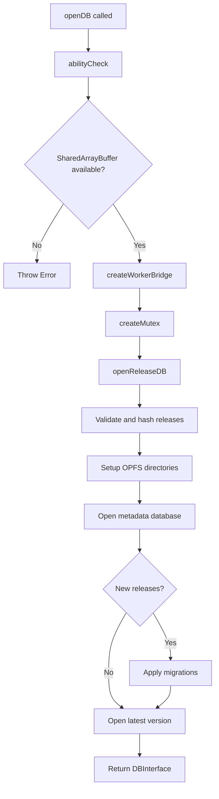

**Code**:

```typescript
export const openDB = async (
    filename: string,
    options?: OpenDBOptions
): Promise<DBInterface> => {
    abilityCheck(); // Throws if SharedArrayBuffer unavailable

    const { sendMsg } = createWorkerBridge();
    const runMutex = createMutex();

    return await openReleaseDB({
        filename,
        options,
        sendMsg,
        runMutex,
    });
};
```

---

### `DBInterface.exec(sql, params?): Promise<ExecResult>`

**Purpose**: Execute SQL statements without returning rows.

**File**: `src/release/release-manager.ts` (implemented in `openReleaseDB`)

**Dependencies**:

-   `runMutex()` - Concurrency control
-   `sendMsg()` - Worker communication

**Flow**:

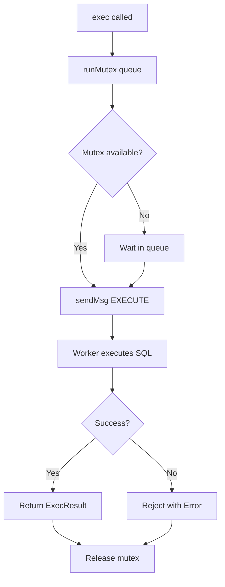

**Code**:

```typescript
const exec = async (sql: string, params?: SQLParams): Promise<ExecResult> => {
    return runMutex(() => _exec(sql, params, "active"));
};

const _exec = async (
    sql: string,
    params?: SQLParams,
    target: DbTarget = "active"
): Promise<ExecResult> => {
    return await sendMsg<ExecResult, ExecParams>(SqliteEvent.EXECUTE, {
        sql,
        bind: params,
        target,
    });
};
```

---

### `DBInterface.query<T>(sql, params?): Promise<T[]>`

**Purpose**: Execute SELECT queries and return typed results.

**File**: `src/release/release-manager.ts` (implemented in `openReleaseDB`)

**Dependencies**:

-   `runMutex()` - Concurrency control
-   `sendMsg()` - Worker communication

**Flow**:

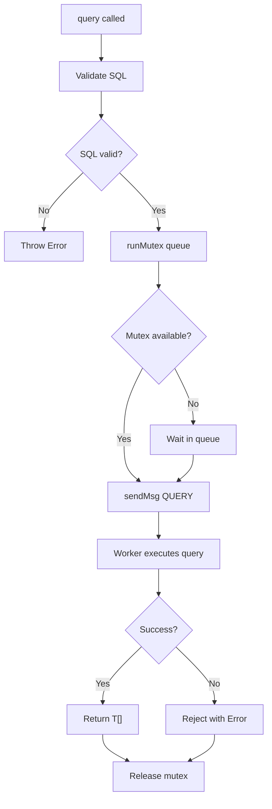

**Code**:

```typescript
const query = async <T = unknown>(
    sql: string,
    params?: SQLParams
): Promise<T[]> => {
    return runMutex(() => _query<T>(sql, params, "active"));
};

const _query = async <T = unknown>(
    sql: string,
    params?: SQLParams,
    target: DbTarget = "active"
): Promise<T[]> => {
    if (typeof sql !== "string" || sql.trim() === "") {
        throw new Error("SQL query must be a non-empty string");
    }
    return await sendMsg<T[], ExecParams>(SqliteEvent.QUERY, {
        sql,
        bind: params,
        target,
    });
};
```

---

### `DBInterface.transaction<T>(fn): Promise<T>`

**Purpose**: Execute operations atomically with automatic rollback on error.

**File**: `src/release/release-manager.ts` (implemented in `openReleaseDB`)

**Dependencies**:

-   `runMutex()` - Concurrency control
-   `_exec()` - SQL execution

**Flow**:

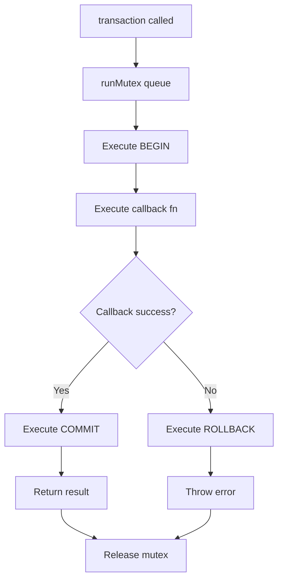

**Code**:

```typescript
const transaction = async <T>(fn: transactionCallback<T>): Promise<T> => {
    return runMutex(async () => {
        await _exec("BEGIN", undefined, "active");
        try {
            const result = await fn({
                exec: (sql: string, params?: SQLParams) =>
                    _exec(sql, params, "active"),
                query: <U = unknown>(sql: string, params?: SQLParams) =>
                    _query<U>(sql, params, "active"),
            });
            await _exec("COMMIT", undefined, "active");
            return result;
        } catch (error) {
            await _exec("ROLLBACK", undefined, "active");
            throw error;
        }
    });
};
```

---

### `DBInterface.close(): Promise<void>`

**Purpose**: Close database connections and release resources.

**File**: `src/release/release-manager.ts` (implemented in `openReleaseDB`)

**Dependencies**:

-   `runMutex()` - Concurrency control
-   `sendMsg()` - Worker communication

**Flow**:

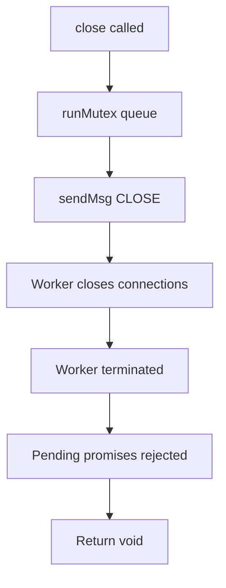

**Code**:

```typescript
const close = async (): Promise<void> => {
    return runMutex(async () => {
        await sendMsg(SqliteEvent.CLOSE);
    });
};
```

---

### `DBInterface.devTool.release(input): Promise<void>`

**Purpose**: Create new dev version for testing.

**File**: `src/release/release-manager.ts` (implemented in `openReleaseDB`)

**Dependencies**:

-   `validateAndHashReleases()` - Release validation
-   `compareVersions()` - Version comparison
-   `withReleaseLock()` - Metadata lock
-   `applyVersion()` - Version application

**Flow**:

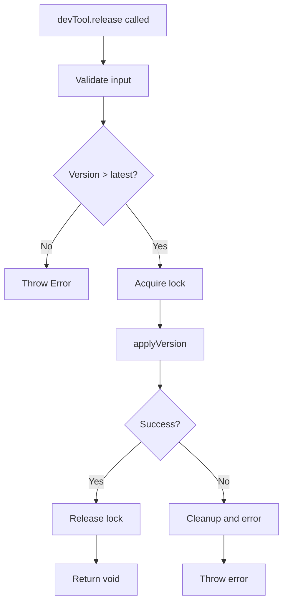

**Code**:

```typescript
const devToolRelease: DevTool["release"] = async (input) => {
    return runMutex(async () => {
        const [config] = await validateAndHashReleases([input]);
        if (!config) {
            throw new Error("devTool.release requires a valid release config");
        }
        if (compareVersions(config.version, latestVersion) <= 0) {
            throw new Error(
                "devTool.release version must be greater than latest"
            );
        }
        await withReleaseLock(async () => {
            await applyVersion(config, "dev");
        });
    });
};
```

---

### `DBInterface.devTool.rollback(version): Promise<void>`

**Purpose**: Roll back to target version, removing dev versions above it.

**File**: `src/release/release-manager.ts` (implemented in `openReleaseDB`)

**Dependencies**:

-   `withReleaseLock()` - Metadata lock
-   `compareVersions()` - Version comparison
-   `removeDir()` - OPFS cleanup

**Flow**:

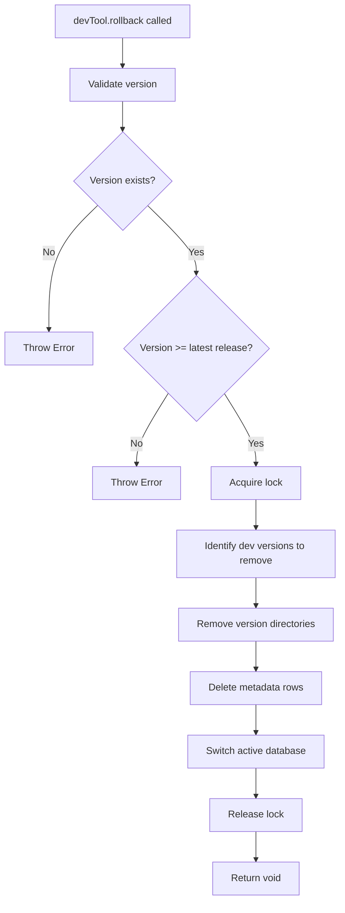

**Code**:

```typescript
const devToolRollback: DevTool["rollback"] = async (version) => {
    return runMutex(async () => {
        if (version !== DEFAULT_VERSION && !VERSION_RE.test(version)) {
            throw new Error(`Invalid version format: ${version}`);
        }

        await withReleaseLock(async () => {
            const rows = await metaQuery<ReleaseRow>(
                "SELECT * FROM release ORDER BY id"
            );

            const targetRow = rows.find((row) => row.version === version);
            if (!targetRow) {
                throw new Error(`Version not found: ${version}`);
            }

            const latestRelease = getLatestReleaseVersion(
                rows.filter((row) => row.mode === "release")
            );

            if (compareVersions(version, latestRelease) < 0) {
                throw new Error(
                    "Cannot rollback below the latest release version"
                );
            }

            const devRowsToRemove = rows.filter(
                (row) =>
                    row.mode === "dev" &&
                    compareVersions(row.version, version) > 0
            );

            for (const row of devRowsToRemove) {
                await removeDir(baseDir, row.version);
                await metaExec("DELETE FROM release WHERE id = ?", [row.id]);
            }

            latestVersion = version;
            latestDbHandle = await getDbHandleForVersion(
                baseDir,
                version,
                false
            );
            await openActiveDb(
                getDbPathForVersion(normalizedFilename, version),
                true
            );
        });
    });
};
```

---

## 4) Internal Operations

### Operation: SQL Validation

**Purpose**: Validate SQL strings before execution.

**Location**: `src/release/release-manager.ts` (in `_query`)

**Code**:

```typescript
if (typeof sql !== "string" || sql.trim() === "") {
    throw new Error("SQL query must be a non-empty string");
}
```

**Rules**:

-   SQL must be a string
-   SQL cannot be empty or whitespace-only
-   Validation happens before mutex queue

---

### Operation: Mutex Queue Management

**Purpose**: Serialize all database operations to prevent race conditions.

**Location**: `src/utils/mutex/mutex.ts`

**Flow**:

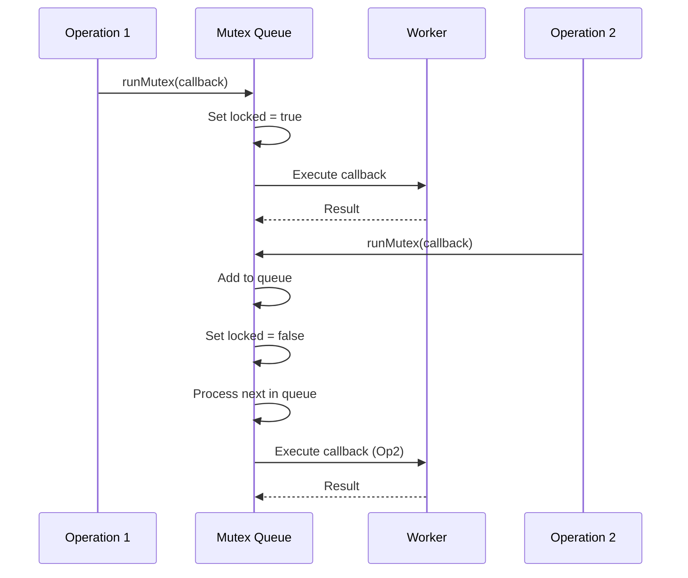

**Code**:

```typescript
export const createMutex = () => {
    let locked = false;
    const queue: Array<() => void> = [];

    const runMutex = async <T>(callback: () => Promise<T>): Promise<T> => {
        return new Promise<T>((resolve, reject) => {
            const task = async () => {
                try {
                    const result = await callback();
                    resolve(result);
                } catch (error) {
                    reject(error);
                } finally {
                    if (queue.length > 0) {
                        const next = queue.shift()!;
                        next();
                    } else {
                        locked = false;
                    }
                }
            };

            if (!locked) {
                locked = true;
                task();
            } else {
                queue.push(task);
            }
        });
    };

    return { runMutex };
};
```

---

### Operation: Worker Message Sending

**Purpose**: Send messages to worker and await responses.

**Location**: `src/worker-bridge.ts`

**Flow**:

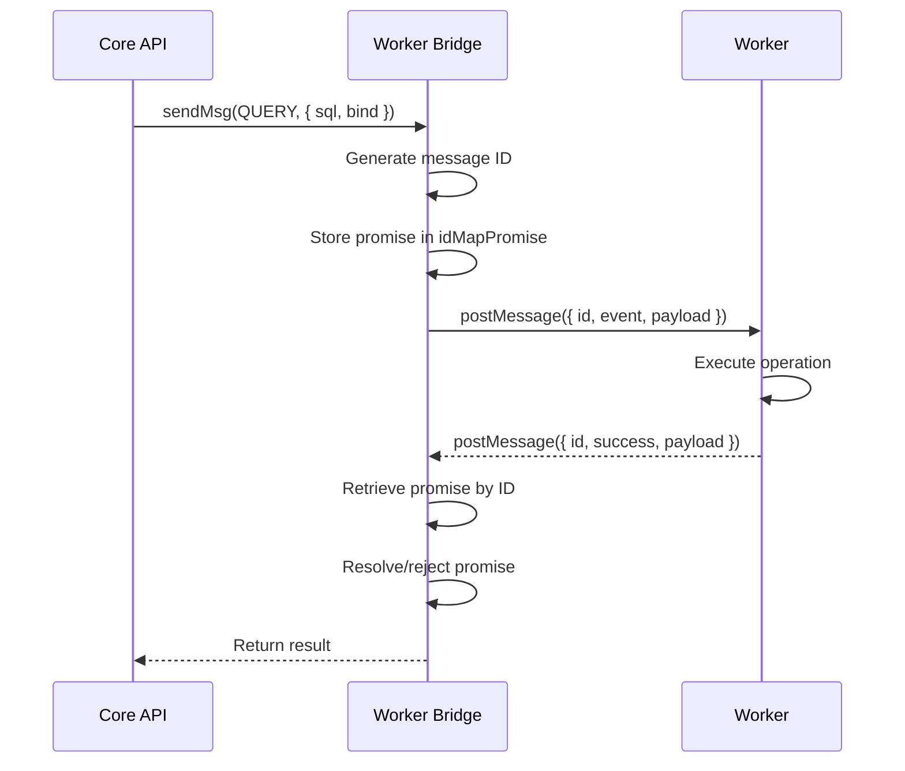

**Code**:

```typescript
const sendMsg = <TRes, TReq = unknown>(
    event: SqliteEvent,
    payload?: TReq
): Promise<TRes> => {
    const id = getLatestMsgId();
    const msg: SqliteReqMsg<TReq> = { id, event, payload };

    return new Promise<TRes>((resolve, reject) => {
        idMapPromise.set(id, {
            resolve: resolve as (value: unknown) => void,
            reject,
        });
        worker.postMessage(msg);
    });
};
```

---

## 5) Error Handling

### Error Categories

1. **Initialization Errors**: SharedArrayBuffer unavailable, invalid filename
2. **SQL Execution Errors**: Syntax errors, constraint violations
3. **Transaction Errors**: Callback errors, SQL errors
4. **Release Errors**: Hash mismatches, version conflicts
5. **Dev Tool Errors**: Invalid version, rollback constraints

### Error Propagation

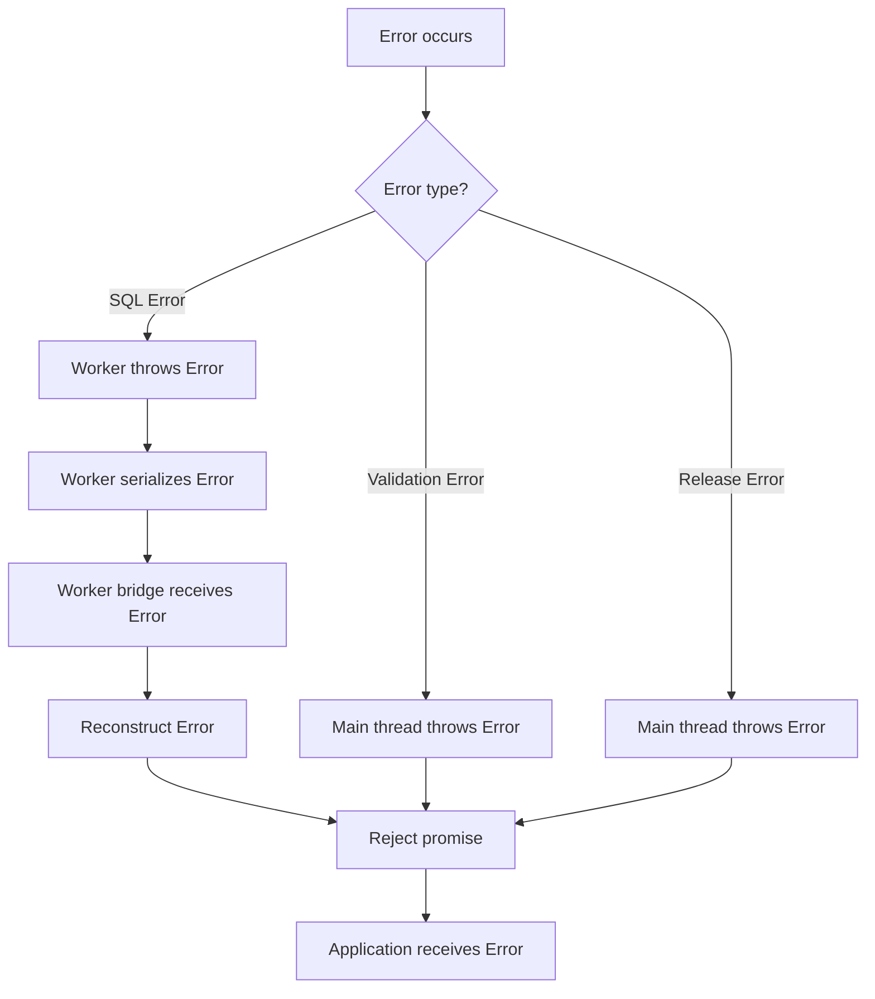

### Stack Trace Preservation

**Worker Error Serialization**:

```typescript
// In worker
const errorObj = err instanceof Error ? err : new Error(String(err));
const res: SqliteResMsg<void> = {
    id,
    success: false,
    error: {
        name: errorObj.name,
        message: errorObj.message,
        stack: errorObj.stack,
    } as Error,
};
self.postMessage(res);
```

**Main Thread Error Reconstruction**:

```typescript
// In worker bridge
worker.onmessage = (event: MessageEvent<SqliteResMsg<unknown>>) => {
    const { id, success, error } = event.data;
    const task = idMapPromise.get(id);

    if (!success) {
        const newError = new Error(error!.message);
        newError.name = error!.name;
        newError.stack = error!.stack;
        task.reject(newError);
    }
};
```

---

## 6) Data Flow

### Query Execution Flow

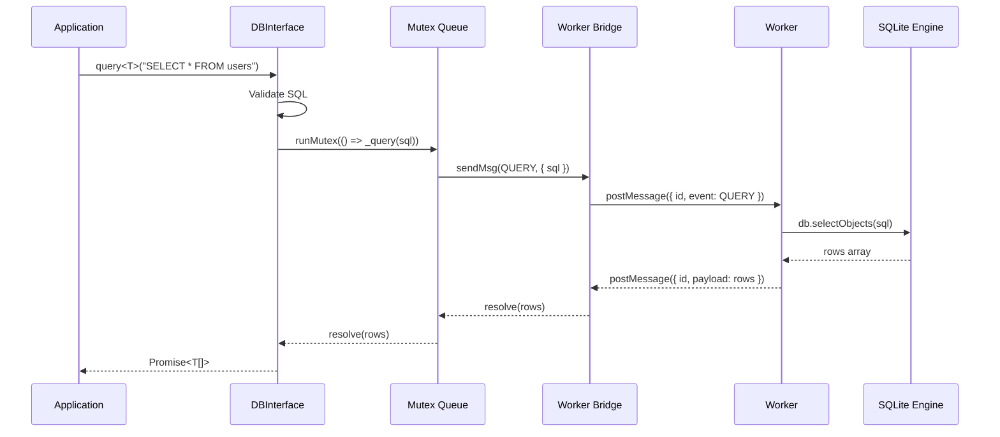

### Transaction Execution Flow

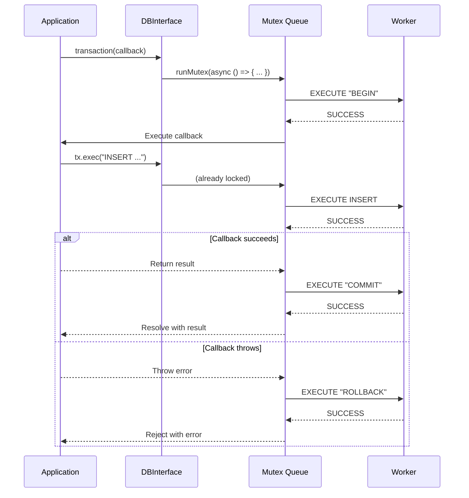

---

## 7) Performance Characteristics

### Operation Timing

| Operation               | Typical Latency | Components                                   |
| ----------------------- | --------------- | -------------------------------------------- |
| `openDB()` (first time) | 50-100ms        | WASM init + OPFS setup + migrations          |
| `openDB()` (subsequent) | 10-50ms         | OPFS setup + migrations                      |
| `exec()`                | 0.3-0.6ms       | Mutex + worker communication + SQL execution |
| `query()`               | 0.3-0.6ms       | Mutex + worker communication + SQL execution |
| `transaction()`         | 0.5-2ms         | BEGIN + operations + COMMIT/ROLLBACK         |
| `close()`               | <10ms           | Worker termination                           |

### Concurrency

-   **Mutex Queue**: Serializes all operations (no concurrent execution)
-   **Throughput**: 1000+ transactions/second (measured)
-   **Queue Depth**: Unlimited (but typically < 10 concurrent operations)

### Memory

-   **Worker Memory**: Separate from main thread
-   **Result Sets**: Full arrays transferred via structured clone
-   **Query Results**: No streaming (future enhancement)

---

## 8) Dependencies

### Internal Dependencies

```
src/main.ts
├── src/validations/shareBufferAbiliCheck.ts
├── src/worker-bridge.ts
├── src/utils/mutex/mutex.ts
└── src/release/release-manager.ts
    ├── src/release/constants.ts
    ├── src/release/types.ts
    ├── src/release/opfs-utils.ts
    ├── src/release/hash-utils.ts
    ├── src/release/lock-utils.ts
    └── src/release/version-utils.ts
```

### External Dependencies

-   **sqlite3.wasm**: SQLite WASM module (vendored in `src/jswasm/`)
-   **Browser APIs**: OPFS, Web Workers, SharedArrayBuffer, Web Crypto

---

## 9) Testing Strategy

### Unit Tests

-   **Mutex Queue**: `tests/unit/mutex.test.ts`
    -   Queue ordering
    -   Lock/unlock behavior
    -   Concurrent operations

### E2E Tests

-   **Database Operations**: `tests/e2e/core.e2e.test.ts`

    -   openDB initialization
    -   exec, query, transaction operations
    -   close behavior

-   **Release Management**: `tests/e2e/release.e2e.test.ts`

    -   Migration application
    -   Hash validation
    -   Dev tool release and rollback

-   **Error Handling**: `tests/e2e/error.e2e.test.ts`
    -   Invalid SQL handling
    -   Transaction rollback
    -   Hash mismatch errors

---

## 10) Security Considerations

### Input Validation

-   **Filename**: Non-empty string validation
-   **SQL**: Non-empty string validation
-   **Version**: Semver pattern validation
-   **Bind Parameters**: Accepted as-is (SQLite handles validation)

### SQL Injection Prevention

-   **Parameterized Queries**: Enforced via bind parameters
-   **No String Concatenation**: SQL statements never concatenated with user input
-   **Prepared Statements**: SQLite prepared statements used internally

### Worker Isolation

-   **Sandbox**: Worker runs in isolated context
-   **No DOM Access**: Worker cannot access main thread DOM
-   **Same-Origin**: OPFS access restricted to same origin
-   **WASM Isolation**: SQLite runs in WASM sandbox

---

## Navigation

**Previous**: [02 Migration Strategy](../02-schema/02-migrations.md) - Release versioning and migrations

**Next in Series**: [Release Management Module](./release-management.md) - Release versioning system

**Related Design Documents**:

-   [Back to Modules](./)
-   [API Contracts](../01-contracts/01-api.md) - Public API specifications

**All Design Documents**:

-   [Contracts](../01-contracts/) - API, Events, Errors
-   [Schema](../02-schema/) - Database, Migrations

**Related ADRs**:

-   [ADR-0001: Web Worker](../../04-adr/0001-web-worker-architecture.md) - Worker architecture
-   [ADR-0003: Mutex Queue](../../04-adr/0003-mutex-queue-concurrency.md) - Concurrency control

**Back to**: [Spec Index](../../00-control/00-spec.md)
