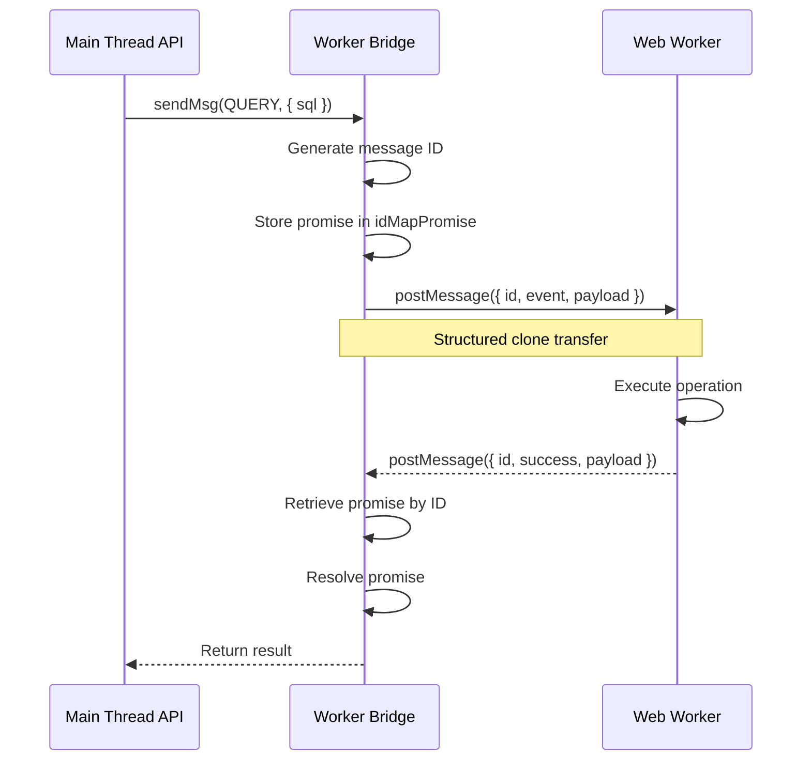
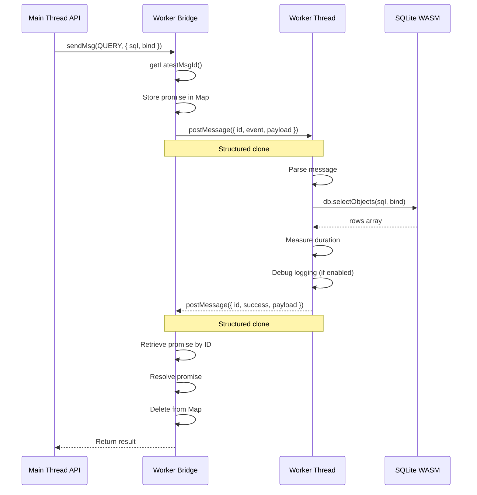
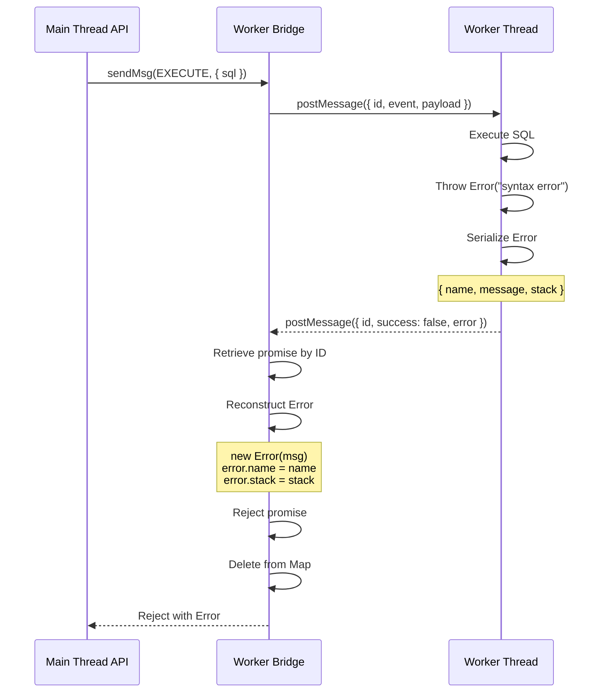

# Module: Worker Bridge

## 1) Assets

**Purpose**: Provide message-passing abstraction between main thread and Web Worker with promise-based API.

**Links to Contracts**:

- API: `docs/05-design/01-contracts/01-api.md#internal-worker-api`
- Events: `docs/05-design/01-contracts/02-events.md#worker-message-events`
- Errors: `docs/05-design/01-contracts/03-errors.md#category-7-worker-errors`

---

## 2) Module Responsibilities

### Primary Responsibilities

1. **Worker Creation**: Initialize Web Worker with SQLite WASM module
2. **Message Sending**: Send messages to worker with unique IDs
3. **Promise Management**: Map message IDs to pending promises
4. **Response Handling**: Resolve/reject promises based on worker responses
5. **Error Reconstruction**: Reconstruct Error objects with preserved properties
6. **Worker Termination**: Clean up worker and reject pending promises

### Cross-Cutting Concerns

- **Async Communication**: All worker operations are asynchronous
- **Error Propagation**: Stack traces preserved across worker boundary
- **Resource Cleanup**: Proper worker termination and promise cleanup

---

## 3) Public Interface

### Function: `createWorkerBridge(): WorkerBridge`

**Purpose**: Create worker bridge with message protocol implementation.

**File**: `src/worker-bridge.ts`

**Returns**: `WorkerBridge` object with `sendMsg` and `terminate` methods

**Type Definition**:

```typescript
type WorkerBridge = {
    sendMsg: <TRes, TReq = unknown>(
        event: SqliteEvent,
        payload?: TReq,
    ) => Promise<TRes>;
    terminate: () => void;
};
```

---

### Method: `sendMsg<TRes, TReq>(event, payload): Promise<TRes>`

**Purpose**: Send message to worker and await response.

**Parameters**:

- `event` (SqliteEvent): Event type (OPEN, EXECUTE, QUERY, CLOSE)
- `payload` (TReq, optional): Request payload

**Returns**: `Promise<TRes>` - Response payload

**Flow**:



**Code**:

```typescript
const sendMsg = <TRes, TReq = unknown>(
    event: SqliteEvent,
    payload?: TReq,
): Promise<TRes> => {
    const id = getLatestMsgId();
    const msg: SqliteReqMsg<TReq> = {
        id,
        event,
        payload,
    };

    return new Promise<TRes>((resolve, reject) => {
        idMapPromise.set(id, {
            resolve: resolve as (value: unknown) => void,
            reject,
        });
        worker.postMessage(msg);
    });
};
```

---

### Method: `terminate(): void`

**Purpose**: Terminate worker and reject all pending promises.

**Behavior**:

- Calls `worker.terminate()`
- Rejects all pending promises with "Worker terminated" error
- Clears message ID map

**Code**:

```typescript
const terminate = () => {
    worker.terminate();
    idMapPromise.forEach((task) => {
        task.reject(new Error("Worker terminated"));
    });
    idMapPromise.clear();
};
```

---

## 4) Internal Operations

### Operation: Message ID Generation

**Purpose**: Generate unique incremental IDs for message correlation.

**Implementation**: Closure-based counter

**Code**:

```typescript
const getLatestMsgId = (() => {
    let latestId = 0;
    return () => ++latestId;
})();
```

**Properties**:

- Starts at 1 (first call returns 1)
- Increments by 1 each call
- Safe for concurrent use (single-threaded JavaScript)

**Usage**:

```typescript
const id1 = getLatestMsgId(); // 1
const id2 = getLatestMsgId(); // 2
const id3 = getLatestMsgId(); // 3
```

---

### Operation: Promise Storage

**Purpose**: Map message IDs to pending promises for resolution.

**Data Structure**:

```typescript
type Task<T> = {
    resolve: (value: T | PromiseLike<T>) => void;
    reject: (reason?: unknown) => void;
};

const idMapPromise: Map<number, Task<unknown>> = new Map();
```

**Storage**:

```typescript
idMapPromise.set(id, {
    resolve: resolve as (value: unknown) => void,
    reject,
});
```

**Retrieval**:

```typescript
const task = idMapPromise.get(id);
if (task) {
    task.resolve(payload);
    idMapPromise.delete(id);
}
```

**Cleanup**:

- Promises removed after response received
- All promises rejected on worker termination
- Map cleared on terminate

---

### Operation: Worker Message Handling

**Purpose**: Handle responses from worker and resolve/reject promises.

**Event Handler**:

```typescript
worker.onmessage = (event: MessageEvent<SqliteResMsg<unknown>>) => {
    const { id, success, error, payload } = event.data;
    const task = idMapPromise.get(id);

    if (!task) return; // Ignore unknown message IDs

    if (!success) {
        const newError = new Error(error!.message);
        newError.name = error!.name;
        newError.stack = error!.stack;
        task.reject(newError);
    } else {
        task.resolve(payload);
    }

    idMapPromise.delete(id);
};
```

**Error Reconstruction**:

```typescript
// Worker serializes error
const errorObj = err instanceof Error ? err : new Error(String(err));
const res: SqliteResMsg<void> = {
    id,
    success: false,
    error: {
        name: errorObj.name,
        message: errorObj.message,
        stack: errorObj.stack,
    } as Error,
};

// Main thread reconstructs error
const newError = new Error(error!.message);
newError.name = error!.name;
newError.stack = error!.stack;
```

---

### Operation: Worker Initialization

**Purpose**: Initialize Web Worker with SQLite WASM module.

**Implementation**: Vite worker import with inline option

**Code**:

```typescript
import Sqlite3Worker from "./worker?worker&inline";

export const createWorkerBridge = () => {
    const worker = new Sqlite3Worker();
    // ... rest of implementation
};
```

**Vite Configuration**:

- `?worker`: Import as Web Worker
- `&inline`: Inline worker code in bundle (no separate file)

**Worker Context**:

- Runs in isolated thread
- Has access to `sqlite3` global (initialized in worker)
- Cannot access main thread DOM or globals

---

## 5) Worker Module (Worker Side)

### Worker Entry Point

**File**: `src/worker.ts`

**Purpose**: Handle worker messages and execute SQLite operations.

**Global State**:

```typescript
let activeDb: Sqlite3DB | null = null; // Active user database
let metaDb: Sqlite3DB | null = null; // Metadata database
let sqlite3: Sqlite3 | null = null; // SQLite WASM module
let isDebug = false; // Debug logging flag
```

### Message Handler

**Event Listener**:

```typescript
self.onmessage = async (msg: MessageEvent<SqliteReqMsg<unknown>>) => {
    const { id, event, payload } = msg.data;

    try {
        if (sqlite3 === null && event !== SqliteEvent.OPEN) {
            throw new Error("Database is not open");
        }

        let result: unknown = undefined;

        switch (event) {
            case SqliteEvent.OPEN:
                await handleOpen(payload as OpenDBArgs);
                break;
            case SqliteEvent.EXECUTE:
                result = handleExecute(payload);
                break;
            case SqliteEvent.QUERY:
                result = handleQuery(payload as ExecParams);
                break;
            case SqliteEvent.CLOSE:
                handleClose();
                break;
            default:
                throw new Error(`Unknown event: ${event}`);
        }

        const res: SqliteResMsg<unknown> = {
            id,
            success: true,
            payload: result,
        };
        self.postMessage(res);
    } catch (err) {
        const errorObj = err instanceof Error ? err : new Error(String(err));
        const res: SqliteResMsg<void> = {
            id,
            success: false,
            error: {
                name: errorObj.name,
                message: errorObj.message,
                stack: errorObj.stack,
            } as Error,
        };
        self.postMessage(res);
    }
};
```

### OPEN Handler

**Purpose**: Open database connection (active or metadata).

**Code**:

```typescript
const handleOpen = async (payload: OpenDBArgs) => {
    if (typeof payload.filename !== "string") {
        throw new Error(
            "Invalid payload for OPEN event: expected filename string",
        );
    }

    if (!sqlite3) {
        sqlite3 = await sqlite3InitModule();
        console.debug(`Initialized sqlite3 module in worker.`);
    }

    let { filename } = payload;
    if (!filename.endsWith(".sqlite3")) {
        filename += ".sqlite3";
    }

    if (payload.options) {
        isDebug = payload.options.debug === true;
        configureLogger(isDebug);
    }

    const target = payload.target ?? "active";
    const replace = payload.replace === true;

    if (target === "meta") {
        if (metaDb && replace) {
            metaDb.close();
            metaDb = null;
        }
        if (!metaDb) {
            metaDb = new sqlite3!.oo1!.OpfsDb!(filename, "c");
            console.debug(`Opened metadata database: ${filename}`);
        }
        return;
    }

    const hadActiveDb = Boolean(activeDb);
    if (activeDb && replace) {
        activeDb.close();
        activeDb = null;
    }
    if (!activeDb) {
        activeDb = new sqlite3!.oo1!.OpfsDb!(filename, "c");
        if (replace && hadActiveDb) {
            console.debug(`Switched active database to: ${filename}`);
        } else {
            console.debug(`Opened active database: ${filename}`);
        }
    }
};
```

### EXECUTE Handler

**Purpose**: Execute SQL without returning rows.

**Code**:

```typescript
const handleExecute = (payload: unknown) => {
    const start = performance.now();
    const { sql, bind, target } = payload as ExecParams;

    if (typeof sql !== "string") {
        throw new Error(
            "Invalid payload for EXECUTE event: expected SQL string or { sql, bind }",
        );
    }

    const db = target === "meta" ? metaDb : activeDb;
    if (!db) {
        throw new Error("Database is not open");
    }

    db.exec({ sql, bind });
    const end = performance.now();
    const duration = end - start;

    if (isDebug) {
        console.debug({ sql, duration, bind } as SqlLogInfo);
    }

    return {
        changes: db.changes(),
        lastInsertRowid: db.selectValue("SELECT last_insert_rowid()"),
    };
};
```

### QUERY Handler

**Purpose**: Execute SELECT query and return rows.

**Code**:

```typescript
const handleQuery = (payload: ExecParams) => {
    const { sql, bind, target } = payload;

    if (typeof sql !== "string") {
        throw new Error(
            "Invalid payload for QUERY event: expected { sql: string, bind?: any[] }",
        );
    }

    const db = target === "meta" ? metaDb : activeDb;
    if (!db) {
        throw new Error("Database is not open");
    }

    const start = performance.now();
    const rows = db.selectObjects(sql, bind);
    const end = performance.now();
    const duration = end - start;

    if (isDebug) {
        console.debug({
            sql,
            duration,
            bind,
        } as SqlLogInfo);
    }

    return rows;
};
```

### CLOSE Handler

**Purpose**: Close database connections and cleanup.

**Code**:

```typescript
const handleClose = () => {
    if (activeDb) {
        activeDb.close();
        activeDb = null;
    }
    if (metaDb) {
        metaDb.close();
        metaDb = null;
    }
    sqlite3 = null;
};
```

---

## 6) Data Flow

### Request-Response Flow



### Error Flow



---

## 7) Error Handling

### Error Categories

1. **Worker Initialization Errors**: WASM module load failures
2. **Message Serialization Errors**: Invalid payload structures
3. **SQL Execution Errors**: Syntax errors, constraint violations
4. **Database State Errors**: Database not open, invalid target
5. **Worker Termination**: Worker crashed or terminated

### Error Serialization

**Worker Side**:

```typescript
try {
    // ... operation ...
    self.postMessage({ id, success: true, payload: result });
} catch (err) {
    const errorObj = err instanceof Error ? err : new Error(String(err));
    self.postMessage({
        id,
        success: false,
        error: {
            name: errorObj.name,
            message: errorObj.message,
            stack: errorObj.stack,
        } as Error,
    });
}
```

**Main Thread Side**:

```typescript
worker.onmessage = (event) => {
    const { id, success, error } = event.data;
    const task = idMapPromise.get(id);

    if (!success) {
        const newError = new Error(error!.message);
        newError.name = error!.name;
        newError.stack = error!.stack;
        task.reject(newError);
    } else {
        task.resolve(payload);
    }
};
```

### Stack Trace Preservation

**Properties Preserved**:

- `name`: Error class name (e.g., "Error", "TypeError")
- `message`: Error message
- `stack`: Stack trace with file names and line numbers

**Properties Lost**:

- Custom error properties (not standard)
- Error cause (if available)
- Prototype chain (reconstructed as plain Error)

---

## 8) Performance Characteristics

### Operation Timing

| Operation                   | Latency        | Notes                     |
| --------------------------- | -------------- | ------------------------- |
| postMessage (Main → Worker) | ~0.02ms        | Structured clone overhead |
| Worker processing           | 0.2-0.5ms      | SQLite execution time     |
| postMessage (Worker → Main) | ~0.02ms        | Structured clone overhead |
| Promise resolution          | ~0.01ms        | Map lookup and cleanup    |
| **Total Round-trip**        | **~0.3-0.6ms** | End-to-end latency        |

### Concurrency

- **No Concurrent Operations**: Worker processes one message at a time
- **Mutex Queue**: Main thread serializes operations via mutex
- **Message Ordering**: FIFO ordering maintained

### Memory

- **Promise Map**: Stores pending promises (typically < 10)
- **Structured Clone**: Copies data between threads (no shared memory)
- **Worker Memory**: Separate from main thread (limited by browser)

---

## 9) Dependencies

### Internal Dependencies

```
src/worker-bridge.ts
└── src/worker.ts (worker module)
    ├── src/jswasm/sqlite3.mjs (SQLite WASM)
    ├── src/types/message.ts (message types)
    └── src/utils/logger.ts (debug logging)
```

### External Dependencies

- **sqlite3.wasm**: SQLite WASM module (vendored)
- **Browser APIs**: Web Workers, postMessage, performance.now()

---

## 10) Testing Strategy

### Unit Tests

- **Message ID Generation**: Verify unique incremental IDs
- **Promise Storage**: Verify map operations
- **Error Reconstruction**: Verify error properties preserved

### E2E Tests

- **Worker Communication**: `tests/e2e/worker.e2e.test.ts`
    - Message send/receive
    - Promise resolution
    - Error propagation
    - Worker termination

---

## 11) Debug Logging

### Debug Mode Activation

**Main Thread**:

```typescript
await sendMsg(OPEN, {
    filename: "mydb",
    options: { debug: true },
});
```

**Worker Side**:

```typescript
if (payload.options) {
    isDebug = payload.options.debug === true;
    configureLogger(isDebug);
}
```

### Debug Output

**Query Execution**:

```javascript
{sql: "SELECT * FROM users WHERE id = ?", duration: 0.28, bind: [1]}
```

**Execute Operation**:

```javascript
{sql: "INSERT INTO users (name) VALUES (?)", duration: 0.35, bind: ["Alice"]}
```

**Database Open**:

```javascript
[openDB] opened release.sqlite3
[openDB] opened active database: mydb/1.0.0/db.sqlite3
```

### Logger Implementation

**File**: `src/utils/logger.ts`

**Code**:

```typescript
export type SqlLogInfo = {
    sql: string;
    duration: number;
    bind?: unknown;
};

let isDebugMode = false;

export const configureLogger = (enabled: boolean): void => {
    isDebugMode = enabled;
};

export const logSql = (info: SqlLogInfo): void => {
    if (isDebugMode) {
        console.debug(info);
    }
};
```

---

## 12) Security Considerations

### Message Validation

**Payload Validation** (Worker Side):

```typescript
if (typeof payload.filename !== "string") {
    throw new Error("Invalid payload for OPEN event: expected filename string");
}

if (typeof sql !== "string") {
    throw new Error(
        "Invalid payload for QUERY event: expected { sql: string }",
    );
}
```

### SQL Injection Prevention

- **Parameterized Queries**: Bind parameters used for all SQL
- **No String Concatenation**: SQL statements never concatenated with user input
- **SQLite Prepared Statements**: Used internally by SQLite WASM

### Worker Isolation

- **Sandbox**: Worker runs in isolated thread
- **No DOM Access**: Worker cannot access main thread DOM
- **Same-Origin**: Worker script subject to same-origin policy
- **WASM Isolation**: SQLite runs in WASM sandbox

### Memory Isolation

- **Structured Clone**: Data copied between threads (not shared)
- **No Shared State**: Worker cannot access main thread variables
- **Memory Limits**: Worker has separate memory limits

---

## Navigation

**Previous**: [Release Management Module](./release-management.md) - Release versioning system

**Modules Series Complete**

**Related Design Documents**:

- [Back to Modules: Core](./core.md)
- [Back to Modules: Release Management](./release-management.md)

**All Design Documents**:

- [Contracts](../01-contracts/) - API, Events, Errors
- [Schema](../02-schema/) - Database, Migrations

**Related ADRs**:

- [ADR-0001: Web Worker](../../04-adr/0001-web-worker-architecture.md) - Worker architecture
- [ADR-0007: Error Handling](../../04-adr/0007-error-handling-strategy.md) - Error reconstruction

**Back to**: [Spec Index](../../00-control/00-spec.md)
