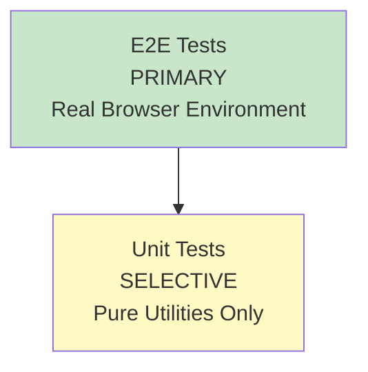
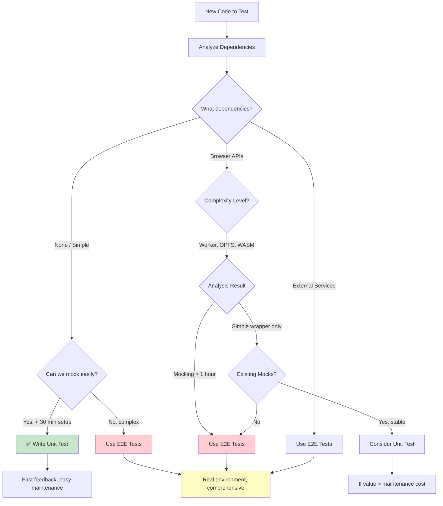
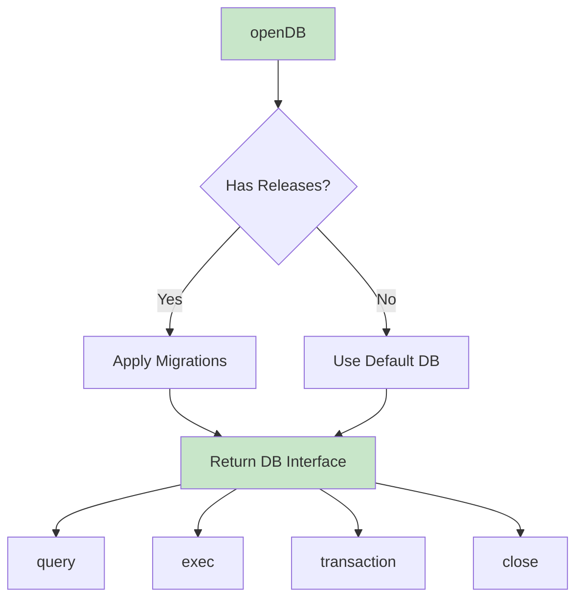
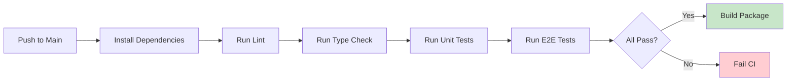

# Test Plan

**Project**: web-sqlite-js
**Version**: 1.1.0
**Last Updated**: 2025-01-09
**Status**: Production

---

## Overview

This document defines the **comprehensive testing strategy** for the web-sqlite-js project. All code MUST be tested before it can be merged to main.

### Testing Philosophy

- **E2E-First Approach**: Primary testing is done in real browsers with Playwright
- **Analyze First, Then Decide**: Before testing, analyze if the code can support unit testing
- **Complexity-Based Decision**: If conditions permit (simple, manageable), do unit tests; if too complicated, use E2E
- **Pragmatic Over Dogmatic**: Prioritize practical testing strategies over theoretical coverage
- **Real Environment**: E2E tests run in real browsers with actual Web Worker and OPFS

---

## 1. Testing Tools

### 1.1 Tech Stack

| Tool                           | Purpose                | Version |
| ------------------------------ | ---------------------- | ------- |
| **Vitest**                     | Unit test runner       | ^4.0.15 |
| **@vitest/browser**            | Browser testing        | ^4.0.15 |
| **@vitest/coverage-v8**        | Code coverage          | 4.0.15  |
| **Playwright**                 | E2E browser automation | ^1.57.0 |
| **@vitest/browser-playwright** | Playwright integration | ^4.0.15 |

### 1.2 Configuration Files

**Unit Tests** (`vitest.unit.config.ts`):

```typescript
export default defineConfig({
    test: {
        include: ["**/*.unit.test.ts"],
    },
    resolve: {
        alias: {
            "@": srcDir,
            "web-sqlite-js": resolve(srcDir, "main.ts"),
        },
    },
});
```

**E2E Tests** (`vitest.e2e.config.ts`):

```typescript
export default defineConfig({
    test: {
        include: ["**/*.e2e.test.ts"],
        browser: {
            enabled: true,
            instances: [{ browser: "chromium" }],
            provider: playwright(),
            headless: process.env.HEADERS === "true",
        },
        testTimeout: 1000 * 60 * 3, // 3 minutes
    },
    server: {
        headers: {
            "Cross-Origin-Opener-Policy": "same-origin",
            "Cross-Origin-Embedder-Policy": "require-corp",
            "Access-Control-Allow-Origin": "*",
        },
    },
});
```

---

## 2. Test Strategy

### 2.1 Testing Strategy



**Why E2E-First?**

Most of the code depends on browser-specific APIs that are extremely difficult to mock:
- **Web Worker API**: Worker creation, message passing, SharedArrayBuffer
- **OPFS (Origin Private File System)**: File system operations only available in secure contexts
- **SQLite WASM**: Compiled WebAssembly module requiring specific browser features
- **COOP/COEP Headers**: Security headers required for SharedArrayBuffer

**Unit Tests (SELECTIVE)**:

- Only for pure utility functions that don't require browser/worker mocking
- Examples: mutex queue, hash utilities, helper functions
- Fast execution (<1s total)
- **Not suitable for**: worker bridge, release manager, OPFS operations

**E2E Tests (PRIMARY)**:

- Test the entire library in real browsers with actual Web Worker and OPFS
- Test all critical user flows and API surface
- No mocking - tests actual behavior in production environment
- Slower but comprehensive and reliable

### 2.2 Test Categories

| Category        | Purpose                     | Examples                       | File Pattern            | Notes                                    |
| --------------- | --------------------------- | ------------------------------ | ----------------------- | ---------------------------------------- |
| **Unit**        | Test pure utility functions | Mutex queue, hash utils        | `*.unit.test.ts`        | Only for code not requiring browser APIs |
| **E2E**         | Test critical user flows    | openDB, transactions, rollback | `*.e2e.test.ts`         | Primary testing approach                 |

---

## 3. Unit Testing

### 3.1 Guidelines

**Rules**:

1. Test each function in isolation
2. Mock external dependencies
3. Test edge cases and error paths
4. Use descriptive test names

**Example**:

```typescript
import { describe, it, expect } from "vitest";
import { createMutex } from "./mutex";

describe("createMutex", () => {
    it("should execute tasks sequentially", async () => {
        const mutex = createMutex();
        const results: number[] = [];

        await Promise.all([
            mutex(async () => {
                results.push(1);
                await new Promise((resolve) => setTimeout(resolve, 10));
            }),
            mutex(async () => {
                results.push(2);
            }),
        ]);

        expect(results).toEqual([1, 2]);
    });

    it("should handle errors without breaking the queue", async () => {
        const mutex = createMutex();
        let errorThrown = false;

        try {
            await mutex(async () => {
                throw new Error("Task failed");
            });
        } catch (error) {
            errorThrown = true;
        }

        expect(errorThrown).toBe(true);

        // Next task should still execute
        const result = await mutex(async () => "success");
        expect(result).toBe("success");
    });
});
```

### 3.2 Coverage Requirements

**Explicit Decision: No Unit Tests for Worker-Dependent Code**

When code depends on complex browser environments (workers, OPFS, WASM, COOP/COEP), we make an **explicit decision to skip unit testing entirely**. The mocking complexity outweighs the benefits.

**Unit Test Coverage Targets** (only for pure utilities):

| Module          | Coverage Target | Notes                          |
| --------------- | --------------- | ------------------------------ |
| Mutex Utils     | 100%            | Pure utility, no dependencies  |
| Hash Utils      | 90%             | Pure utility, no dependencies  |
| Other utilities | Only if simple  | Must have zero browser deps    |

**Explicitly NOT Unit Tested** (E2E only):

| Module                   | Reason                                      | Testing Approach |
| ------------------------ | ------------------------------------------- | ---------------- |
| ❌ Worker bridge         | Requires Web Worker API, complex to mock    | E2E tests        |
| ❌ Release manager       | Requires OPFS + worker communication        | E2E tests        |
| ❌ OPFS utilities        | Requires browser file system APIs           | E2E tests        |
| ❌ Main API (openDB)     | Requires full worker + OPFS integration     | E2E tests        |
| ❌ Worker implementation | Requires WASM + SQLite + SharedArrayBuffer  | E2E tests        |

**Rationale**: Mocking Web Worker, OPFS, and WASM APIs is:
- **Time-consuming**: Complex setup that breaks easily
- **Unreliable**: Mocks don't match real browser behavior
- **High maintenance**: Mocks need constant updates
- **Low value**: E2E tests provide better confidence

### 3.3 Decision Process: Analyze First, Then Decide

**Step 1: Analyze the Code**

Before writing tests, ask these questions:
1. What are the external dependencies?
2. How complex would mocking be?
3. Is there existing mocking infrastructure?
4. What's the maintenance cost of mocks?
5. Would E2E tests provide better coverage?

**Step 2: Decision Flowchart**



**Step 3: Make the Decision**

| Scenario | Analysis | Decision |
|----------|----------|----------|
| Pure utility, no deps | Trivial to test | ✅ Unit test |
| Simple browser API wrapper | 30min to mock, high value | ✅ Unit test (if mocks exist) |
| Complex worker integration | >1hr to mock, fragile | ❌ Use E2E |
| OPFS operations | Complex, unreliable mocks | ❌ Use E2E |
| Module integration | Multiple mocks needed | ❌ Use E2E |

**Key Principle**: If the analysis shows mocking is too complicated or time-consuming, use E2E tests instead. Don't force unit tests when they don't make practical sense.

### 3.4 When to Write Unit Tests

**After Analysis: Write Unit Tests When**:
- ✅ Pure utility functions (mutex, hash, string manipulation) - Trivial
- ✅ Business logic with zero external dependencies - Trivial
- ✅ Algorithms that can be tested in isolation - Trivial
- ✅ Simple browser API wrappers where:
  - Existing mocks are stable and reliable
  - Mocking takes < 30 minutes to set up
  - Value outweighs maintenance cost

**After Analysis: Use E2E Tests When**:
- ❌ Code touches `window.Worker` or `new Worker()` - Complex mocking
- ❌ Code uses `navigator.storage.getDirectory()` (OPFS) - Unreliable mocks
- ❌ Code uses `SharedArrayBuffer` - Requires COOP/COEP
- ❌ Code requires actual WebAssembly execution - Cannot mock
- ❌ Testing integration between modules - Multiple mocks needed
- ❌ Mocking setup would take > 1 hour - Not worth the effort

### 3.5 Pre-Test Analysis Checklist

Before writing any tests, complete this analysis:

| Question | Yes → | No → |
|----------|-------|------|
| 1. Does the code have external dependencies? | Go to Q2 | ✅ Write Unit Test |
| 2. Are dependencies browser APIs? | Go to Q3 | ⚠️ Consider if simple |
| 3. Is there existing mock infrastructure? | Go to Q4 | Go to Q5 |
| 4. Are mocks stable and reliable? | ✅ Consider Unit Test | Go to Q5 |
| 5. Would mocking take < 30 minutes? | ⚠️ Maybe Unit Test | ❌ Use E2E |
| 6. Would E2E tests be equally effective? | Go to Q7 | ✅ Write Unit Test |
| 7. Is E2E test simpler to write? | ❌ Use E2E | ⚠️ Consider both |

**Analysis Outcomes**:
- **Green path** (mostly ✅): Write unit tests
- **Red path** (mostly ❌): Use E2E tests
- **Yellow path** (mixed ⚠️): Use judgment, prefer E2E for simplicity

**Examples**:

```typescript
// ✅ UNIT TEST - Pure function, no dependencies
export function hashString(input: string): string {
    // ... pure logic
}

// ❌ NO UNIT TEST - Requires Worker API
export async function createWorkerBridge(): Promise<WorkerBridge> {
    const worker = new Worker(/* ... */);  // Browser API
    // ...
}

// ❌ NO UNIT TEST - Requires OPFS
export async function getOPFSFile(path: string): Promise<FileHandle> {
    const root = await navigator.storage.getDirectory();  // Browser API
    // ...
}

// ❌ NO UNIT TEST - Integration of multiple modules
export async function openDB(name: string): Promise<DBInterface> {
    const worker = await createWorkerBridge();  // Worker-dependent
    const releaseManager = await createReleaseManager();  // OPFS-dependent
    // ...
}
```

---

## 4. Integration Testing

> **Note**: Integration testing as a separate category is **not currently implemented**. Module interactions, worker message protocol, and OPFS operations are tested through E2E tests in real browser environments.

### Why No Separate Integration Tests?

Integration tests for worker-dependent code face the same challenges as unit tests:
- Requires Web Worker API mocking
- Requires OPFS API mocking
- Mocking these browser-specific APIs is complex and unreliable
- E2E tests provide better coverage of actual integration behavior

### 4.1 Alternative: E2E Integration Coverage

The E2E test suite effectively covers integration scenarios:
- Worker message protocol is tested through actual API calls
- OPFS operations are tested with real file system
- Module interactions are tested in production environment

See the [E2E Testing](#5-e2e-testing) section for details.

---

## 5. E2E Testing

### 5.1 Critical Flows



### 5.2 E2E Test Suite

**Test 1: Database Initialization**

```typescript
describe("openDB", () => {
    it("should open database with release migrations", async () => {
        const db = await openDB("test-db", {
            releases: [
                {
                    version: "1.0.0",
                    migrationSQL:
                        "CREATE TABLE users (id INTEGER PRIMARY KEY);",
                },
            ],
        });

        const result = await db.query<{ name: string }>(
            "SELECT name FROM sqlite_master WHERE type='table'",
        );

        expect(result).toHaveLength(1);
        expect(result[0].name).toBe("users");

        await db.close();
    });
});
```

**Test 2: Transaction Execution**

```typescript
describe("transaction", () => {
    it("should execute transactions atomically", async () => {
        const db = await openDB("test-db");

        await db.exec("CREATE TABLE users (id INTEGER PRIMARY KEY, name TEXT)");

        // Successful transaction
        await db.transaction(async (tx) => {
            await tx.exec("INSERT INTO users (name) VALUES (?)", ["Alice"]);
            await tx.exec("INSERT INTO users (name) VALUES (?)", ["Bob"]);
        });

        const users = await db.query<{ name: string }>(
            "SELECT name FROM users",
        );
        expect(users).toHaveLength(2);

        // Failed transaction (rollback)
        try {
            await db.transaction(async (tx) => {
                await tx.exec("INSERT INTO users (name) VALUES (?)", [
                    "Charlie",
                ]);
                throw new Error("Intentional error");
            });
        } catch (error) {
            // Expected error
        }

        const usersAfter = await db.query<{ name: string }>(
            "SELECT name FROM users",
        );
        expect(usersAfter).toHaveLength(2); // No new users added

        await db.close();
    });
});
```

**Test 3: Dev Tool Rollback**

```typescript
describe("devTool.rollback", () => {
    it("should rollback to previous version", async () => {
        const db = await openDB("test-db", {
            releases: [
                {
                    version: "1.0.0",
                    migrationSQL: "CREATE TABLE v1 (id INTEGER);",
                },
            ],
        });

        // Create dev version
        await db.devTool.release({
            version: "1.0.1-dev",
            migrationSQL: "ALTER TABLE v1 ADD COLUMN name TEXT;",
        });

        // Verify schema
        const columns = await db.query<{ sql: string }>(
            "SELECT sql FROM sqlite_master WHERE type='table'",
        );
        expect(columns[0].sql).toContain("name TEXT");

        // Rollback
        await db.devTool.rollback("1.0.0");

        // Verify rollback
        const columnsAfter = await db.query<{ sql: string }>(
            "SELECT sql FROM sqlite_master WHERE type='table'",
        );
        expect(columnsAfter[0].sql).not.toContain("name TEXT");

        await db.close();
    });
});
```

### 5.3 E2E Test Environment

**Browser**: Chromium (headless in CI, headed in local debug)

**Headers**: COOP/COEP required for SharedArrayBuffer

```http
Cross-Origin-Opener-Policy: same-origin
Cross-Origin-Embedder-Policy: require-corp
```

**Timeout**: 3 minutes per test suite

---

## 6. Test Execution

### 6.1 Local Development

```bash
# Run all tests
npm test

# Unit tests only
npm run test:unit

# E2E tests only
npm run test:e2e

# E2E tests in debug mode (headed browser, no parallelism)
npm run test:debug
```

### 6.2 CI Pipeline



**CI Commands**:

```bash
# Full test suite
npm test

# With coverage
npm run test:unit -- --coverage
```

### 6.3 Test Reports

**Coverage Report**:

```bash
npm run test:unit -- --coverage
```

Output: `coverage/index.html`

**Target Coverage**:

> **Note**: Coverage targets apply only to unit-testable code (utilities). Worker-dependent code is tested via E2E.

| Metric     | Target | Scope                          |
| ---------- | ------ | ------------------------------ |
| Statements | N/A    | Not tracked (E2E-focused)      |
| Branches   | N/A    | Not tracked (E2E-focused)      |
| Functions  | N/A    | Not tracked (E2E-focused)      |
| Lines      | N/A    | Not tracked (E2E-focused)      |
| E2E Flows  | 100%   | All critical API paths covered |

**Actual Test Coverage**:
- **Unit tests**: 1 file (mutex) - ~200 lines of testable utility code
- **E2E tests**: 6 test files covering all API surface and critical flows

---

## 7. Test Data Management

### 7.1 Fixtures

**Location**: `tests/fixtures/`

**Example**:

```typescript
// tests/fixtures/releases.ts
export const TEST_RELEASES = [
    {
        version: "1.0.0",
        migrationSQL: "CREATE TABLE users (id INTEGER PRIMARY KEY);",
    },
    {
        version: "1.1.0",
        migrationSQL: "ALTER TABLE users ADD COLUMN name TEXT;",
    },
];
```

### 7.2 Test Isolation

**Rules**:

1. Each test uses a unique database name
2. Tests clean up OPFS entries after completion
3. No shared state between tests

**Example**:

```typescript
describe("Database Tests", () => {
    const dbName = `test-db-${Math.random()}`;

    afterEach(async () => {
        // Clean up OPFS
        const root = await navigator.storage.getDirectory();
        // ... cleanup logic
    });

    it("should create database", async () => {
        const db = await openDB(dbName);
        // ... test logic
        await db.close();
    });
});
```

---

## 8. Debugging Tests

### 8.1 Debug Mode

**Run E2E tests in headed browser**:

```bash
HEADERS=true npm run test:debug
```

**Browser DevTools**:

1. Test runs in headed Chromium
2. Open DevTools (F12)
3. Set breakpoints in test code
4. Inspect console logs and OPFS

### 8.2 Debug Logging

**Enable debug mode**:

```typescript
const db = await openDB("test-db", {
  releases: [...],
  debug: true  // Enable debug logging
});
```

**Debug Output**:

```
Debug: [openDB] input validation start
Debug: [openDB] normalized filename: test-db
Debug: [openDB] ensured directory: test-db
Debug: [release] apply start 1.0.0 (release)
Debug:sql CREATE TABLE users (id INTEGER PRIMARY KEY); (0.25ms)
Debug: [release] apply end 1.0.0 (release)
```

---

## 9. Continuous Testing

### 9.1 Watch Mode

```bash
# Unit tests in watch mode
npm run test:unit -- --watch

# E2E tests in watch mode
npm run test:e2e -- --watch
```

### 9.2 Pre-commit Hooks

**Recommended**: Husky + lint-staged

```bash
npm install --save-dev husky lint-staged
npx husky init
```

`.husky/pre-commit`:

```bash
#!/bin/sh
. "$(dirname "$0")/_/husky.sh"

npm run lint
npm run typecheck
npm run test:unit
```

---

## 10. Troubleshooting

### 10.1 Common Issues

**Issue**: E2E tests fail with COOP/COEP errors

```bash
Error: SharedArrayBuffer is not defined
```

**Solution**:

- Use `npm run http` for local testing
- Ensure headers are set in CI

**Issue**: Tests timeout

```bash
Error: Test timeout exceeded
```

**Solution**:

- Increase timeout in `vitest.e2e.config.ts`
- Check for hanging promises
- Verify worker is responding

**Issue**: OPFS not available

```bash
Error: navigator.storage.getDirectory is not a function
```

**Solution**:

- Ensure tests run in secure context (HTTPS or localhost)
- Check browser compatibility (Chrome/Edge/Opera only)

---

## 11. References

### Internal Documentation

- [Build and Run Guide](./01-build-and-run.md) - Development workflow
- [API Contracts](../05-design/01-contracts/01-api.md) - API specifications
- [Error Standards](../05-design/01-contracts/03-errors.md) - Error handling

### External Resources

- [Vitest Testing Guide](https://vitest.dev/guide/)
- [Playwright Documentation](https://playwright.dev/)
- [Testing Best Practices](https://testingjavascript.com/)

---

## Navigation

**Previous**: [Build and Run Guide](./01-build-and-run.md)

**Next**: [Observability Guide](./03-observability.md)

**Up**: [Specification Index](../00-control/00-spec.md)
