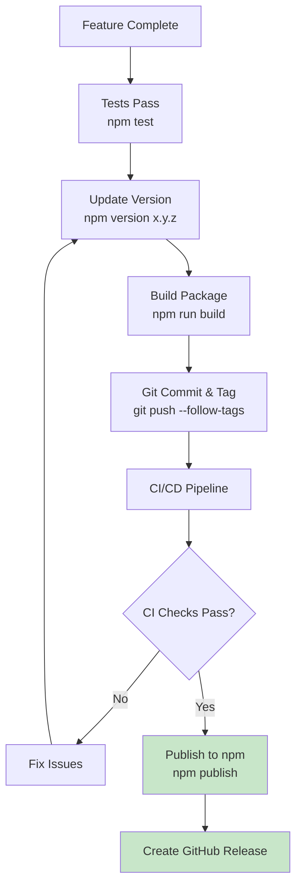
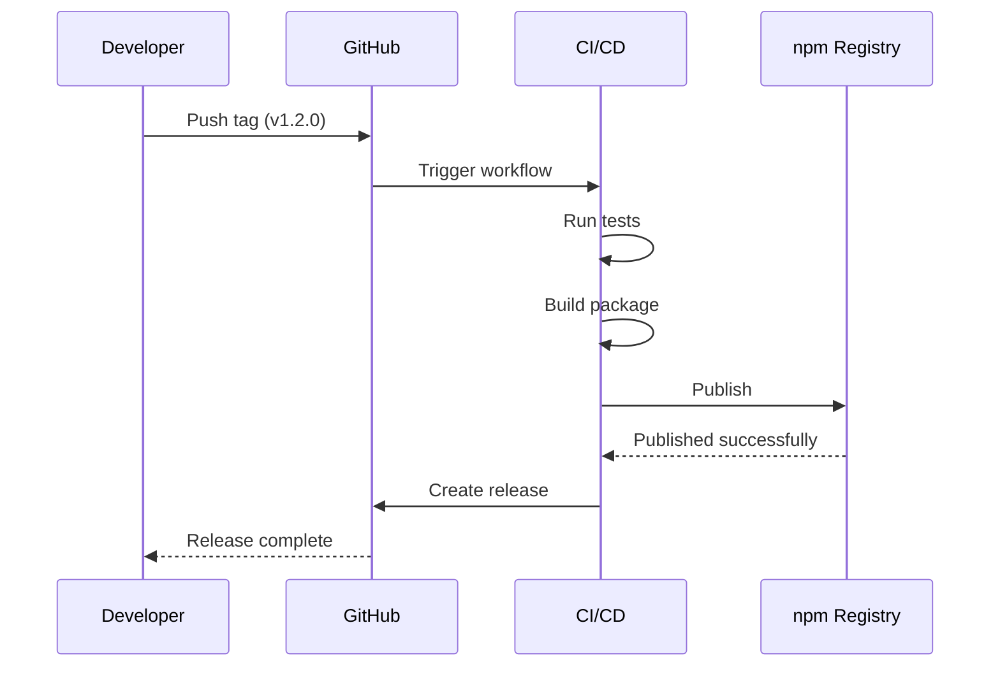
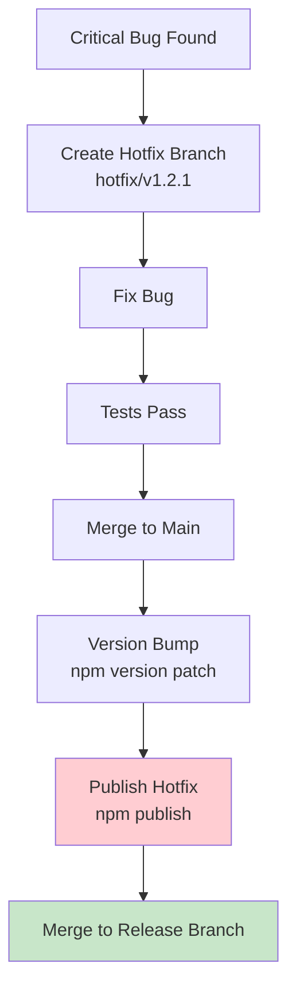

# Release and Rollback Guide

**Project**: web-sqlite-js
**Version**: 1.1.0
**Last Updated**: 2025-01-09
**Status**: Production

---

## Overview

This guide defines the **release process** and **rollback procedures** for publishing the web-sqlite-js library to npm. All releases MUST follow this process to ensure stability and traceability.

### Release Philosophy

- **Automated**: Use CI/CD for releases
- **Versioned**: Semantic versioning (semver)
- **Traced**: Git tags for every release
- **Safe**: Rollback capability for critical issues

---

## 1. Release Process

### 1.1 Release Workflow



### 1.2 Prerequisites

Before releasing, verify:

- [ ] All tests pass (`npm test`)
- [ ] Linting passes (`npm run lint`)
- [ ] Type checking passes (`npm run typecheck`)
- [ ] Documentation updated (if needed)
- [ ] CHANGELOG.md updated
- [ ] Version number incremented

### 1.3 Version Bump

**Semantic Versioning**:

```bash
# Patch release (bug fixes)
npm version patch

# Minor release (new features)
npm version minor

# Major release (breaking changes)
npm version major
```

**Example**:

```bash
# Current: 1.1.0
npm version patch
# New: 1.1.1

npm version minor
# New: 1.2.0

npm version major
# New: 2.0.0
```

**Manual Version**:

```bash
npm version 1.2.0 -m "Release version 1.2.0"
```

---

## 2. Publishing to npm

### 2.1 Publishing Workflow

```bash
# Full release command (recommended)
npm run package:publish
```

**This command**:

1. Runs tests (`npm test`)
2. Builds package (`npm run build`)
3. Publishes to npm (`npm publish --access public`)

### 2.2 Publishing Steps

**Step 1: Ensure npm authentication**

```bash
npm whoami
# Should show your npm username
```

**Step 2: Run tests**

```bash
npm test
```

**Step 3: Build package**

```bash
npm run build
```

**Step 4: Publish**

```bash
npm publish --access public
```

**Step 5: Verify**

```bash
# Check npm registry
npm view web-sqlite-js

# Install test
npm install web-sqlite-js@latest
```

### 2.3 Package Contents

**Included Files** (from `package.json`):

```json
{
    "files": ["dist"]
}
```

**Output Structure**:

```
dist/
├── index.js          # Main library
├── index.d.ts        # TypeScript definitions
└── assets/           # (if any)
```

---

## 3. CI/CD Pipeline

### 3.1 GitHub Actions Workflow

**File**: `.github/workflows/release.yml`

```yaml
name: Release

on:
    push:
        tags:
            - "v*"

jobs:
    release:
        runs-on: ubuntu-latest
        steps:
            - uses: actions/checkout@v3
              with:
                  fetch-depth: 0

            - name: Setup Node.js
              uses: actions/setup-node@v3
              with:
                  node-version: "20"
                  registry-url: "https://registry.npmjs.org"

            - name: Install dependencies
              run: npm ci

            - name: Run tests
              run: npm test

            - name: Build package
              run: npm run build

            - name: Publish to npm
              run: npm publish --access public
              env:
                  NODE_AUTH_TOKEN: ${{ secrets.NPM_TOKEN }}
```

### 3.2 GitHub Secrets

**Required Secrets**:

| Secret      | Purpose                  | How to Set                               |
| ----------- | ------------------------ | ---------------------------------------- |
| `NPM_TOKEN` | npm authentication token | GitHub Settings -> Secrets -> New secret |

**Creating npm Token**:

1. Go to https://www.npmjs.com/settings/tokens
2. Click "Generate New Token"
3. Select "Automation"
4. Copy token
5. Add to GitHub Secrets

### 3.3 Automated Release Process



---

## 4. Rollback Procedures

### 4.1 npm Rollback

**Scenario 1: Unpublish within 72 hours**

```bash
# Unpublish entire version
npm unpublish web-sqlite-js@1.2.0

# Publish fixed version
npm version patch
npm publish
```

**Scenario 2: Deprecate version (after 72 hours)**

```bash
# Deprecate version
npm deprecate web-sqlite-js@1.2.0 "Critical bug in release. Use 1.2.1 instead."

# Publish fixed version
npm version patch
npm publish
```

### 4.2 Git Rollback

**Revert commit**:

```bash
# Find the commit to revert
git log --oneline

# Revert the commit
git revert <commit-hash>

# Push to main
git push origin main
```

**Reset branch (local only)**:

```bash
# Reset to previous commit
git reset --hard HEAD~1

# Force push (DANGEROUS)
git push --force
```

### 4.3 Hotfix Process



**Hotfix Workflow**:

```bash
# Create hotfix branch
git checkout -b hotfix/v1.2.1

# Fix bug
# ... make changes ...

# Commit and test
git add .
git commit -m "fix: resolve critical bug in query execution"
npm test

# Merge to main
git checkout main
git merge hotfix/v1.2.1

# Version bump and publish
npm version patch
npm publish

# Push
git push --follow-tags
```

---

## 5. Release Notes

### 5.1 CHANGELOG.md

**Format**:

```markdown
# Changelog

## [1.2.0] - 2025-01-09

### Added

- Support for batch queries
- Performance optimizations

### Fixed

- Race condition in mutex queue
- Memory leak in worker

### Changed

- Improved error messages
- Updated dependencies

## [1.1.0] - 2025-01-08

### Added

- Initial release
```

### 5.2 Automatic Changelog

**Tool**: conventional-changelog

```bash
npm install -g conventional-changelog

# Generate changelog from commits
conventional-changelog -p angular -i CHANGELOG.md -s
```

**Commit Conventions**:

```bash
feat: add batch query support
fix: resolve race condition
docs: update API documentation
chore: upgrade dependencies
```

---

## 6. Versioning Strategy

### 6.1 Semantic Versioning

**Format**: `MAJOR.MINOR.PATCH`

- **MAJOR**: Breaking changes
- **MINOR**: New features (backward compatible)
- **PATCH**: Bug fixes (backward compatible)

**Examples**:

| Version | Type  | Example Changes       |
| ------- | ----- | --------------------- |
| `2.0.0` | Major | Remove deprecated API |
| `1.2.0` | Minor | Add batch queries     |
| `1.1.1` | Patch | Fix memory leak       |

### 6.2 Breaking Changes

**When to increment MAJOR**:

- Remove or rename public API
- Change parameter types
- Change return types
- Change default behavior

**Migration Guide**:

````markdown
## Migration from 1.x to 2.0

### Breaking Changes

- `openDB()` now requires `options.debug` to be explicitly set
- `DBInterface.exec()` return type changed

### Migration Steps

1. Update `openDB()` calls:

    ```typescript
    // Old
    const db = await openDB("mydb");

    // New
    const db = await openDB("mydb", { debug: false });
    ```
````

2. Update `exec()` calls:

    ```typescript
    // Old
    const result = await db.exec(sql);

    // New
    const { changes, lastInsertRowId } = await db.exec(sql);
    ```

````

---

## 7. Release Checklist

### 7.1 Pre-Release

- [ ] All tests passing
- [ ] Code review completed
- [ ] Documentation updated
- [ ] CHANGELOG.md updated
- [ ] Version number bumped
- [ ] Git tag created

### 7.2 Release

- [ ] CI/CD pipeline triggered
- [ ] Build successful
- [ ] Tests passing in CI
- [ ] Published to npm
- [ ] GitHub release created

### 7.3 Post-Release

- [ ] Verify npm package
- [ ] Test installation
- [ ] Update documentation site
- [ ] Announce release (if major/minor)
- [ ] Monitor issues

---

## 8. Troubleshooting

### 8.1 Publishing Failures

**Issue**: `npm ERR! 403 Forbidden`

```bash
Error: 403 Forbidden - You don't have permission to publish
````

**Solution**:

```bash
# Check npm authentication
npm whoami

# Re-authenticate
npm login

# Check package ownership
npm owner ls web-sqlite-js
```

**Issue**: `npm ERR! 409 Conflict`

```bash
Error: 409 Conflict - Version already exists
```

**Solution**:

```bash
# Check existing versions
npm view web-sqlite-js versions

# Bump version
npm version patch
npm publish
```

### 8.2 Build Failures

**Issue**: Build errors in CI

```bash
Error: Build failed with exit code 1
```

**Solution**:

```bash
# Test locally
npm run build

# Check Node version
node --version  # Should match CI

# Clean install
rm -rf node_modules
npm install
npm run build
```

---

## 9. Best Practices

### 9.1 Release Hygiene

**DO**:

- Use semantic versioning
- Update CHANGELOG.md
- Create git tags
- Test before publishing
- Monitor releases

**DON'T**:

- Skip tests before release
- Publish from local machine (use CI/CD)
- Forget to bump version
- Break backward compatibility without MAJOR bump
- Publish without git tag

### 9.2 Security

**Secrets Management**:

- Use GitHub Secrets for NPM_TOKEN
- Never commit `.npmrc`
- Use automation tokens (not personal tokens)
- Rotate tokens regularly

**Package Security**:

```bash
# Check for vulnerabilities
npm audit

# Fix vulnerabilities
npm audit fix

# Lockfile integrity
npm ci  # Uses package-lock.json exactly
```

---

## 10. References

### Internal Documentation

- [Build and Run Guide](./01-build-and-run.md) - Build workflow
- [ADR-0004: Release Versioning System](../04-adr/0004-release-versioning-system.md) - Database versioning

### External Resources

- [npm Publishing Guide](https://docs.npmjs.com/packages-and-modules/contributing-packages-to-the-registry)
- [Semantic Versioning](https://semver.org/)
- [Conventional Commits](https://www.conventionalcommits.org/)

---

## Navigation

**Previous**: [Observability Guide](./03-observability.md)

**Next**: [Specification Index](../00-control/00-spec.md)

**Up**: [Specification Index](../00-control/00-spec.md)
