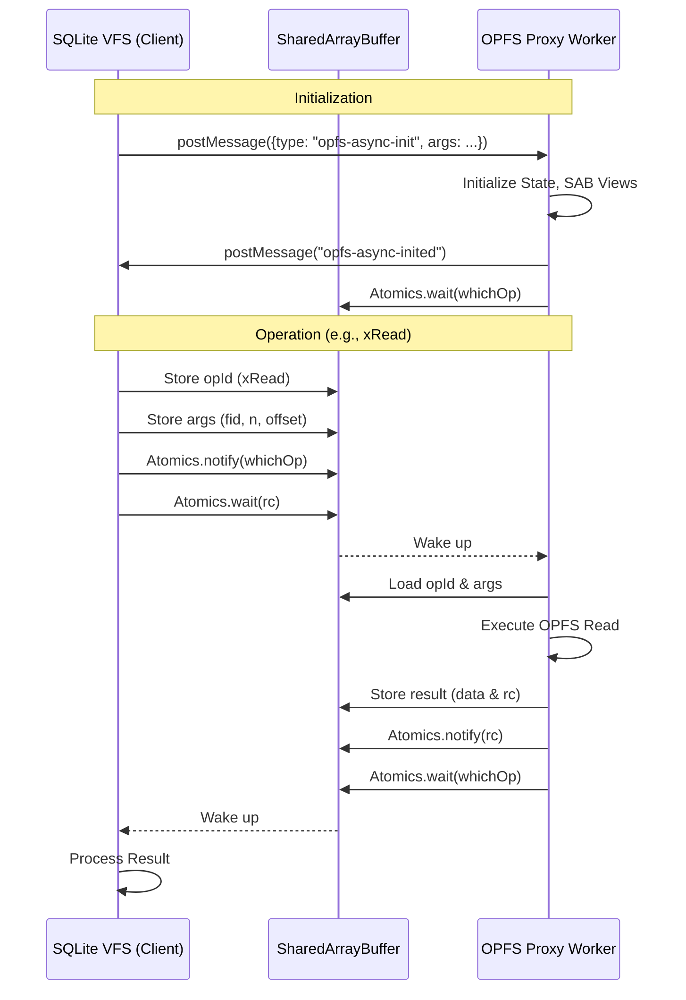

# SQLite OPFS Async Proxy Migration Specification

## 1. Overview

This document outlines the plan to convert the existing `src/jswasm/vfs/opfs/sqlite3-opfs-async-proxy.js` file to TypeScript. This file implements a Web Worker that manages asynchronous Origin Private File System (OPFS) handles for a synchronous SQLite VFS counterpart.

The proxy acts as a bridge, allowing the synchronous SQLite VFS (running in another thread) to perform file operations on OPFS (which requires asynchronous APIs in some contexts, though sync methods are becoming available) via `SharedArrayBuffer` and `Atomics`.

## 2. System Architecture

The system consists of two main components communicating via `postMessage` and `SharedArrayBuffer`:

1.  **Main/Worker Thread (Client):** Runs the SQLite VFS. It sends requests to the proxy worker by writing to `SharedArrayBuffer` and notifying via `Atomics`.
2.  **Proxy Worker (Server - `sqlite3-opfs-async-proxy.js`):** Waits for requests, executes OPFS operations, and reports results back via `SharedArrayBuffer` and `Atomics`.

### 2.1 Communication Protocol

- **Control Channel:** `SharedArrayBuffer` (SAB) is used for low-latency synchronization and data transfer.
    - `sabOP`: Operations control (op codes, return codes, wait handles).
    - `sabIO`: I/O buffer for file data and serialization.
- **Signaling:** `Atomics.wait()` and `Atomics.notify()` are used to coordinate execution between the VFS and the Proxy.
- **Initialization:** Initial setup happens via `postMessage` (`opfs-async-init`).

### 2.2 UML Sequence Diagram (Simplified)



## 3. Migration Plan

The migration will be performed in the following steps:

### Step 1: Type Definitions & Interfaces

Create TypeScript interfaces for the state, messages, and OPFS objects.

- Define `OpfsAsyncProxyState` interface.
- Define `OpfsAsyncMsg` types.
- Define `OpfsFile` interface.

### Step 2: File Conversion

Rename `sqlite3-opfs-async-proxy.js` to `sqlite3-opfs-async-proxy.ts` and apply types.

### Step 3: Refactoring & Modernization

- Replace `var` with `const`/`let`.
- Use strict typing for `SharedArrayBuffer` views (`Int32Array`, `Uint8Array`, `DataView`).
- Improve error handling with typed Errors.
- Modularize code if possible (though it's a standalone worker, internal helper functions can be typed properly).

### Step 4: Verification

- Ensure the build system (Vite/Rollup) correctly bundles the worker.
- Verify the proxy still communicates correctly with the VFS installer.

## 4. Detailed Component Analysis

### 4.1 State Object (`state`)

The `state` object holds global configuration and shared buffer views.

```typescript
interface OpfsAsyncProxyState {
    verbose: number;
    sabIO: SharedArrayBuffer;
    sabOP: SharedArrayBuffer;
    sabOPView: Int32Array;
    sabFileBufView: Uint8Array;
    sabS11nView: Uint8Array;
    sabS11nOffset: number;
    sabS11nSize: number;
    fileBufferSize: number;
    opIds: Record<string, number>;
    sq3Codes: Record<string, number>;
    opfsFlags: Record<string, number>;
    littleEndian: boolean;
    asyncIdleWaitTime: number;
    rootDir: FileSystemDirectoryHandle;
    s11n: Serializer;
    // ... other properties
}
```

### 4.2 File Handle Map (`__openFiles`)

Maps file IDs (integers) to file objects.

```typescript
interface OpfsFile {
    fid: number;
    filenameAbs: string;
    filenamePart: string;
    dirHandle: FileSystemDirectoryHandle;
    fileHandle: FileSystemFileHandle;
    syncHandle?: FileSystemSyncAccessHandle;
    sabView: Uint8Array;
    readOnly: boolean;
    deleteOnClose: boolean;
    xLock: number;
    releaseImplicitLocks: boolean;
}
```

### 4.3 Serialization (`s11n`)

A custom binary serialization format is used to pass arguments via `sabIO`. This needs to be typed to ensure correct data packing/unpacking.

## 5. Implementation Details

- **Location:** `src/jswasm/vfs/opfs/sqlite3-opfs-async-proxy.ts`
- **Dependencies:** Standard DOM types (for `FileSystemHandle` APIs), `sqlite3` types (if available, or mirrored locally).

## 6. Verification Strategy

Since this is a worker file, standard unit tests are tricky. Verification will rely on:

1.  **Compilation:** `tsc` check to ensure type safety.
2.  **Integration Tests:** Running existing SQLite test suites that utilize OPFS to ensure no regression.
