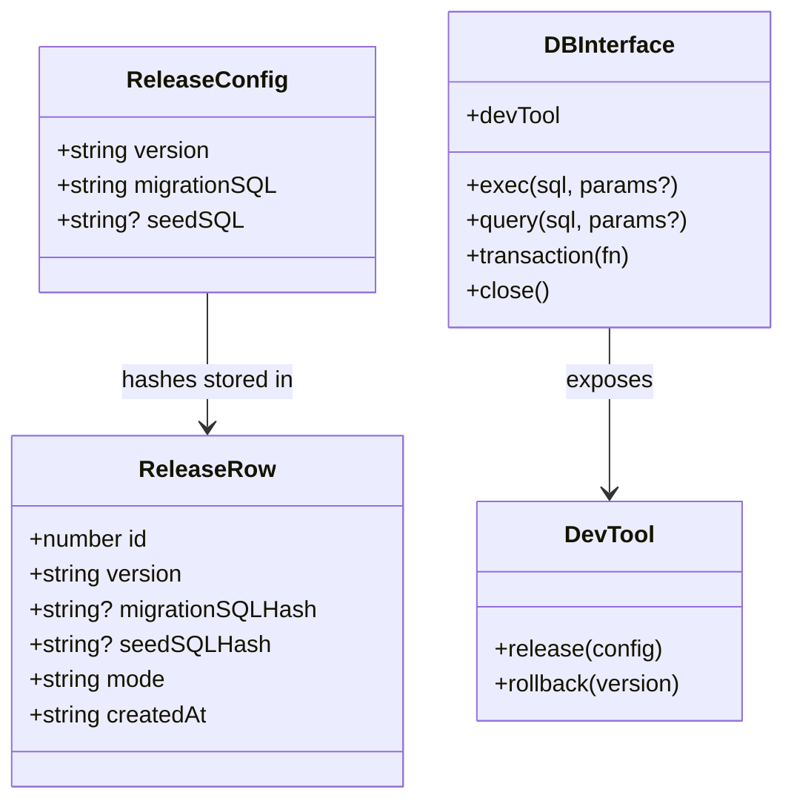

# Releases (Versioned Migrations)

Releases let you evolve your schema and seed data on the client in a predictable,
versioned way. Each release is immutable and identified by a semantic version
string (`x.x.x` with no leading zeros). The library stores release metadata in a
separate SQLite file and keeps a historical database copy for every version.

## OPFS layout

When you open a database named `demo.sqlite3`, OPFS will look like this:

```
demo.sqlite3/
  release.sqlite3
  default.sqlite3
  0.0.0/
    db.sqlite3
    migration.sql
    seed.sql
  0.0.1/
    db.sqlite3
    migration.sql
```

Notes:

- `release.sqlite3` stores release metadata (version, hashes, mode, timestamp).
- `default.sqlite3` is the system-generated base version (`default`).
- Each release version gets its own `db.sqlite3`, plus `migration.sql` and
  optional `seed.sql` files.

## Release metadata (UML)



## Open flow (UML)

```mermaid
sequenceDiagram
  participant App
  participant OpenDB
  participant OPFS
  participant Worker
  participant MetaDB
  participant ActiveDB

  App->>OpenDB: openDB(filename, { releases, debug })
  OpenDB->>OPFS: ensure <name>.sqlite3/ exists
  OpenDB->>OPFS: ensure default.sqlite3
  OpenDB->>Worker: OPEN release.sqlite3 (target=meta)
  OpenDB->>MetaDB: create tables + insert default row
  OpenDB->>MetaDB: read latest row + release rows
  OpenDB->>OpenDB: validate releases + hashes

  alt new release configs exist
    loop each config > latest version
      OpenDB->>OPFS: copy latest db -> <version>/db.sqlite3
      OpenDB->>OPFS: write migration.sql + seed.sql
      OpenDB->>Worker: OPEN <version>/db.sqlite3 (target=active, replace)
      OpenDB->>ActiveDB: BEGIN; migrationSQL; seedSQL; COMMIT
      OpenDB->>MetaDB: INSERT release row
    end
  end

  OpenDB->>Worker: OPEN latest db (target=active, replace)
  OpenDB-->>App: DBInterface
```

## Dev tool flow (UML)

```mermaid
sequenceDiagram
  participant App
  participant DevTool
  participant MetaDB
  participant OPFS
  participant Worker
  participant ActiveDB

  App->>DevTool: devTool.release(config)
  DevTool->>MetaDB: acquire release lock
  DevTool->>OPFS: copy latest db -> <version>/db.sqlite3
  DevTool->>Worker: OPEN <version>/db.sqlite3 (active, replace)
  DevTool->>ActiveDB: BEGIN; migrationSQL; seedSQL; COMMIT
  DevTool->>MetaDB: INSERT release row (mode=dev)
  DevTool-->>App: resolved

  App->>DevTool: devTool.rollback(targetVersion)
  DevTool->>MetaDB: acquire release lock
  DevTool->>MetaDB: validate target >= latest release
  DevTool->>OPFS: remove dev version directories above target
  DevTool->>MetaDB: delete dev rows above target
  DevTool->>Worker: OPEN target db (active, replace)
  DevTool-->>App: resolved
```

## Usage

### 1) Declare immutable releases at startup

```ts
import openDB from "web-sqlite-js";

const db = await openDB("demo.sqlite3", {
  releases: [
    {
      version: "0.0.0",
      migrationSQL: "CREATE TABLE users (id INTEGER PRIMARY KEY, name TEXT);",
      seedSQL: "INSERT INTO users (name) VALUES ('Ada');",
    },
    {
      version: "0.0.1",
      migrationSQL: "ALTER TABLE users ADD COLUMN created_at TEXT;",
    },
  ],
  debug: false,
});
```

### 2) Create a dev-only release during development

```ts
await db.devTool.release({
  version: "0.0.2",
  migrationSQL: "ALTER TABLE users ADD COLUMN role TEXT;",
  seedSQL: null,
});
```

### 3) Roll back a dev-only release

```ts
await db.devTool.rollback("0.0.1");
```

## Validation rules

- Versions must follow `x.x.x` with no leading zeros (for example: `0.0.1`).
- Versions in `releases` must be strictly increasing and unique.
- The version name `default` is reserved and cannot be used in `releases`.
- Archived release rows must be declared in `releases` and their hashes must
  match the stored metadata.
- New versions must be greater than the latest version in metadata.
- `devTool.rollback()` cannot roll back below the latest **release** version.

## Behavior notes

- The latest version (release or dev) is always opened as the active database.
- Migration + seed SQL run inside a single transaction.
- Failed releases clean up their version directory and do not update metadata.
- SHA-256 is used to hash `migrationSQL` and `seedSQL` for immutability checks.
